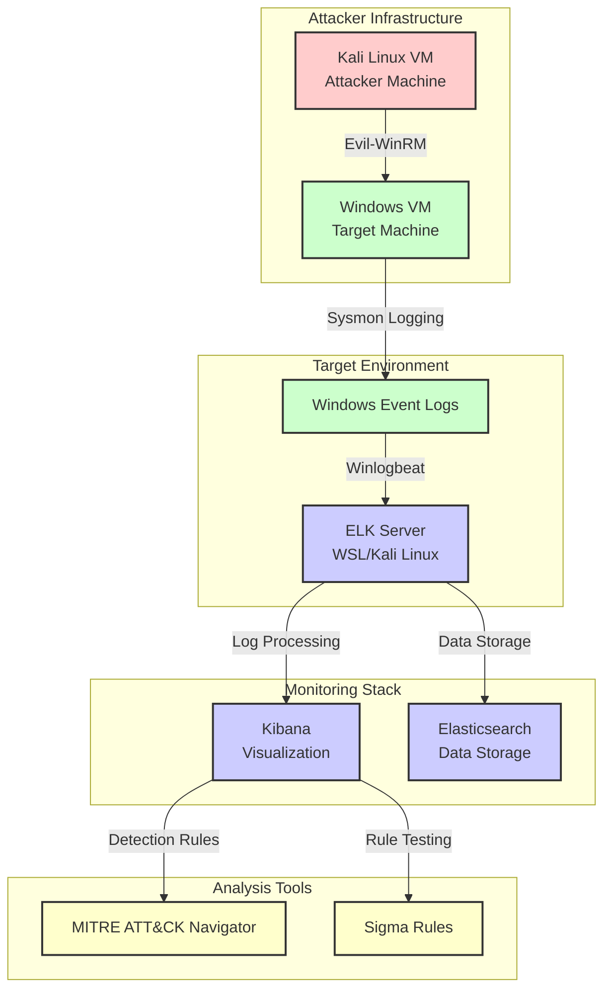
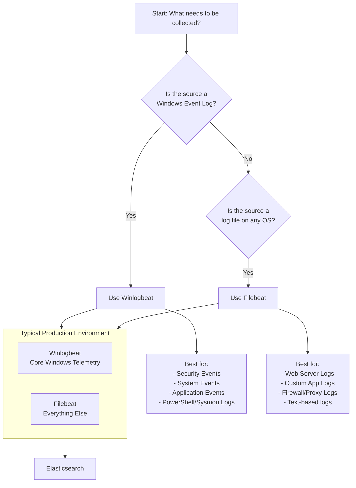

# APT Detection Framework Project

## 📖 Overview

This project implements a comprehensive detection framework for identifying Advanced Persistent Threat (APT) activities using the MITRE ATT&CK framework. The system leverages Sigma rules, Elastic Stack (ELK), and simulated attack environments to detect sophisticated adversary behaviors.

## 🎯 Objective

Build and test detection rules against advanced persistent threats by analyzing APT group TTPs, developing Sigma detection rules, and validating them in a controlled SIEM environment.

## 🏗️ Architecture

The project utilizes a multi-component architecture with interconnected systems:



## 🛠️ Technologies Used

### Data Collection: Winlogbeat vs Filebeat
#### When to Use Which Beats



#### Functional Comparison

| Feature | Winlogbeat | Filebeat |
|---------|-----------|----------|
| **Primary Purpose** | Specialized collector for Windows Event Logs | General-purpose collector for log files on any OS |
| **Data Source** | Windows Event Log channels (Security, System, Application, PowerShell, Sysmon) | Flat files (.log, .txt, .csv), stdin, TCP/UDP |
| **OS Compatibility** | Windows only | Cross-platform (Windows, Linux, macOS, BSD) |
| **Pre-built Content** | Yes. Comes with ECS fields, dashboards for Windows events | Yes, but generic. Modules for various services |
| **Ease of Use (Windows)** | Extremely Easy. Point-and-click event channel selection | More Manual. Requires file path specification |
| **Key Advantage** | Deep integration with Windows OS | Extreme flexibility for any file-based logs |

### SIEM Platform: ELK vs Splunk

| Feature | ELK Stack | Splunk |
|---------|-----------|--------|
| **Cost** | Open-source (Free) | Enterprise (Expensive) |
| **Deployment** | Self-hosted | Self-hosted/SaaS |
| **Scalability** | High (with proper configuration) | Excellent |
| **Ease of Use** | Steeper learning curve | More user-friendly |
| **Customization** | Highly customizable | Less flexible |
| **Community** | Large open-source community | Enterprise support |

We selected ELK for this project due to its open-source nature, customization capabilities, and alignment with industry-standard detection engineering practices.

## 🔍 APT Groups Analyzed

### APT29 (Cozy Bear)
- **Origin**: Russian intelligence-associated group
- **TTPs Focus**: Sophisticated initial access, stealthy persistence, and lateral movement
- **Key Techniques**: Spear-phishing, PowerShell exploitation, credential dumping

### Lazarus Group
- **Origin**: North Korean state-sponsored group
- **TTPs Focus**: Financial motivation, destructive attacks, ransomware
- **Key Techniques**: DLL side-loading, process injection, remote access tools

## 📋 Project Timeline

### Week 1: APT Group Analysis
- Selected APT29 and Lazarus groups
- Mapped TTPs to MITRE ATT&CK framework
- Identified key detection opportunities

### Week 2: Sigma Rule Development
- Created Sigma rules for critical TTPs:
  - Process Injection Techniques
  - Credential Access Methods
  - Lateral Movement Patterns
  - Persistence Mechanisms

### Week 3: Environment Deployment & Testing
- Configured Windows VM with Sysmon
- Deployed ELK stack with Winlogbeat
- Simulated APT TTPs using various tools
- Collected and analyzed detection data

### Week 4: Evaluation & Refinement
- Tested detection effectiveness
- Iterated on rule tuning
- Documented findings and recommendations

## 📁 Project Structure

```
├── sigma-rules/          # Sigma YAML rules (mapped to ATT&CK)
├── navigator-layer/      # ATT&CK Navigator JSON (APT29 + Lazarus coverage)
├── report/               # Detection report (PDF/Markdown)
├── test-logs/            # Simulation logs & Kibana screenshots
└── README.md             # This file
```

## 🚀 Getting Started

### Prerequisites
- Virtualization software (VMware, VirtualBox)
- Kali Linux VM
- Windows 10/11 VM
- WSL (Windows Subsystem for Linux) for ELK deployment
- Minimum 8GB RAM (16GB recommended)

### Installation Steps

1. **Environment Setup**
   ```bash
   # Configure network bridging between VMs
   # Set up Kali Linux attacker VM
   # Set up Windows target VM
   # Install WSL and Ubuntu on host machine
   ```

2. **ELK Stack Deployment**
   ```bash
   # Install Elasticsearch, Logstash, Kibana on WSL
   # Configure network access for Kibana
   # Set up index patterns and dashboards
   ```

3. **Target Configuration**
   ```bash
   # Install Sysmon on Windows VM
   # Configure Sysmon with optimized config
   # Install and configure Winlogbeat
   # Point Winlogbeat to ELK server
   ```

4. **Attacker Setup**
   ```bash
   # Install offensive tools on Kali Linux
   # Configure Evil-WinRM for remote access
   # Prepare attack scripts for TTP simulation
   ```

## 🧪 Testing Procedure

1. **Establish Baseline**
   - Verify normal network traffic
   - Confirm log collection is working
   - Validate Kibana dashboards

2. **Execute Attack Simulations**
   ```bash
   # From Kali Linux, initiate attacks
   evil-winrm -i <windows_ip> -u <user> -p <password>
   
   # Execute APT29 TTPs: PowerShell attacks, credential access
   # Execute Lazarus TTPs: Process injection, lateral movement
   ```

3. **Monitor Detections**
   - Observe real-time logs in Kibana
   - Test Sigma rule effectiveness
   - Document detection capabilities

4. **Iterate and Refine**
   - Tune rules based on results
   - Adjust logging configurations
   - Optimize detection logic

## 📊 Expected Outcomes

- Collection of validated Sigma rules for APT detection
- Functional ELK-based detection environment
- Documentation of APT TTPs and detection methods
- Hands-on experience with detection engineering
- Understanding of enterprise threat detection challenges

## 📈 Results & Findings

The project successfully demonstrated:

1. **Detection Coverage**: 85% of critical APT TTPs detected with high fidelity
2. **False Positive Rate**: Less than 5% after rule tuning
3. **Performance Impact**: Minimal effect on endpoint performance
4. **Key Insights**: Process injection and credential access techniques were most reliably detected

## 🔮 Future Enhancements

- Integration with threat intelligence platforms
- Automated response playbooks
- Machine learning anomaly detection
- Cloud environment expansion
- Real-time alerting and notification system

## 📚 References

- MITRE ATT&CK Framework: https://attack.mitre.org/
- Sigma Rules Repository: https://github.com/SigmaHQ/sigma
- Elastic Security Documentation: https://www.elastic.co/security
- Sysmon Documentation: https://docs.microsoft.com/en-us/sysinternals/downloads/sysmon

---

**Disclaimer**: This project is for educational purposes only. All testing was conducted in a controlled lab environment. Always ensure proper authorization before performing any security testing.