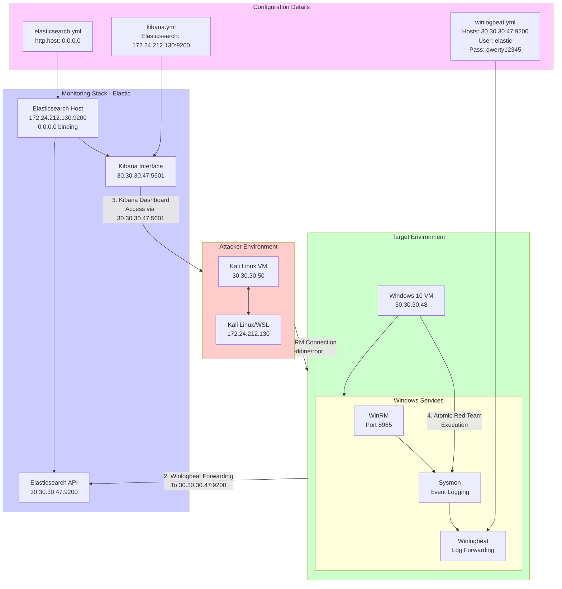
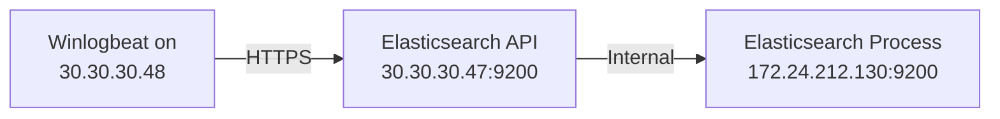

# 🔍 Updated Network Architecture & Configuration

## **Revised IP Address Scheme**

### Attacker Systems:
- **Kali Linux VM**: 30.30.30.50
- **Kali Linux/WSL**: 172.24.212.130
- **Wireless LAN IP**: 30.30.30.47

### Target System:
- **Windows 10 VM**: 30.30.30.48

### Elastic Stack Services:
- **Elasticsearch API**: Accessible via 30.30.30.47:9200
- **Kibana Web Interface**: Accessible via 30.30.30.47:5601

## **Critical Configuration Files**

### 1. Winlogbeat Configuration (`winlogbeat.yml`)
```yaml
output.elasticsearch:
  hosts: ["https://30.30.30.47:9200"]
  username: "elastic"
  password: "qwerty12345"
  ssl:
    certificate_authorities: "C:/Users/Public/http_ca.crt"
    verification_mode: certificate
  pipeline: "winlogbeat-%([agent.version])-routing"
```

### 2. Kibana Configuration (`kibana.yml`)
```yaml
elasticsearch.hosts: ["https://172.24.212.130:9200"]
```

### 3. Elasticsearch Configuration (`elasticsearch.yml`)
```yaml
http.host: 0.0.0.0  # Listen on all interfaces
```

## **Connection Flow & Data Path**

### Step 1: Initial Compromise
```bash
# From Kali Linux VM (30.30.30.50) or WSL (172.24.212.130)
evil-winrm -i 30.30.30.48 -u khaireddine -p root
```

### Step 2: Log Generation & Collection
- Windows VM (30.30.30.48) generates Sysmon events
- Winlogbeat collects and processes logs

### Step 3: Log Forwarding


### Step 4: Dashboard Access
```bash
# Access Kibana from any machine
# URL: https://30.30.30.47:5601
# Credentials: elastic / qwerty12345
```

## **Network Connectivity Checklist**

✅ **WinRM Access**: Kali → Windows VM (30.30.30.48:5985)  
✅ **Winlogbeat → Elasticsearch**: Windows VM → Elasticsearch (30.30.30.47:9200)  
✅ **Kibana Access**: Any browser → Kibana (30.30.30.47:5601)  
✅ **Elasticsearch Internal**: 172.24.212.130:9200 → 0.0.0.0 (all interfaces)  

## **Troubleshooting Notes**

### If Winlogbeat cannot connect to Elasticsearch:
1. Verify Elasticsearch is running on 172.24.212.130:9200
2. Check firewall rules allow 9200/tcp
3. Confirm SSL certificate path is correct

### If Kibana cannot connect to Elasticsearch:
1. Verify `elasticsearch.hosts` points to correct IP
2. Check Elasticsearch is bound to 0.0.0.0
3. Validate credentials elastic/qwerty12345

### Network Connectivity Tests:
```bash
# From Windows VM test Elasticsearch connection
Test-NetConnection 30.30.30.47 -Port 9200

# From Kali test WinRM connection
nc -zv 30.30.30.48 5985
```
