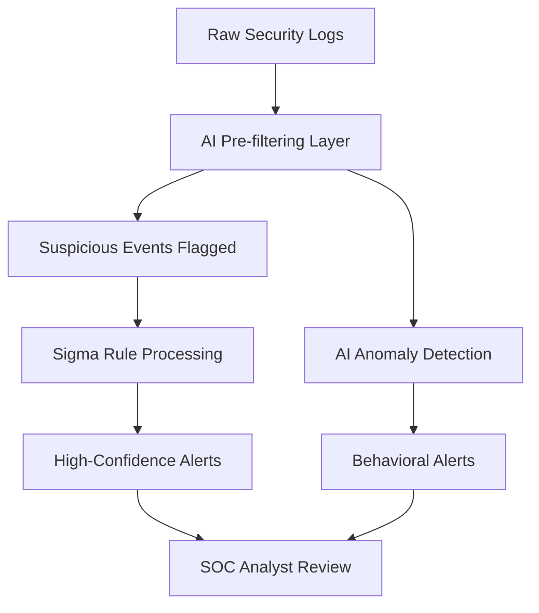

# APTs & Detection Framework - Final Report

## Basic Info
- **Your Name**: Khaireddine CHEBBI
- **Project Dates**:  30/09/2025
- **Total Techniques**: 18/190
- **Primary Tools Used**:
    -- Sysmon for endpoint monitoring
    -- Elastic Stack (Winlogbeat) for log aggregation
    -- Kibana platform for log management
    -- Atomic Red Team for testing procedures
- **Lab Environment**:
    -- Windows 10 Enterprise VM: Target
    -- Kali Linux VM: Attacker
    -- Kali Linux/wsl: ELK Server

## Top 3 Most Valuable Techniques Covered
1. **Technique**:T1546.003 WMI Event Subscription
   - **Why valuable**:
        This technique represents one of the most sophisticated persistence mechanisms that operates at the SYSTEM level and survives reboots. The ability to trigger malicious code execution based on system events (like uptime, logon events, or process creation) makes it extremely stealthy and difficult for traditional AV to detect since the payload executes through legitimate WMI infrastructure.
   - **Detection challenge**:
        WMI event subscriptions operate through legitimate system processes (WmiPrvSe.exe), making process-based detection ineffective. The persistence is stored in the WMI repository rather than traditional locations like registry or file system, requiring specialized knowledge of WMI classes and namespaces to detect. Additionally, the use of MOF compilation (mofcomp.exe) provides an alternative deployment method that bypasses many monitoring solutions.

2. **Technique**: T1053.005 Scheduled Task Persistence
   - **Why valuable**: 
        Scheduled tasks provide a native Windows persistence mechanism that's widely abused by both attackers and legitimate software, creating significant "noise" that makes detection challenging. The technique offers flexibility in execution timing (logon, startup, specific times) and privilege levels (including SYSTEM), making it versatile for various attack scenarios.
   - **Detection challenge**:
        The challenge lies in distinguishing legitimate administrative tasks from malicious ones, as both use the same tools (schtasks.exe, PowerShell cmdlets) and parameters. Attackers can use stealth parameters like /F (force), /ru system, and timing-based triggers that blend with normal system activity. The technique also has multiple implementation methods (command-line, PowerShell, WMI) requiring comprehensive detection coverage.

3. **Technique**: T1485 Data Destruction
   - **Why valuable**:
        This technique represents the ultimate impact attack that can cause irreversible damage to organizations. The ability to detect data destruction attempts before they complete is critical for business continuity. The covered methods (SDelete, cipher /w, ESXi snapshot destruction) show how attackers leverage both built-in utilities and specialized tools for maximum impact.
   - **Detection challenge**:
        Detection is challenging because these tools are legitimate administrative utilities that exist in most environments. The key detection challenge is contextual - distinguishing between authorized administrative use (disk cleanup, secure deletion) and malicious destruction. The remote execution through wsmprovhost.exe adds another layer of complexity, as it's a legitimate management channel that attackers abuse.

## Biggest Technical Challenge
Creating effective detection logic that balances precision and recall across multiple attack variations. The most difficult problem was designing Sigma rules that could detect the core immutable components of each technique while accommodating the numerous variations attackers use for evasion. For example, with T1059.001 PowerShell attacks, I had to identify the fundamental API calls and parameter patterns that remain constant across different obfuscation methods, while avoiding excessive false positives from legitimate administrative scripts.

## Most Important Lesson Learned
The critical importance of understanding the "why" behind attack techniques rather than just the "how." What surprised me was realizing that effective detection requires deep understanding of the underlying Windows APIs, system components, and operational constraints that force attackers to use certain immutable patterns. For instance, WMI event subscriptions (T1546.003) must use specific class names and namespaces because they're defined by Microsoft's WMI architecture - attackers can't change these without breaking functionality. This perspective shift from "what commands are run" to "what system constraints force specific behaviors" fundamentally changed my detection approach.

## How This Project Demonstrates Your Skills
- **Technical Skills**:
    1. ELK Stack Implementation - Deployed and configured Elasticsearch, Logstash, Kibana for security monitoring
    2. Atomic Red Team Framework - Executed and automated attack simulations for detection validation
    3. Sysmon Configuration - Customized sysmon configs for optimal security event collection
    4. Kibana Dashboard Development - Built interactive security dashboards for threat visualization
    5. Winlogbeat Configuration - Set up and optimized Windows event shipping to Elasticsearch
    6. ATT&CK Framework Mapping - Correlating detection rules to specific MITRE techniques
- **Analytical Skills**:
    1. Advanced Sigma Rule Development - Creating complex detection logic with multiple conditions and correlation patterns
    2. Threat Analysis Methodology - Systematic approach to identifying immutable detection points
    3. Log Analysis Expertise - Processing and interpreting Sysmon and Windows event logs
    4. False Positive Analysis - Evaluating and minimizing false positive scenarios
- **Practical Application**:
    This work directly translates to real-world security operations by:
    * Reducing mean time to detection for critical attack techniques
    * Improving SOC efficiency through high-fidelity alerts
    * Enhancing incident response with detailed attack chain understanding
    * Supporting threat hunting with specific detection hypotheses

## Future Plans
- **Skills to develop**:
    * Memory forensics for detecting fileless attacks and process injection
    * Network traffic analysis for C2 communication detection
    * Machine learning integration for anomaly detection in security logs
    * Cloud security monitoring as organizations migrate to Azure/AWS
    * Incident response automation through SOAR platforms
- **Career goals this supports**:
    This project supports my goal of becoming a Threat Detection Engineer or Security Operations Center Lead. The skills demonstrated align perfectly with roles focused on building detection capabilities, improving security monitoring, and leading incident response teams.
- **AI Integration Vision**:

The AI could:
    * Learn normal baseline behavior for each environment
    * Detect subtle anomalies that rule-based systems miss
    * Reduce alert fatigue by filtering out known false positives
    * Correlate related events across multiple data sources
    * Provide context-aware scoring of suspicious activities
