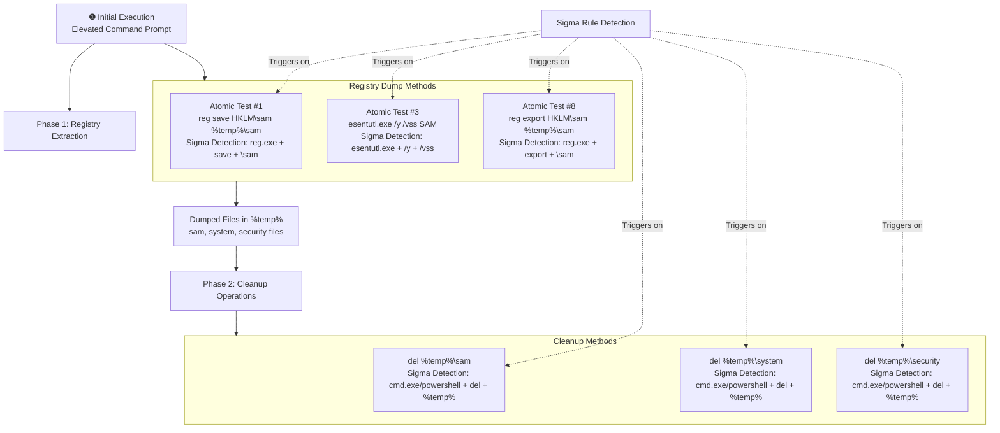

# Technical Detection Report: OS Credential Dumping - Security Account Manager

## Overview
This report analyzes detection capabilities for credential dumping techniques targeting the Security Account Manager (SAM) registry hive through multiple methods including reg.exe, esentutl.exe, and subsequent cleanup operations.

## Attack Summary
- **MITRE Technique:** T1003.002 (OS Credential Dumping: Security Account Manager)
- **Primary Tactics:** Credential Access (TA0006)
- **Description:** Adversaries attempt to extract credential material from the SAM database through registry operations using native Windows utilities like reg.exe and esentutl.exe, followed by cleanup activities to remove evidence.

## Attack Chain Analysis
The attack follows a predictable pattern of registry extraction followed by cleanup operations. The Sigma rule detects multiple stages of this attack chain.



## Immutable Detection Points

### 1. reg.exe Save/Export Operations
**Indicator:** `reg save` or `reg export` commands
**Why Immutable:** The `reg` command requires specific verbs (`save`, `export`) to perform registry extraction operations. The target hives (`HKLM\sam`, `HKLM\system`, `HKLM\security`) have fixed paths in the Windows registry.

### 2. esentutl.exe Extraction
**Indicator:** `esentutl.exe /y /vss` with SAM path
**Why Immutable:** The `/y` (copy) and `/vss` (volume shadow copy) flags are required for this extraction method. The SAM database path (`/config/SAM`) is fixed in the Windows system.

### 3. Temporary File Cleanup
**Indicator:** `del %temp%\sam` and similar commands
**Why Immutable:** The cleanup process requires deleting specific files (`sam`, `system`, `security`) from the temp directory. The `del` command and `%temp%` environment variable are standard components.

## Sigma Rule Analysis

### Rule Effectiveness
```yaml
detection:
  event_id:
    EventID: 1
  reg_img:
    Image|endswith: '\reg.exe'
  reg_parent:
    ParentImage|endswith:
      - '\cmd.exe'
      - '\powershell.exe'
  reg_exe:
    CommandLine|contains: 'reg'
  reg_cmd:
    CommandLine|contains:
      - ' save '
      - ' export '
  reg_hive:
    CommandLine|contains:
      - '\sam'
      - '\system'
      - '\security'
  cleanup_img:
    Image|endswith:
      - '\cmd.exe'
      - '\powershell.exe'
  cleanup_cmd:
    CommandLine|contains|all:
      - 'del'
      - '%temp%'
  cleanup_hive:
    CommandLine|contains:
      - '\sam'
      - '\SAM'
      - '\system'
      - '\security'
  esentutl_img:
    Image|endswith: '\cmd.exe'
  esentutl_cmd:
    CommandLine|contains|all:
      - 'esentutl.exe'
      - ' /y '
      - ' /vss '
      - '/config/SAM'

condition: event_id and (reg_img and reg_parent and reg_exe and reg_cmd and reg_hive)
        or (cleanup_img and cleanup_cmd and cleanup_hive)
        or (esentutl_img and esentutl_cmd)
```

The rule effectively covers three attack vectors:
1. **Registry export via reg.exe** with save/export operations targeting sensitive hives
2. **File cleanup operations** removing SAM/SYSTEM/SECURITY files from temp directory
3. **esentutl.exe extraction** using volume shadow copy technique

### Detection Logic
The rule triggers when specific combinations of indicators appear:
- **reg.exe detection:** Requires reg.exe image, suspicious parent process, and commands containing both registry operations and sensitive hive names
- **Cleanup detection:** Requires cmd/powershell process deleting temp files with hive names
- **esentutl detection:** Requires cmd process executing esentutl with specific copy and VSS flags targeting SAM

### False Positive Considerations
Legitimate activities that may trigger similar patterns:
```cmd
# Legitimate admin backing up registry for troubleshooting
reg export HKLM\software C:\backups\software.reg
reg save HKLM\software C:\backups\software.hiv

# System maintenance cleaning temp files
del %temp%\*.tmp
del %temp%\old_logs.txt

# Legitimate use of esentutl for database maintenance
esentutl.exe /y C:\database.edb /d C:\backup\database.edb
```

However, the combination requirements in the rule (specific hive names, specific commands) significantly reduce false positive risk.

## Mitigation Recommendations

1. **Application Control:** Implement application whitelisting to restrict reg.exe and esentutl.exe execution to authorized administrators only
2. **Privilege Management:** Follow principle of least privilege to limit who can perform registry export operations
3. **Monitoring:** Enhance command-line auditing to capture registry operations and file deletion activities
4. **File Integrity Monitoring:** Monitor for changes to SAM, SYSTEM, and SECURITY registry hives
5. **User Training:** Educate administrators about legitimate vs. suspicious uses of registry utilities

## Conclusion

This Sigma rule provides comprehensive coverage against SAM credential dumping techniques by targeting the immutable components of the attack chain. The rule effectively detects multiple methods of registry extraction and subsequent cleanup operations while maintaining reasonable specificity through combination logic. The detection covers the essential attack patterns demonstrated in Atomic Tests #1, #3, and #8, making it a valuable addition to credential access detection capabilities. The multi-stage approach ensures detection regardless of whether attackers use reg save, reg export, esentutl, or attempt to clean up their traces.