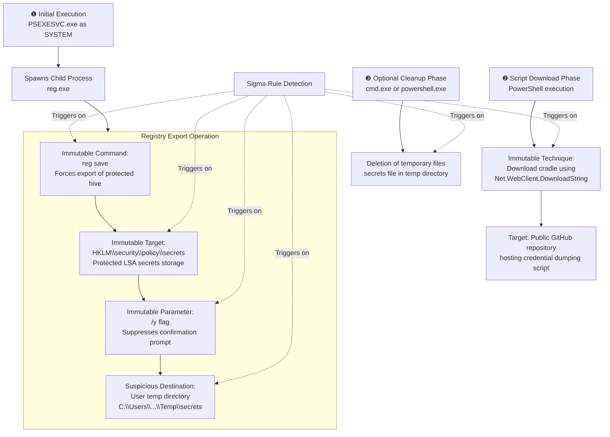

# Technical Detection Report: OS Credential Dumping - LSA Secrets

## Overview

This report analyzes a Sigma rule designed to detect the credential dumping technique of saving the LSA Secrets registry hive to a file for offline processing, consistent with MITRE ATT&CK technique **T1003.004 (OS Credential Dumping: LSA Secrets)**. The analysis is based on detailed Sysmon logs showing a two-stage attack: first dumping the secrets using reg.exe, then downloading a processing script via PowerShell.

## Attack Summary

- **MITRE Technique:** T1003.004 (OS Credential Dumping: LSA Secrets)
- **Primary Tactics:** Credential Access (TA0006)
- **Description:** Adversaries use the built-in reg.exe utility to export the protected `HKLM\SECURITY\Policy\Secrets` hive to a disk file, then use custom tools or scripts to parse the file and extract stored credentials such as service account passwords, automated task credentials, and system secrets.

## Attack Chain Analysis

The attack follows a clear two-stage process with optional cleanup. The following flowchart details the exact steps and the specific techniques used, which serve as the immutable detection points.

## Immutable Detection Points

The rule's strength lies in targeting the unchangeable commands and parameters required to access the LSA secrets.

### 1. Registry Export Command Structure
**Indicator:** `reg save HKLM\security\policy\secrets <path> /y`
**Why Immutable:** 
- The `save` command is the specific reg.exe subcommand for exporting hive data
- The target path `HKLM\security\policy\secrets` is the fixed registry location where LSA secrets are stored
- The `/y` flag suppresses confirmation prompts, indicating automated/non-interactive use

### 2. Temporary File Destination
**Indicator:** File saved to `C:\Users\*\AppData\Local\Temp\secrets` or similar user temp path
**Why Immutable:** Legitimate administrative processes would not export protected system hives to user temporary directories. This location is chosen specifically to avoid system-protected areas and facilitate later processing/exfiltration.

### 3. PowerShell Download Cradle
**Indicator:** `(New-Object Net.WebClient).DownloadString('http[s]://...')`
**Why Immutable:** This is the fundamental syntax for downloading content from the internet via PowerShell. The .NET class `Net.WebClient` and method `DownloadString` are fixed requirements for this technique.

### 4. Cleanup Operation
**Indicator:** `del` command targeting `secrets` files in temp directories
**Why Immutable:** The specific filename (`secrets`) and location (`%temp%`, `\Temp\`) correlate directly with the earlier export operation, indicating attempt to remove evidence.

## Sigma Rule Analysis

### Rule Effectiveness

Your revised rule shows **good coverage** of the attack chain but has some structural issues that affect its precision.

**Strengths:**
1.  **Comprehensive Coverage:** The rule correctly identifies all three phases of the attack: the credential dump, the script download, and the cleanup operation.
2.  **Focused Detection Criteria:** Using `endswith` for process images and `contains|all` for command components provides good specificity.
3.  **Good Field Selection:** The included fields (CommandLine, User, Parent information) provide essential context for investigation.

**Areas for Improvement:**
1.  **Overly Broad Condition:** The `OR` condition between the three detection methods means any one of them will trigger a high-severity alert. This will generate false positives:
    - The `powershell_http` condition alone would trigger on any legitimate script downloading from GitHub
    - The `cleanup_temp` condition could trigger on various admin cleanup tasks

2.  **Parent Process Assumption:** While you removed the specific PsExec parent requirement (good), the rule structure still suggests looking for this pattern. Better to focus entirely on the action itself.

3.  **Brittle Cleanup Detection:** The cleanup pattern assumes specific command syntax that attackers can easily modify.

### Final Verdict on Rule Strength

**Grade: B**

The rule demonstrates good understanding of the attack technique but needs refinement to achieve production-ready reliability. The main issue is the OR condition that will generate excessive noise. This rule would be more effective as three separate rules with different severity levels, or as a correlation rule that looks for the sequence of events.

## Mitigation Recommendations

1.  **Privilege Access Management:** Limit SYSTEM-level access to critical systems. The attack requires high privileges to access the LSA secrets hive.
2.  **Application Control:** Implement WDAC or AppLocker to restrict execution of reg.exe and PowerShell to specific authorized paths and users.
3.  **Network Restrictions:** Block outbound PowerShell web requests (except to explicitly allowed endpoints) at the firewall/proxy level.
4.  **Monitoring Enhancements:** 
    - Enable Windows Defender Credential Guard to protect LSA secrets
    - Monitor for reg.exe accessing sensitive registry hives
    - Alert on PowerShell making web requests, especially to raw GitHub content

5.  **Rule Optimization:** 
    - Split the current rule into three separate rules with appropriate severity levels
    - Create a correlation rule that looks for the sequence: reg.exe saving secrets → PowerShell web request → file deletion
    - Add more specific filters for legitimate administrative patterns

## Conclusion

The provided Sigma rule effectively identifies the key components of T1003.004 attacks but requires structural refinement to reduce false positives in production environments. The rule correctly targets the immutable aspects of the attack—the specific reg.exe command structure and the PowerShell download cradle—which makes it a valuable detection foundation.

With optimization to handle the correlation logic and false positive reduction, this detection approach can provide high-fidelity alerting for credential dumping activities that leverage the built-in reg.exe utility to access protected system secrets.