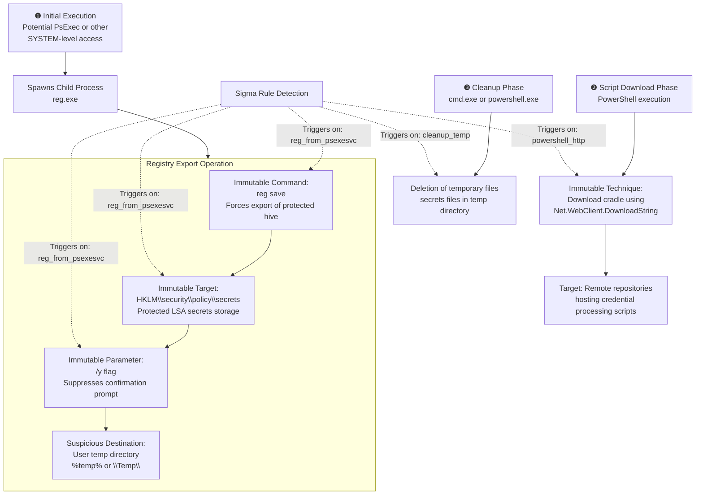

# Technical Detection Report: OS Credential Dumping - LSA Secrets

## Overview

This report analyzes a Sigma rule designed to detect credential dumping techniques targeting SAM and LSA Secrets registry hives, consistent with MITRE ATT&CK techniques **T1003.002 (Security Account Manager)** and **T1003.004 (LSA Secrets)**. The analysis focuses on detecting registry export operations, suspicious script downloads, and subsequent cleanup activities.

## Attack Summary

- **MITRE Techniques:** T1003.002 (OS Credential Dumping: SAM), T1003.004 (OS Credential Dumping: LSA Secrets)
- **Primary Tactics:** Credential Access (TA0006)
- **Description:** Adversaries use built-in utilities like reg.exe to export protected registry hives (SAM, SYSTEM, SECURITY, LSA Secrets) to disk files, then use custom tools or scripts to parse these files offline to extract credentials, followed by cleanup operations to remove evidence.

## Attack Chain Analysis

The attack follows a multi-stage process involving registry extraction, script downloading, and evidence cleanup. The following flowchart details the attack sequence and detection points.



## Immutable Detection Points

### 1. Registry Export Command Structure
**Indicator:** `reg save HKLM\security\policy\secrets <path> /y`
**Why Immutable:** 
- The `save` command is the specific reg.exe subcommand for exporting hive data
- The target path `HKLM\security\policy\secrets` is the fixed registry location where LSA secrets are stored
- The `/y` flag suppresses confirmation prompts, indicating automated/non-interactive use

### 2. Temporary File Destination Patterns
**Indicator:** Files saved to `%temp%` or `\Temp\` directories
**Why Immutable:** Legitimate administrative processes typically don't export protected system hives to user temporary directories. These locations are chosen to avoid system-protected areas.

### 3. PowerShell Download Cradle
**Indicator:** `Invoke-Expression` with `WebClient.DownloadString`
**Why Immutable:** This is the fundamental syntax for downloading and executing remote content via PowerShell. The .NET class `WebClient` and method `DownloadString` are fixed requirements.

### 4. Cleanup Operation Patterns
**Indicator:** `del` command targeting `secrets` files in temp directories
**Why Immutable:** The specific filename patterns and temp directory locations correlate with registry export operations, indicating evidence removal.

## Sigma Rule Analysis

### Rule Effectiveness

```yaml
detection:
  event_id:
    EventID: 1
  reg_from_psexesvc:
    Image|endswith: '\reg.exe'
    CommandLine|contains|all:
      - 'reg'
      - ' save '
      - '\security\policy\secrets'
      - '/y'
    CommandLine|contains:
      - '%temp%'
      - '\Temp\'
  powershell_http:
    Image|endswith:
      - '\powershell.exe'
    CommandLine|contains|all:
      - 'Invoke-Expression'
      - 'WebClient'
      - 'DownloadString'
      - '.ps1'
    CommandLine|contains:
      - 'http'
      - 'https'
  cleanup_temp:
    Image|endswith:
      - '\cmd.exe'
      - '\powershell.exe'
    CommandLine|contains|all:
      - 'del'
      - '\secrets'
    CommandLine|contains:
      - '%temp%'
      - '\Temp\'
  condition: event_id and (reg_from_psexesvc or powershell_http or cleanup_temp)
```

The rule provides comprehensive coverage across multiple attack stages but uses an OR condition that may increase false positives.

### Detection Logic
The rule triggers on three distinct patterns:
1. **Registry export operations** targeting LSA secrets to temporary directories
2. **PowerShell download cradles** fetching remote scripts (typically for credential processing)
3. **Cleanup operations** removing secrets files from temporary locations

### False Positive Considerations
**Legitimate activities that may trigger similar patterns:**

```cmd
# Legitimate administrative registry backup (false positive for reg_from_psexesvc)
reg save HKLM\software C:\backups\software.hiv /y

# Legitimate PowerShell module download (false positive for powershell_http)
Invoke-Expression (New-Object Net.WebClient).DownloadString('https://chocolatey.org/install.ps1')

# Normal temp file cleanup (false positive for cleanup_temp)
del %temp%\*.log /s /q
```

**Specific false positive scenarios:**
- System administrators using reg.exe for legitimate backup operations
- DevOps pipelines using PowerShell to download installation scripts
- Scheduled tasks performing routine temp directory cleanup
- Security tools conducting legitimate forensic operations

## Mitigation Recommendations

1. **Privilege Access Management:** Implement least privilege principles to limit access to sensitive registry hives
2. **Application Control:** Use WDAC or AppLocker to restrict reg.exe and PowerShell execution to authorized paths
3. **Network Restrictions:** Implement egress filtering to control PowerShell web requests
4. **Monitoring Enhancements:**
   - Enable Windows Defender Credential Guard for LSA protection
   - Implement registry auditing for sensitive hive access
   - Monitor for reg.exe accessing protected registry areas

5. **Rule Optimization:**
   - Consider splitting into separate rules for better severity tuning
   - Add exclusion for known legitimate administrative patterns
   - Implement correlation logic to detect the attack sequence rather than individual events

## Conclusion

The Sigma rule provides good coverage of credential dumping techniques targeting SAM and LSA secrets. It correctly identifies the immutable components of the attack, including specific registry commands, download patterns, and cleanup operations. While the OR condition may increase false positive rates, the rule's specificity within each detection component provides a solid foundation for identifying credential access attacks.

With additional tuning and potential segmentation into multiple rules, this detection approach can provide effective monitoring for credential dumping activities while maintaining manageable false positive levels in production environments. The rule demonstrates understanding of the critical attack patterns and focuses on the unchangeable elements that adversaries must use to successfully execute these techniques.