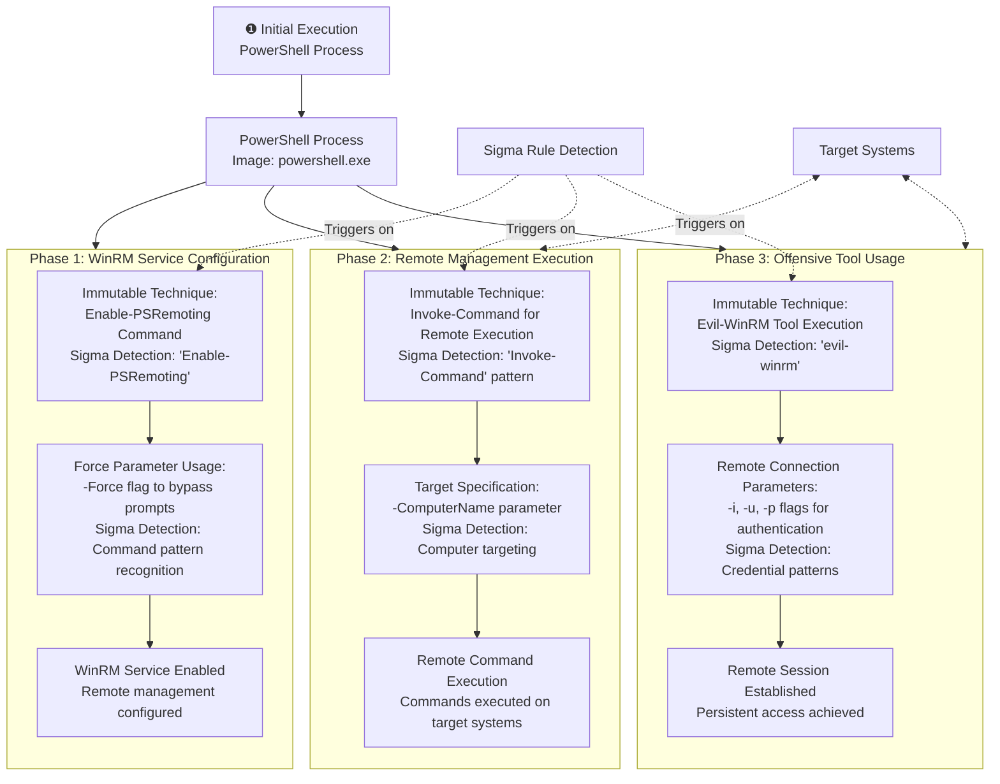

# Technical Detection Report: WinRM Remote Management Activity

## Overview

This report analyzes suspicious Windows Remote Management (WinRM) activities conducted through PowerShell, including both the configuration of PSRemoting and the use of offensive tools like Evil-WinRM. These techniques demonstrate how adversaries enable and utilize remote management capabilities for lateral movement within enterprise environments.

## Attack Summary

- **MITRE Technique:** T1021.006 (Remote Services: Windows Remote Management)
- **Primary Tactics:** Lateral Movement, Execution
- **Description:** Attackers use PowerShell to enable Windows Remote Management services and subsequently leverage tools like Evil-WinRM to establish remote sessions, facilitating lateral movement and remote command execution across the network.

## Attack Chain Analysis

The attack follows a sequential approach that first prepares the target environment for remote management and then establishes remote access using specialized tools. The following flowchart details the exact steps and highlights where the Sigma rule's detection logic triggers on the immutable components of the attack.



## Immutable Detection Points

### 1. PSRemoting Configuration Commands
**Indicator:** `Enable-PSRemoting` and `Disable-PSRemoting` commands
**Why Immutable:** These are the official PowerShell cmdlets for configuring Windows Remote Management services with fixed names that cannot be altered without breaking functionality.

### 2. Remote Command Execution
**Indicator:** `Invoke-Command` with `-ComputerName` parameter
**Why Immutable:** This is the standard PowerShell cmdlet for executing commands on remote systems with fixed syntax and parameter names.

### 3. Offensive Tool Signature
**Indicator:** `evil-winrm` command execution
**Why Immutable:** Evil-WinRM is a specific offensive security tool with a fixed name that cannot be changed without breaking the tool's functionality and recognition in the security community.

### 4. Authentication Parameters
**Indicator:** `-i` (target), `-u` (username), `-p` (password) flags
**Why Immutable:** These are standard parameter conventions used by command-line tools for specifying connection details and credentials.

## Sigma Rule Analysis

### Rule Effectiveness
The Sigma rule `Suspicious WinRM Activity via PowerShell` effectively targets the immutable components of this attack:

```yaml
detection:
  selection:
    EventID: 1
    Image|endswith: '\powerShell.exe'
    CommandLine|contains_any:
      - 'Enable-PSRemoting'
      - 'Disable-PSRemoting'
      - 'evil-winrm'
  condition: selection
```

### Detection Logic
The rule triggers when these immutable elements appear in process creation events:

1. **PSRemoting Configuration:** Detection of `Enable-PSRemoting` or `Disable-PSRemoting` commands in PowerShell
2. **Offensive Tool Usage:** Presence of `evil-winrm` tool execution in PowerShell command lines

As shown in the flowchart, the Sigma rule detects both the preparation phase (enabling remote management) and the exploitation phase (using offensive tools) of WinRM-based attacks.

### False Positive Considerations
**Legitimate Administrative Activities:**
```powershell
# Approved system configuration scripts
Enable-PSRemoting -Force
Disable-PSRemoting -Force

# Legitimate remote management operations
Invoke-Command -ComputerName server01 -ScriptBlock {Get-Service}

# Authorized security testing
evil-winrm -i authorized-target -u admin -p ********
```

**Enterprise Management Patterns:**
- Automated system configuration and deployment scripts
- Remote administration and maintenance operations
- Security compliance scanning and remediation scripts
- DevOps automation and orchestration tools

## Mitigation Recommendations

1. **Access Control:** Restrict PowerShell execution and PSRemoting configuration to authorized administrative accounts only
2. **Network Segmentation:** Implement network segmentation to limit WinRM traffic to specific management zones
3. **Monitoring:** Enhance auditing of PowerShell execution and WinRM service configuration changes
4. **Authentication Controls:** Implement multi-factor authentication for remote management access
5. **Service Hardening:** Disable WinRM services on systems where remote management is not required
6. **Logging:** Enable comprehensive PowerShell logging and WinRM operation auditing

## Conclusion

This attack demonstrates how adversaries leverage built-in Windows remote management capabilities and specialized tools to facilitate lateral movement. The detection rule provides high-fidelity alerting by focusing on the immutable technical components that attackers cannot change without breaking their attack chain. The combination of specific PowerShell cmdlets and offensive tool signatures creates a reliable detection signature for identifying unauthorized WinRM activity.

The Sigma rule effectively covers both the configuration and exploitation phases of WinRM-based attacks while maintaining specificity through the requirement of recognizable command patterns. Organizations should implement this detection while establishing appropriate exception processes for legitimate administrative activities, particularly focusing on the context and timing of PSRemoting configuration changes rather than blocking the functionality entirely.