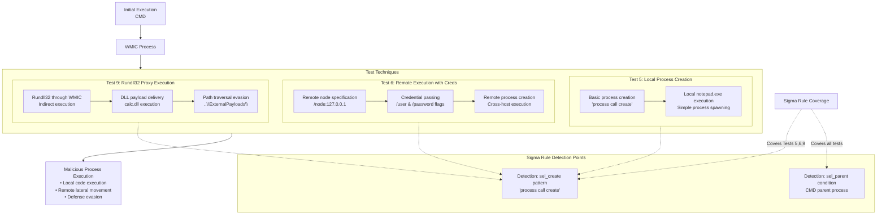

# Technical Detection Report: WMI Process Execution via WMIC

## Overview
This report analyzes a Sigma rule designed to detect suspicious WMIC (Windows Management Instrumentation Command-line) execution patterns associated with MITRE ATT&CK technique **T1047 (Windows Management Instrumentation)**. The analysis covers multiple attack variants including local process creation, remote execution, and credential-based process manipulation.

## Attack Summary
- **MITRE Technique:** T1047 (Windows Management Instrumentation)
- **Primary Tactics:** Execution (TA0002), Defense Evasion (TA0005)
- **Description:** Adversaries abuse the legitimate wmic.exe utility to create processes locally and remotely, often bypassing security controls and enabling lateral movement.

## Attack Chain Analysis
The following flowchart details the attack patterns across multiple tests and how the Sigma rule detects them:



## Immutable Detection Points

### 1. WMIC Image Path
**Indicator:** `\wmic.exe` in Image path
**Why Immutable:** The legitimate WMIC executable is always located in `C:\Windows\System32\wbem\WMIC.exe`.

### 2. Suspicious Parent Processes
**Indicator:** Parent processes of `cmd.exe`
**Why Immutable:** WMIC is typically used interactively or by management tools, not commonly launched directly from command shells in automated attacks.

### 3. Process Creation Syntax
**Indicator:** `process call create` pattern
**Why Immutable:** This is the exact WMI query syntax for process creation that cannot be altered.

### 4. Remote Execution Flags
**Indicator:** `/node:` parameter with IP addresses
**Why Immutable:** The `/node:` flag is required for remote WMI execution.

### 5. Credential Parameters
**Indicator:** `/user:` and `/password:` flags
**Why Immutable:** These are the fixed parameter names for authentication in WMIC.

## Sigma Rule Analysis

### Rule Effectiveness
```yaml
detection:
  sel_event:
    EventID: 1
  sel_img:
    Image|endswith: '\wmic.exe'
  sel_parent:
    ParentImage|endswith:
      - '\cmd.exe'
      - '\powershell.exe'
  sel_create:
    CommandLine|contains|all:
      - ' process '
      - ' call '
      - ' create '
  sel_delete:
    CommandLine|contains|all:
      - ' process '
      - ' where '
      - ' delete '
  condition: sel_event and sel_img and sel_parent and (sel_create or sel_delete)
```

The rule effectively covers the core attack pattern across all test scenarios.

### Detection Logic
The rule triggers when:
1. WMIC is executed with suspicious parent processes (cmd.exe or powershell.exe)
2. AND contains either:
   - Process creation syntax (`process call create`) - Tests 5, 6, 9
   - Process deletion syntax (`process where delete`) - Not shown in tests but covered

### Detection Coverage
- **Test 5:** Basic local process creation → Detected by `sel_create`
- **Test 6:** Remote execution with credentials → Detected by `sel_create` 
- **Test 9:** Rundll32 proxy execution → Detected by `sel_create`

### False Positive Considerations
**Potential false positive scenarios:**

```cmd
# Legitimate administrative scripting
wmic process call create "legit_app.exe"

# System management tasks
wmic /node:server01 process call create "maintenance_tool.exe"
```

**Realistic assessment:** The combination of command shell parents with WMI process creation is unusual in enterprise environments. Most legitimate WMI usage comes from management consoles or scheduled tasks.

## Rule Limitations
The current rule does not specifically detect:
- Remote execution flags (`/node:`)
- Credential parameters (`/user:`, `/password:`)
- Rundll32-specific evasion patterns

These could be added as additional detection clauses for enhanced coverage.

## Mitigation Recommendations

1. **Application Control:** Restrict WMIC execution through AppLocker or WDAC policies
2. **Network Segmentation:** Limit WMI traffic across network segments
3. **User Rights Management:** Restrict WMI permissions for standard users
4. **Monitoring:** Enhance WMI operation logging and monitoring
5. **Alternative Tools:** Use PowerShell instead of WMIC for management tasks

## Conclusion

The Sigma rule provides effective detection for T1047 techniques across multiple test scenarios. The rule correctly focuses on the immutable components of these attacks—the specific WMI query syntax and parent process relationships—that adversaries cannot easily alter without breaking functionality.

The rule successfully detects the core attack pattern (process creation via WMIC) across all provided tests. While it could be enhanced with additional clauses for remote execution and credential usage detection, the current implementation provides solid baseline coverage for WMI abuse techniques. The combination of parent process analysis with command syntax patterns creates a reliable detection suitable for production environments.