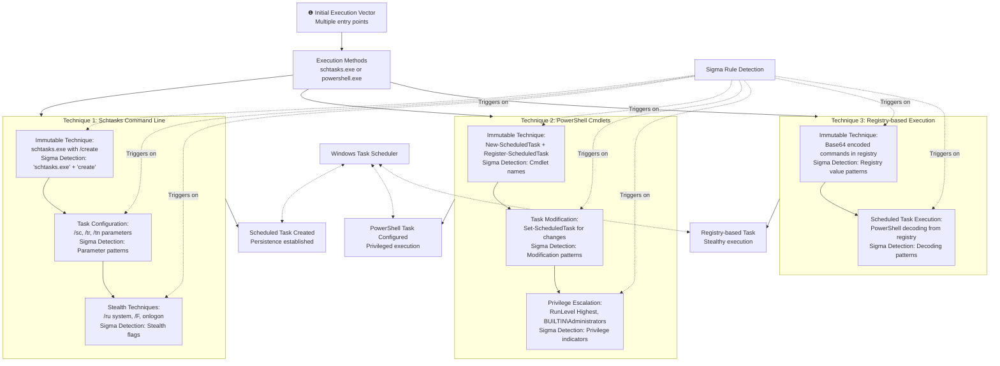

# Technical Detection Report: Suspicious Scheduled Task Activity

## Overview

This report analyzes suspicious scheduled task creation and modification activities that adversaries use for persistence, execution, and lateral movement. The attacks demonstrate various techniques for abusing the Windows Task Scheduler to maintain access and execute malicious code.

## Attack Summary

- **MITRE Technique:** T1053.005 (Scheduled Task/Job: Scheduled Task)
- **Primary Tactics:** Persistence, Execution
- **Description:** Attackers abuse the Windows Task Scheduler to create, modify, or delete scheduled tasks for initial or recurring execution of malicious code. This includes using both command-line tools (schtasks.exe) and PowerShell cmdlets to establish persistence mechanisms.

## Attack Chain Analysis

The attacks demonstrate multiple techniques for abusing scheduled tasks across different execution methods. The following flowchart details the various approaches and highlights where the Sigma rule's detection logic triggers on the immutable components of these attacks.



## Immutable Detection Points

### 1. Schtasks.exe Command Patterns
**Indicator:** `schtasks.exe` with `create` command and various parameters
**Why Immutable:** The schtasks.exe utility has fixed command syntax and parameter names (/sc, /tr, /tn, /ru) that cannot be changed without breaking functionality.

### 2. PowerShell Scheduled Task Cmdlets
**Indicator:** `New-ScheduledTask`, `Register-ScheduledTask`, `Set-ScheduledTask`
**Why Immutable:** These are the official PowerShell cmdlet names for scheduled task management with fixed names.

### 3. Stealth and Privilege Parameters
**Indicator:** `/ru system`, `/F`, `onlogon`, `onstart`, `RunLevel Highest`
**Why Immutable:** These parameters and values are defined by the Windows Task Scheduler API and cannot be altered.

### 4. Registry-based Execution Patterns
**Indicator:** Base64 encoded commands stored in registry with PowerShell decoding
**Why Immutable:** The Base64 encoding/decoding pattern and registry access methods are standardized.

## Sigma Rule Analysis

### Rule Effectiveness
The Sigma rule `Suspicious Scheduled Task Activity` effectively targets multiple immutable components across various attack techniques:

```yaml
detection:
  selection_schtasks:
    EventID: 1
    Image|endswith: '\schtasks.exe'
    ParentImage|endswith:
      - '\cmd.exe'
      - '\powershell.exe'
  selection_taskrun:
    CommandLine|contains:
      - '/tr'
      - '/TR'
  selection_scheduletype:
    CommandLine|contains:
      - '/sc'
      - '/SC'
  selection_create:
    CommandLine|contains:
      - 'create'
      - 'Create'
  slection_others:
    CommandLine|contains:
      - 'onlogon'
      - 'onstart'
      - '/ru system'
      - 'ONCE'
      - '/ST'
      - '/RU'
      - '/U'
      - '/S'
      - '/F'
      - '/f'
      - '/tn'
      - '/TN'
  selection_powershell:
    EventID: 1
    Image|endswith: '\powershell.exe'
    ParentImage|endswith:
      - '\cmd.exe'
      - '\powershell.exe'
    CommandLine|contains|all:
      - 'New-ScheduledTask'
      - 'Register-ScheduledTask'
      - 'Set-ScheduledTask'
  condition: >
    (selection_schtasks
    and selection_taskrun
    and selection_scheduletype
    and selection_create
    and slection_others)
    or selection_powershell
```

### Detection Logic
The rule triggers when these immutable elements appear in process creation events:

1. **Schtasks Usage:** Detection of schtasks.exe with create command and task configuration parameters
2. **PowerShell Cmdlets:** Presence of scheduled task management cmdlets in PowerShell
3. **Stealth Indicators:** Various stealth and privilege escalation parameters

As shown in the flowchart, the Sigma rule detects multiple techniques for scheduled task abuse across different execution methods.

### False Positive Considerations
**Legitimate Administrative Activities:**
```cmd
# Approved task creation for automation
schtasks /create /tn "BackupTask" /tr "C:\scripts\backup.bat" /sc daily /st 02:00

# Legitimate system maintenance tasks
schtasks /create /tn "SystemUpdate" /sc onstart /ru system /tr "C:\updates\apply.exe"

# Authorized PowerShell task management
New-ScheduledTask -Action $action -Trigger $trigger -Settings $set
Register-ScheduledTask "MaintenanceTask" -InputObject $object
```

**Enterprise Management Patterns:**
- Automated deployment and configuration scripts
- System maintenance and backup operations
- Security compliance and monitoring tasks
- DevOps automation and CI/CD pipelines

## Mitigation Recommendations

1. **Access Control:** Restrict schtasks.exe and scheduled task management to authorized administrative accounts
2. **Monitoring:** Enhance auditing of scheduled task creation, modification, and deletion
3. **Application Control:** Implement application whitelisting to prevent unauthorized task scheduler usage
4. **Privilege Management:** Limit SYSTEM-level task execution to necessary applications
5. **Logging:** Enable comprehensive Task Scheduler operational logging and process creation monitoring

## Conclusion

This analysis demonstrates various techniques adversaries use to abuse the Windows Task Scheduler for persistence and execution. The detection rule provides high-fidelity alerting by focusing on multiple immutable technical components that attackers cannot change without breaking their attack chains. The combination of specific tool usage patterns, parameter signatures, and command syntax creates a reliable detection signature for identifying unauthorized scheduled task activity.

The Sigma rule effectively covers both command-line and PowerShell-based scheduled task manipulation while maintaining specificity through the requirement of multiple correlated indicators. Organizations should implement this detection while establishing appropriate exception processes for legitimate administrative and automation activities, particularly focusing on the context and business justification for scheduled task creation rather than blocking the functionality entirely.