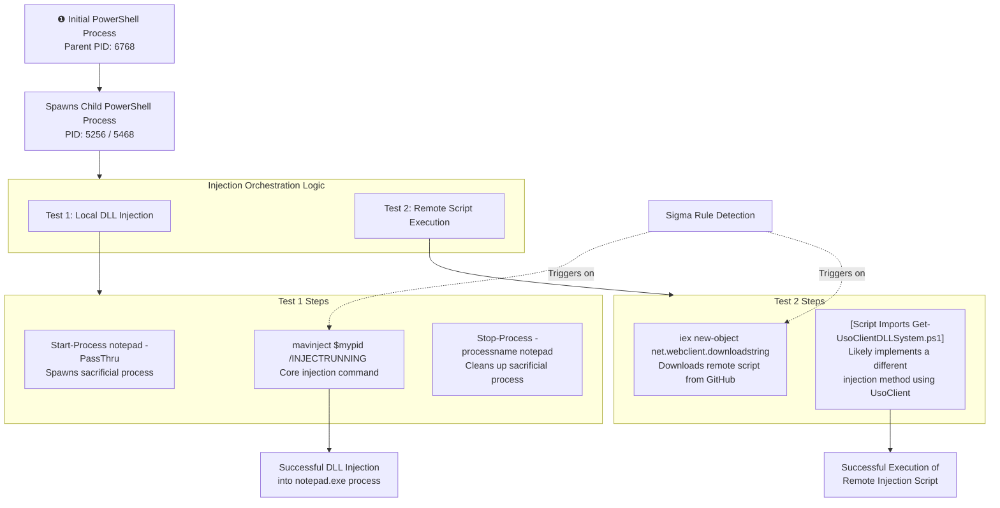

# Technical Detection Report: Process Injection - DLL Injection

## Overview

This report analyzes a Sigma rule designed to detect process injection attempts using the legitimate tool `mavinject.exe` orchestrated via PowerShell, consistent with MITRE ATT&CK technique **T1055.001 (Process Injection: Dynamic-link Library Injection)**. The analysis is based on two detailed logs showing the execution of this technique, one using a local DLL and another downloading a script from the internet.

## Attack Summary

- **MITRE Technique:** T1055.001 (Process Injection: Dynamic-link Library Injection)
- **Primary Tactics:** Defense Evasion (TA0005), Privilege Escalation (TA0004)
- **Description:** Adversaries abuse the Microsoft signed utility `mavinject.exe` (Microsoft Application Virtualization Injector) to execute arbitrary code in the address space of a separate live process. This allows them to evade process-based defenses and potentially gain elevated permissions.

## Attack Chain Analysis

The attack involves a PowerShell process orchestrating the injection sequence. The following flowchart details the exact steps, highlighting the core, immutable commands that must be present for the technique to work.

## Immutable Detection Points

The rule's effectiveness hinges on targeting the unchangeable commands and tool names required to perform this specific injection method.

### 1. Execution of Mavinject
**Indicator:** `mavinject`
**Why Immutable:** `mavinject.exe` is the name of the legitimate Microsoft binary being abused. The adversary cannot change this filename without breaking the technique, as it is the tool that performs the injection. The command must be called as `mavinject`.

### 2. Mavinject Injection Flag
**Indicator:** `/INJECTRUNNING`
**Why Immutable:** This is the specific command-line flag passed to `mavinject.exe` to instruct it to inject a DLL into a running process. This flag is required for this specific abuse case and is a primary indicator of malicious use.

### 3. PowerShell Download Cradle
**Indicator:** `iex (new-object net.webclient).downloadstring`
**Why Immutable:** This is a well-known and largely immutable pattern for downloading and executing remote PowerShell scripts in memory. The cmdlets `Invoke-Expression` (`iex`) and `Net.WebClient.DownloadString` are fixed .NET class and method names that must be used for this specific task.

### 4. Script Indicator
**Indicator:** `Get-UsoClientDLLSystem.ps1`
**Why Immutable:** While the URL can change, the name of the specific script being fetched (`Get-UsoClientDLLSystem.ps1`) is a strong indicator. This script is a known proof-of-concept for another privilege escalation/injection technique abusing `UsoClient.exe`.

## Sigma Rule Analysis

### Rule Effectiveness

Your rule is **well-structured and has a high probability of detecting real-world attacks** that use this specific technique. It correctly focuses on the core, immutable components of the command line.

**Strengths:**
1.  **Precision Logic:** The use of `contains|all` for the `mavinject` selection ensures that both the tool name and the specific injection flag are present, reducing false positives on legitimate, unrelated uses of `mavinject`.
2.  **Coverage of Two Techniques:** The rule successfully covers both the local injection method (Test 1) and the remote script fetch method (Test 2) observed in the logs.
3.  **Correct Data Source:** Targeting `sysmon` Event ID 1 (Process Creation) is the ideal data source for detecting the execution of `mavinject.exe` and the PowerShell commands.

**Areas for Potential Enhancement:**
1.  **Over-reliance on PowerShell Parent:** The rule currently requires the `Image` to be `powershell.exe`. A sophisticated adversary could use a different parent process (e.g., `cmd.exe`, `wscript.exe`) to launch the `mavinject` command. The rule could be broadened by making the `Image` filter for the injector selection more generic (e.g., `Image|endswith: '\mavinject.exe'`) and then correlating with a suspicious parent process in a separate field.
2.  **Specificity of Download Cradle:** The `dll_inject` selection is very broad. The string `iex` is common, and `webclient` and `downloadstring` appear in many legitimate scripts. Adding a more specific indicator like the script name (`Get-UsoClientDLLSystem`) or the domain (`raw.githubusercontent.com`) would drastically reduce false positives. However, this also makes the rule easier to bypass by changing the script location.
3.  **Missing Process Correlation:** The most robust detection would correlate the start of the target process (e.g., `notepad.exe`) with the subsequent `mavinject` command targeting its PID. This is best done in a SIEM with a correlation rule, not a single-event Sigma rule.

### Final Verdict on Rule Strength

**Grade: B+**

This is a **good and usable Sigma rule**. It correctly identifies the key technical indicators required for the attack to function. It would have successfully detected both of the provided test cases.

For a production environment, its main weakness is the potential for false positives on the download cradle side and the possibility of evasion by using a non-PowerShell parent process. With minor adjustments, such as adding the known script name to the `dll_inject` selection and potentially creating a separate rule for `mavinject` execution regardless of parent, it can be made even more robust.

## Mitigation Recommendations

1.  **Restrict / Audit Mavinject Usage:** Use application control solutions like AppLocker or WDAC to block `mavinject.exe` for non-administrative users or from executing in unusual locations (e.g., user temp directories). At a minimum, audit its execution.
2.  **PowerShell Hardening:** Implement PowerShell Constrained Language Mode and deep script logging. This can prevent the automatic execution of download cradles and provide more visibility into the scripts themselves.
3.  **Network Restrictions:** Restrict outbound internet access for endpoints where it is not required. This can prevent the download of remote scripts from public repositories like GitHub.
4.  **Endpoint Detection and Response (EDR):** Deploy an EDR solution that can detect the specific behavior of one process writing to and executing code in another process's memory space, regardless of the tool used.

## Conclusion

The provided Sigma rule effectively captures the core immutable structure of a T1055.001 attack that abuses `mavinject.exe`. The rule is precise and based on sound logic, targeting the necessary commands and tools. While it could be enhanced for broader coverage and lower false positives, it represents a solid foundation for detecting this specific injection technique and would be a valuable addition to a security team's detection capabilities.