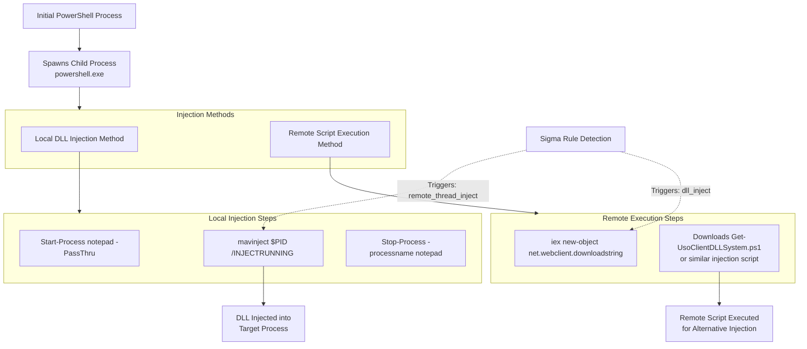

# Technical Detection Report: Process Injection via Mavinject and PowerShell Download Cradles

## Overview
This report analyzes a Sigma rule designed to detect process injection attempts using `mavinject.exe` and suspicious PowerShell download patterns, consistent with MITRE ATT&CK technique **T1055.001 (Process Injection: Dynamic-link Library Injection)**.

## Attack Summary
- **MITRE Technique:** T1055.001 (Process Injection: Dynamic-link Library Injection)
- **Primary Tactics:** Defense Evasion (TA0005), Privilege Escalation (TA0004)
- **Description:** Adversaries abuse the Microsoft-signed utility `mavinject.exe` to inject DLLs into running processes, combined with PowerShell download cradles to retrieve remote scripts for additional injection techniques.

## Attack Chain Analysis
The attack involves PowerShell processes orchestrating injection sequences using either local DLL injection or remote script execution. The detection rule focuses on two primary attack vectors.



## Immutable Detection Points

### 1. Mavinject Execution Pattern
**Indicator:** `mavinject` with `/INJECTRUNNING` flag
**Why Immutable:** The `mavinject.exe` binary name and the `/INJECTRUNNING` command-line flag are required components for this injection technique and cannot be altered without breaking functionality.

### 2. PowerShell Download Cradle
**Indicator:** `iex (new-object net.webclient).downloadstring`
**Why Immutable:** This specific syntax using `Invoke-Expression`, `Net.WebClient`, and `DownloadString` represents the fundamental pattern for downloading and executing remote content in PowerShell.

### 3. Script File Extension
**Indicator:** `.ps1` file extension in download strings
**Why Immutable:** PowerShell scripts require the `.ps1` extension, making this a consistent indicator in remote download attempts.

## Sigma Rule Analysis

### Rule Effectiveness
```yaml
detection:
  event_id:
    EventID: 1
  remote_thread_inject:
    Image|endswith: '\powershell.exe'
    CommandLine|contains|all:
      - 'mavinject'
      - '/INJECTRUNNING'
  dll_inject:
    Image|endswith: '\powershell.exe'
    CommandLine|contains|all:
      - 'iex'
      - 'webclient'
      - 'downloadstring'
      - '.ps1'
  condition: event_id and (remote_thread_inject or dll_inject)
```

The rule effectively targets two distinct attack patterns with appropriate logic conditions.

### Detection Logic
The rule triggers on two primary conditions:
1. **Mavinject Injection:** PowerShell processes containing both 'mavinject' and '/INJECTRUNNING' in command line
2. **PowerShell Download Cradle:** PowerShell processes containing download cradle patterns with .ps1 file references

### False Positive Considerations
**Potential false positive scenarios:**

```powershell
# Legitimate administrative use of mavinject (rare but possible)
mavinject 1234 /INJECTRUNNING C:\approved\application.dll

# Legitimate PowerShell script downloads for administration
iex (New-Object Net.WebClient).DownloadString('https://company-server/scripts/deployment.ps1')

# Development or testing activities
iex (New-Object Net.WebClient).DownloadString('https://github.com/company/legit-tool/script.ps1')
```

**Specific false positive cases:**
- Software deployment tools using mavinject for legitimate application virtualization
- DevOps pipelines downloading PowerShell scripts from internal repositories
- System administrators using download patterns for legitimate automation scripts

## Mitigation Recommendations

1. **Application Control:** Implement application whitelisting to restrict mavinject.exe execution to authorized paths and users
2. **PowerShell Restriction:** Use Constrained Language Mode to limit PowerShell capabilities for standard users
3. **Network Monitoring:** Implement egress filtering to control outbound web requests from PowerShell
4. **Process Monitoring:** Deploy EDR solutions that can detect cross-process injection attempts regardless of the tool used
5. **Script Logging:** Enable PowerShell script block logging to capture the content of downloaded scripts

## Conclusion

The Sigma rule provides effective detection for process injection techniques using mavinject.exe and PowerShell download cradles. The rule correctly focuses on immutable components of these attacks—the specific tool name, command-line flags, and download patterns—that adversaries cannot easily change without breaking their attack functionality.

While the rule may generate some false positives in environments with extensive PowerShell automation, the specific combination requirements in each detection clause provide reasonable specificity. For production deployment, additional contextual filtering or correlation with other suspicious events could further refine the detection accuracy.

The rule represents a solid foundation for detecting T1055.001 techniques and provides valuable coverage for a common attack pattern that leverages legitimate system tools for malicious purposes.