# Technical Detection Report: PowerShell Command and Scripting Interpreter Abuse

## Overview
This report analyzes a Sigma rule designed to detect suspicious PowerShell execution patterns associated with MITRE ATT&CK technique **T1059.001 (Command and Scripting Interpreter: PowerShell)**. The analysis covers multiple attack variants including encoded commands, remote execution, suspicious cmdlets, and registry manipulation.

## Attack Summary
- **MITRE Technique:** T1059.001 (Command and Scripting Interpreter: PowerShell)
- **Primary Tactics:** Execution (TA0002), Defense Evasion (TA0005)
- **Description:** Adversaries abuse PowerShell for various malicious activities including code execution, credential dumping, lateral movement, and persistence establishment.

## Attack Chain Analysis
The following flowchart details the attack patterns across multiple tests and how the Sigma rule detects them:

```mermaid
flowchart TD
    A["Initial Execution<br>CMD or PowerShell"] --> B["PowerShell Process"];

    subgraph AttackVariants[Test Techniques]
        direction TB
        
        subgraph Test6[Test 6: MSXML COM Object]
            T6A["MSXML2.ServerXmlHttp COM object<br>New-Object creation"]
            T6B["HTTP request methods<br>.Open, .Send, .ResponseText"]
            T6C["Remote content execution<br>IEX $comMsXml.ResponseText"]
            T6A --> T6B --> T6C
        end

        subgraph Test10[Test 10: Fileless Execution]
            T10A["Registry storage<br>Encoded payload in registry"]
            T10B["Base64 decoding<br>FromBase64String conversion"]
            T10C["Fileless execution<br>No file written to disk"]
            T10A --> T10B --> T10C
        end

        subgraph Test12[Test 12: PSSession & Lateral Movement]
            T12A["PowerShell remoting<br>New-PSSession creation"]
            T12B["Network discovery<br>Test-Connection usage"]
            T12C["File operations<br>Set-Content/Get-Content"]
            T12A --> T12B --> T12C
        end

        subgraph Test14_15_16[Tests 14-16: Encoded Commands]
            T14A["Encoded command parameters<br>-e, -enc, -encodedcommand"]
            T14B["Obfuscated execution<br>Base64 encoded payloads"]
            T14C["Argument encoding<br>-EncodedArguments parameter"]
            T14A --> T14B --> T14C
        end

        subgraph Test17[Test 17: Obfuscated Execution]
            T17A["Heavily obfuscated code<br>String concatenation"]
            T17B["Compressed syntax<br>Minimal whitespace"]
            T17C["Indirect execution<br>Multiple encoding layers"]
            T17A --> T17B --> T17C
        end

        subgraph Test18[Test 18: Malicious Cmdlets]
            T18A["PowerSploit cmdlets<br>Invoke-Mimikatz, etc."]
            T18B["Privilege escalation<br>PowerUp module"]
            T18C["Reconnaissance<br>PowerView functions"]
            T18A --> T18B --> T18C
        end
    end

    B --> AttackVariants

    subgraph SigmaDetection[Sigma Rule Detection Points]
        S1["Detection: suspicious_patterns⎪1<br>MSXML COM object patterns"]
        S2["Detection: suspicious_patterns⎪2<br>Encoded command flags"]
        S3["Detection: suspicious_patterns⎪3<br>PSSession & file operations"]
        S4["Detection: suspicious_patterns⎪4<br>Malicious cmdlet names"]
        S5["Detection: suspicious_patterns⎪5<br>Registry manipulation"]
        S6["Detection: suspicious_patterns⎪6<br>WMI parent with encoding"]
        S7["Detection: suspicious_patterns⎪7<br>Stealthy file cleanup"]
    end

    Test6 -.-> S1
    Test10 -.-> S5
    Test12 -.-> S3
    Test14_15_16 -.-> S2
    Test17 -.-> S2
    Test18 -.-> S4

    AttackVariants --> C["Malicious Activities<br>• Code execution<br>• Credential access<br>• Lateral movement<br>• Defense evasion"]
    
    D["Sigma Rule Coverage"] -.->|"Covers Test 6"| S1
    D -.->|"Covers Test 10"| S5
    D -.->|"Covers Test 12"| S3
    D -.->|"Covers Tests 14-17"| S2
    D -.->|"Covers Test 18"| S4
```



## Immutable Detection Points

### 1. MSXML COM Object Patterns
**Indicator:** `New-Object`, `.ServerXmlHttp`, `.Open`, `.Send`, `.ResponseText`
**Why Immutable:** These are specific .NET class names and method names required for HTTP requests via COM.

### 2. Encoded Command Parameters
**Indicator:** `-e`, `-enc`, `-encodedcommand`, `/enc`, `/encodedcommand`
**Why Immutable:** These are the official parameter names for encoded command execution in PowerShell.

### 3. PSSession and Network Patterns
**Indicator:** `New-PSSession`, `-ComputerName`, `Test-Connection`, `Set-Content`, `Get-Content`
**Why Immutable:** These are fixed cmdlet names and parameter names for remote sessions and file operations.

### 4. Malicious Cmdlet Names
**Indicator:** PowerSploit cmdlets like `Invoke-Mimikatz`, `Get-GPPPassword`, `PowerUp`, `PowerView`
**Why Immutable:** These are the specific function names from well-known offensive PowerShell frameworks.

### 5. Registry Manipulation Patterns
**Indicator:** `reg.exe add /d` with PowerShell parent containing `Set-Content`
**Why Immutable:** This combination indicates encoded payload storage in registry.

### 6. WMI Parent with Encoding
**Indicator:** PowerShell with `-NoProfile` and encoding flags spawned from `WmiPrvSE.exe`
**Why Immutable:** This pattern suggests WMI-based PowerShell execution with obfuscation.

### 7. Stealthy Cleanup Operations
**Indicator:** `Remove-Item -Force -ErrorAction Ignore` targeting temp files or registry
**Why Immutable:** This specific syntax indicates evidence removal attempts.

## Sigma Rule Analysis

### Rule Effectiveness
The Sigma rule uses a comprehensive multi-pattern approach with seven distinct detection scenarios:

```yaml
detection:
  suspicious_patterns|1: # MSXML COM objects (Test 6)
  suspicious_patterns|2: # Encoded commands (Tests 14-17)
  suspicious_patterns|3: # PSSession & operations (Test 12)
  suspicious_patterns|4: # Malicious cmdlets (Test 18)
  suspicious_patterns|5: # Registry manipulation (Test 10)
  suspicious_patterns|6: # WMI parent with encoding
  suspicious_patterns|7: # Stealth cleanup
  
  condition: (1 of suspicious_patterns)
```

### Detection Coverage
- **Test 6:** MSXML COM object HTTP requests → Detected by `suspicious_patterns|1`
- **Test 10:** Fileless registry execution → Detected by `suspicious_patterns|5` 
- **Test 12:** PSSession and lateral movement → Detected by `suspicious_patterns|3`
- **Tests 14-16:** Various encoded command patterns → Detected by `suspicious_patterns|2`
- **Test 17:** Obfuscated execution → Detected by `suspicious_patterns|2`
- **Test 18:** Malicious cmdlet execution → Detected by `suspicious_patterns|4`

### False Positive Considerations
**Potential false positive scenarios:**

```powershell
# Legitimate administrative scripts
powershell.exe -EncodedCommand VwByAGkAdABlAC0ASABvAHMAdAAgACIASABlAGwAbABvACIA

# System management tasks
New-PSSession -ComputerName server01
Test-Connection server02

# DevOps automation
Set-Content -Path config.json -Value $config
```

**Realistic assessment:** The combination of multiple specific patterns significantly reduces false positives. Most legitimate usage doesn't combine these techniques in suspicious ways.

## Mitigation Recommendations

1. **PowerShell Hardening:** Implement Constrained Language Mode and disable legacy protocols
2. **Application Control:** Restrict PowerShell execution through AppLocker or WDAC
3. **Logging Enhancement:** Enable PowerShell module logging and script block logging
4. **Network Monitoring:** Detect unusual PowerShell network activity and remote sessions
5. **User Training:** Educate administrators about PowerShell security risks
6. **Endpoint Protection:** Deploy EDR solutions with PowerShell behavior monitoring

## Conclusion

The Sigma rule provides comprehensive detection for T1059.001 techniques across multiple test scenarios. The rule correctly focuses on immutable components of these attacks—specific cmdlet names, parameter patterns, method invocations, and execution behaviors—that adversaries cannot easily alter without breaking functionality.

The multi-pattern approach with seven distinct detection scenarios provides robust coverage for various attack techniques while maintaining reasonable specificity. The rule effectively identifies PowerShell abuse for code execution, lateral movement, credential access, and defense evasion, providing valuable coverage for one of the most common attack techniques in Windows environments.