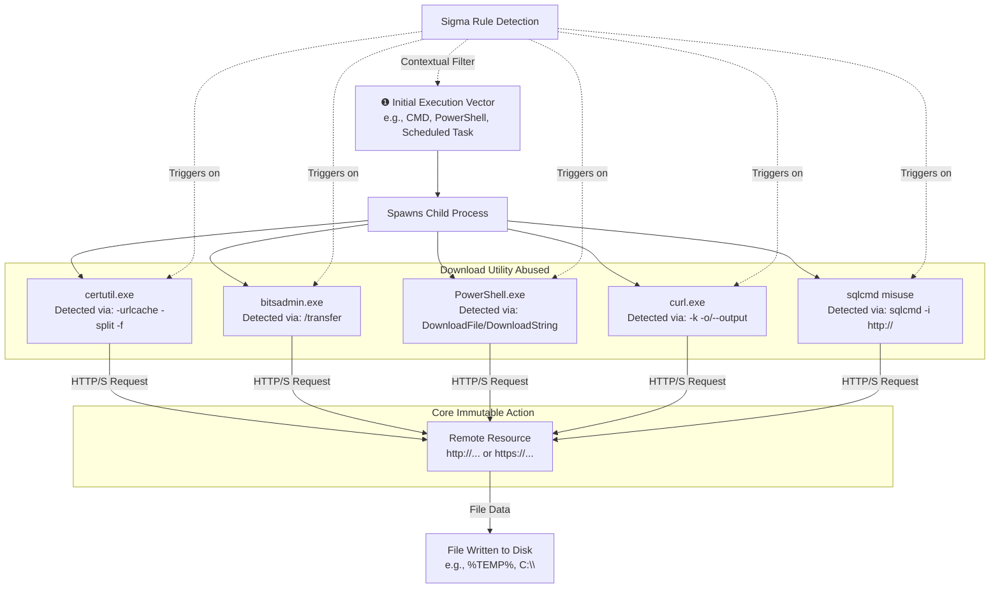

# Technical Detection Report: Detection of T1105 Ingress Tool Transfer via Legitimate Utilities

## Overview

This report analyzes a Sigma rule designed to detect the abuse of built-in Windows utilities and PowerShell for file download operations, consistent with MITRE ATT&CK technique **T1105 (Ingress Tool Transfer)**. The rule focuses on identifying the immutable command-line patterns that cannot be easily altered without breaking functionality, providing robust coverage against multiple implementation variants.

## Attack Summary

- **MITRE Technique:** T1105 (Ingress Tool Transfer)
- **Primary Tactics:** Command and Control, Exfiltration (potentially)
- **Description:** Adversaries leverage native system tools (`certutil`, `bitsadmin`, `curl`, `PowerShell`) to download files from remote systems. This is a fundamental technique for bringing tools into a compromised environment or exfiltrating data to an external attacker-controlled server.

## Attack Chain Analysis

The rule captures the core, immutable action of T1105: using a trusted system process to transfer a file over the network. The following flowchart details the common execution chain and the specific detection points covered by the rule.

## Immutable Detection Points

The rule's strength lies in targeting the unchangeable syntax required for these utilities to function for downloading.

### 1. CertUtil Abuse
**Indicator:** `certutil.exe -urlcache -split -f [URL] [output_file]`
**Why Immutable:** The `-urlcache`, `-split`, and `-f` flags are the specific arguments required for certutil to download a file from a URL. Changing these would break the command.

### 2. BITSAdmin Abuse
**Indicator:** `bitsadmin.exe /transfer [JOB_NAME] [URL] [output_file]`
**Why Immutable:** The `/transfer` argument is the fundamental command to create a file transfer job. The syntax requiring a job name, URL, and local path is fixed.

### 3. PowerShell .NET WebClient Abuse
**Indicator:** `DownloadFile(` or `DownloadString(` method calls, often with `New-Object System.Net.WebClient`
**Why Immutable:** These are the literal names of .NET class methods. An adversary cannot change the method name `DownloadFile` without causing a runtime error.

### 4. PowerShell Invoke-WebRequest (iwr) Abuse
**Indicator:** `Invoke-WebRequest` or its alias `iwr` with parameters `-Uri` and `-OutFile`.
**Why Immutable:** `-Uri` and `-OutFile` are the officially defined parameter names for this cmdlet. While positional parameters can be used, the names are almost always present in scripts.

### 5. Curl Abuse
**Indicator:** `curl.exe -k [URL] -o [output_file]`
**Why Immutable:** The `-o`/`--output` flag is the primary way to write output to a file. The `-k`/`--insecure` flag is commonly used to bypass certificate validation in adversarial use.

### 6. Contextual Parent Process
**Indicator:** These utilities launched from common shells like `cmd.exe` or `powershell.exe`.
**Why Important:** While not immutable, this adds crucial context. Legitimate system use of `bitsadmin` might be launched from `svchost` (BITS service), while adversarial use is almost always from a command-line interpreter.

## Sigma Rule Analysis

### Rule Effectiveness

Your rule is **strong and provides high-quality coverage**. It successfully implements a "multi-basket" approach, creating separate, precise detection logic for each utility and then combining them under a single condition. This is more effective and maintainable than a single complex expression.

**Strengths:**
1.  **Precision:** Each sub-detection (e.g., `certutil:`, `bitsadmin:`) uses specific, immutable command-line arguments, leading to high-fidelity alerts.
2.  **Coverage:** It captures all common living-off-the-land techniques for T1105 in a single rule.
3.  **Context Awareness:** The inclusion of `ParentImage` filters adds valuable context that helps separate potential malicious use from legitimate administrative or system activity.
4.  **Structure:** The logical grouping using `and` and `or` conditions is correct and efficient.

**Areas for Potential Enhancement:**
1.  **Process Path Specificity:** The current condition `Image|endswith: '\certutil.exe'` is good. For extra precision, you could use a path-specific condition like `Image|startswith: 'C:\Windows\System32\certutil.exe'` to ignore copies of these utilities in unusual directories, which is a common evasion tactic. However, this might also increase false negatives if System32 is bypassed.
2.  **Exclusion of Normal Parent Processes:** To reduce false positives, you could consider adding a `filter` section to exclude known-legitimate parent processes for specific tools. For example, `bitsadmin` launched from `svchost.exe` (the BITS service) is likely legitimate, while from `cmd.exe` is more suspicious.
3.  **Focus on Rare Combinations:** The most suspicious events are often these utilities downloading from the internet *and* writing to a user writable location like `%TEMP%`. Incorporating a condition for the output path (e.g., `CommandLine|contains: '$env:TEMP'` or `'AppData\Local\Temp'`) could further refine the rule, though it should be an enhancement, not a replacement for the current logic.

### Final Verdict on Rule Strength

**Grade: A-**

This is a robust, well-structured detection rule. It correctly focuses on the low-level, immutable indicators inherent to the abuse of these utilities. The logic is sound and it would effectively detect the Atomic Red Team tests provided, as well as real-world adversary activity. The minor enhancements suggested are refinements that could make it exceptional, but the rule in its current state is already very strong and usable in production.

## Mitigation Recommendations

1.  **Network Restrictions:** Implement egress firewall rules or web proxies to block unauthorized outbound connections, especially to public repositories like raw.githubusercontent.com from non-developer workstations.
2.  **Application Control:** Use tools like AppLocker or Windows Defender Application Control (WDAC) to restrict the execution of `curl.exe`, `bitsadmin.exe`, and `certutil.exe` to specific users or scenarios, or to prevent execution from user writable directories.
3.  **PowerShell Logging:** Ensure PowerShell Script Block Logging and Module Logging are enabled. This provides deeper visibility into the commands being executed than process creation alone.
4.  **User Privileges:** Adhere to the principle of least privilege. Many of these techniques require user privileges to execute, but limiting administrator privileges can hinder broader exploitation.
5.  **Endpoint Detection and Response (EDR):** Deploy an EDR solution that can correlate process lineage with network events, providing a complete picture of the intrusion chain.

## Conclusion

The provided Sigma rule is a high-quality detection for T1105. It demonstrates a strong understanding of the technique by targeting the fundamental, unchangeable command-line syntax that adversaries must use to successfully transfer tools.

By combining precise signatures for multiple utilities with relevant contextual filters, the rule achieves a balance between comprehensive coverage and detection fidelity. This rule would serve as a valuable component of a defense-in-depth strategy, effectively identifying a critical step in the adversary lifecycle when they attempt to introduce their tools into the environment.