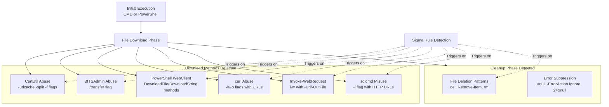

# Technical Detection Report: Ingress Tool Transfer via Multiple Utilities

## Overview
This report analyzes a comprehensive Sigma rule designed to detect the abuse of various built-in Windows utilities and PowerShell for file download operations, consistent with MITRE ATT&CK technique **T1105 (Ingress Tool Transfer)**. The rule covers multiple implementation variants across Atomic Red Team tests.

## Attack Summary
- **MITRE Technique:** T1105 (Ingress Tool Transfer)
- **Primary Tactics:** Command and Control (TA0011)
- **Description:** Adversaries leverage native system tools (`certutil`, `bitsadmin`, `curl`, PowerShell, `sqlcmd`) to download files from remote systems, followed by cleanup operations to remove evidence.
- **Covered Techniques:** CertUtil abuse, BITSAdmin abuse, PowerShell WebClient, curl abuse, Invoke-WebRequest, sqlcmd misuse, and cleanup patterns

## Attack Chain & Detection Analysis
The rule captures multiple variants of T1105 across different utilities and execution methods. The following flowchart details the attack patterns and detection coverage.



## Immutable Detection Points

### 1. CertUtil Abuse Detection
**Indicator:** `certutil.exe -urlcache -split -f [URL]`
**Why Immutable:** The `-urlcache`, `-split`, and `-f` flags are required for certutil to download files from URLs and cannot be altered without breaking functionality.

### 2. BITSAdmin Abuse Detection
**Indicator:** `bitsadmin.exe /transfer [JOB_NAME] [URL]`
**Why Immutable:** The `/transfer` argument is fundamental for BITSAdmin file transfer operations with fixed syntax requirements.

### 3. PowerShell WebClient Detection
**Indicator:** `DownloadFile(` or `DownloadString(` methods with `WebClient`
**Why Immutable:** These are literal .NET method names that cannot be changed without causing runtime errors.

### 4. curl Abuse Detection
**Indicator:** `curl.exe -k [URL] -o [file]` or `--insecure --output`
**Why Immutable:** The `-o/--output` and `-k/--insecure` flags are required for file downloads with SSL bypass.

### 5. Invoke-WebRequest Detection
**Indicator:** `iwr` or `Invoke-WebRequest` with `-Uri` and `-OutFile`
**Why Immutable:** These are the official parameter names for the PowerShell cmdlet.

### 6. Cleanup Operation Detection
**Indicator:** `del >nul 2>&1`, `Remove-Item -Force -ErrorAction Ignore`, `rm 2>$null`
**Why Immutable:** These patterns represent standard syntax for suppressing command output and error messages during cleanup operations.

## Sigma Rule Analysis

### Rule Effectiveness
```yaml
detection:
  select_id:
    EventID: 1
  certutil:
    Image|endswith: '\certutil.exe'
    ParentImage|endswith: ['\cmd.exe', '\powershell.exe']
    CommandLine|contains|all: ['-urlcache', '-split', '-f']
    CommandLine|contains: ['http', 'https']
  bitsadmin:
    Image|endswith: '\bitsadmin.exe'
    ParentImage|endswith: ['\cmd.exe', '\powershell.exe']
    CommandLine|contains|all: ['/transfer']
    CommandLine|contains: ['http', 'https']
  # Additional detection clauses for other methods...
  condition: >
    select_id and (
      certutil or bitsadmin or
      (powershell_web_A and powershell_web_B and powershell_web_C) or
      (cmd_curl and cmd_curl_urls) or
      (powershell_iwr and powershell_iwr_1 and powershell_iwr_2) or
      powershell_sqlcmd_zip or
      (cleanup_proc and (cleanup_del or cleanup_removeitem or cleanup_rm))
    )
```

The rule provides comprehensive coverage through multiple detection clauses with appropriate logic conditions.

### Detection Logic
The rule uses a multi-faceted approach:
1. **Utility-specific detection** for certutil, bitsadmin, curl, and sqlcmd
2. **PowerShell method detection** using combination logic (A AND B AND C)
3. **Cleanup pattern detection** for evidence removal
4. **Contextual filtering** using parent process relationships

### False Positive Considerations
**Potential false positive scenarios:**

```cmd
# Legitimate certutil usage for certificate management
certutil -verifyctl -split -f skipext

# Legitimate BITSAdmin usage for managed transfers
bitsadmin /transfer MyJob https://internal-server/update.exe C:\updates\update.exe

# Legitimate PowerShell web requests
Invoke-WebRequest -Uri https://chocolatey.org/install.ps1 -OutFile install.ps1

# Normal cleanup operations in scripts
del temporary_file.txt >nul 2>&1
```

**Specific false positive cases:**
- System administrators using these utilities for legitimate file transfers
- DevOps pipelines downloading scripts or packages from internal repositories
- Software deployment tools using BITSAdmin for managed downloads
- Maintenance scripts performing routine cleanup operations

## Mitigation Recommendations

1. **Application Control:** Implement application whitelisting to restrict non-essential utilities like certutil, bitsadmin, and curl to authorized users and paths
2. **Network Monitoring:** Implement egress filtering to control outbound web requests, especially to external repositories
3. **PowerShell Restriction:** Use Constrained Language Mode and enable script block logging for enhanced visibility
4. **Process Monitoring:** Deploy EDR solutions that can detect anomalous process chains and command-line patterns
5. **User Training:** Educate administrators about legitimate vs. suspicious uses of system utilities

## Conclusion

The Sigma rule provides extensive coverage for T1105 techniques across multiple utilities and execution methods. The rule correctly focuses on immutable components of these attacks—specific command-line flags, method names, and syntax patterns—that adversaries cannot easily alter without breaking functionality.

While the comprehensive nature of the rule may increase false positive rates in environments with extensive automation, the specific combination requirements and contextual filters provide reasonable specificity. For production deployment, additional tuning based on organizational use cases and environment-specific patterns would further enhance detection accuracy.

The rule represents a robust foundation for detecting ingress tool transfer techniques and provides valuable coverage for a critical stage in the cyber attack lifecycle where adversaries introduce tools into compromised environments.