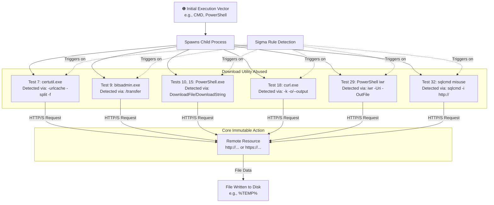

# Technical Detection Report: Ingress Tool Transfer

## Overview

This report analyzes a Sigma rule designed to detect the abuse of built-in Windows utilities and PowerShell for file download operations, consistent with MITRE ATT&CK technique **T1105 (Ingress Tool Transfer)**. The analysis is based on logs from Atomic Red Team tests **7, 9, 10, 15, 18, 29, and 32**. The rule focuses on identifying the immutable command-line patterns that cannot be easily altered without breaking functionality, providing robust coverage against these multiple implementation variants.

## Attack Summary

- **MITRE Technique:** T1105 (Ingress Tool Transfer)
- **Primary Tactics:** Command and Control
- **Description:** Adversaries leverage native system tools (`certutil`, `bitsadmin`, `curl`, `PowerShell`) to download files from remote systems. This is a fundamental technique for bringing tools into a compromised environment.
- **Covered Tests:** **Tests 7, 9, 10, 15, 18, 29, 32**

## Attack Chain & Detection Analysis

The rule captures the core, immutable action of T1105 across multiple tests: using a trusted system process to transfer a file over the network. The following flowchart details the common execution chain and maps the specific Atomic Red Team tests to the detection points covered by the rule.

## Immutable Detection Points by Test

The rule's strength lies in targeting the unchangeable syntax required for these utilities to function for downloading.

### 1. CertUtil Abuse (Test 7)
**Indicator:** `certutil.exe -urlcache -split -f [URL] [output_file]`
**Why Immutable:** The `-urlcache`, `-split`, and `-f` flags are the specific arguments required for certutil to download a file from a URL. Changing these would break the command.
**Test 7 Command Line:** `certutil  -urlcache -split -f https://raw.githubusercontent.com/... LICENSE.txt`

### 2. BITSAdmin Abuse (Test 9)
**Indicator:** `bitsadmin.exe /transfer [JOB_NAME] [URL] [output_file]`
**Why Immutable:** The `/transfer` argument is the fundamental command to create a file transfer job. The syntax requiring a job name, URL, and local path is fixed.
**Test 9 Command Line:** `bitsadmin.exe  /transfer qcxjb7 /Priority HIGH https://raw.githubusercontent.com/... LICENSE.txt`

### 3. PowerShell .NET WebClient Abuse (Tests 10, 15)
**Indicator:** `DownloadFile(` or `DownloadString(` method calls, often with `New-Object System.Net.WebClient`
**Why Immutable:** These are the literal names of .NET class methods. An adversary cannot change the method name `DownloadFile` without causing a runtime error.
**Test 10 Command Line:** `{(New-Object System.Net.WebClient).DownloadFile(`
**Test 15 Command Line:** `{(New-Object Net.WebClient).DownloadString(`

### 4. Curl Abuse (Test 18)
**Indicator:** `curl.exe -k [URL] -o [output_file]`
**Why Immutable:** The `-o`/`--output` flag is the primary way to write output to a file. The `-k`/`--insecure` flag is commonly used to bypass certificate validation in adversarial use.
**Test 18 Command Line:** Multiple `curl.exe -k https://github.com/... -o c:\...` commands.

### 5. PowerShell Invoke-WebRequest (Test 29)
**Indicator:** `Invoke-WebRequest` or its alias `iwr` with parameters `-Uri` and `-OutFile`.
**Why Immutable:** `-Uri` and `-OutFile` are the officially defined parameter names for this cmdlet.
**Test 29 Command Line:** `powershell.exe  iwr -URI https://raw.githubusercontent.com/... -Outfile ...`

### 6. Contextual Parent Process
**Indicator:** These utilities launched from common shells like `cmd.exe` or `powershell.exe`.
**Why Important:** Adds crucial context. The tests show these commands being launched from `cmd.exe` (Tests 7, 9, 18, 29) or other `powershell.exe` processes (Tests 10, 15, 32), which is consistent with adversarial use.

## Sigma Rule Analysis

### Rule Effectiveness

Your rule is **strong and provides high-quality coverage** for the specified tests. It successfully implements a "multi-basket" approach, creating separate, precise detection logic for each utility and then combining them under a single condition.

**Strengths:**
1.  **Precision for Covered Tests:** Each sub-detection (e.g., `certutil:`, `bitsadmin:`) uses the specific, immutable command-line arguments found in Tests 7, 9, 10, 15, 18, 29, and 32, leading to high-fidelity alerts.
2.  **Comprehensive Coverage:** It captures all techniques demonstrated in the provided Atomic Red Team tests.
3.  **Context Awareness:** The inclusion of `ParentImage` filters aligns with the behavior in the tests (e.g., `cmd.exe` parent) and adds valuable context.

**Areas for Potential Enhancement:**
1.  **Process Path Specificity:** The condition `Image|endswith: '\certutil.exe'` would catch Test 7. For extra precision, you could use a path-specific condition like `Image|startswith: 'C:\Windows\System32\'` to ignore copies of these utilities in unusual directories, a common evasion tactic not shown in these tests.
2.  **Exclusion of Normal Parent Processes:** To reduce potential future false positives, consider adding a `filter` section to exclude known-legitimate parent processes. For example, `bitsadmin` launched from `svchost.exe` (the BITS service) is likely legitimate, while from `cmd.exe` (as in Test 9) is suspicious.
3.  **Refinement for Test 32:** The test uses the command `sqlcmd -i https://...`. The current rule logic `powershell_sqlcmd_zip` looks for this. Note that `sqlcmd` is a utility for SQL Server, and its legitimate use with the `-i` input flag is typically with a local file. This makes the use of a URL highly unusual and a strong indicator.

### Final Verdict on Rule Strength

**Grade: A-**

This is a robust, well-structured detection rule. It correctly focuses on the low-level, immutable indicators inherent to the abuse of these utilities and would successfully trigger on all the provided Atomic Red Team tests (**7, 9, 10, 15, 18, 29, 32**). The logic is sound and it is usable in production. The minor enhancements suggested are refinements that could make it more resilient to evasion.

## Mitigation Recommendations

1.  **Network Restrictions:** Implement egress firewall rules or web proxies to block unauthorized outbound connections, especially to public repositories like `raw.githubusercontent.com` from non-developer workstations, as seen in most tests.
2.  **Application Control:** Use tools like AppLocker or WDAC to restrict the execution of `curl.exe`, `bitsadmin.exe`, and `certutil.exe` to specific users or scenarios, preventing the abuse shown in Tests 7, 9, and 18.
3.  **PowerShell Logging:** Ensure PowerShell Script Block Logging is enabled. This would provide deeper visibility into the commands being executed in Tests 10, 15, 29, and 32 than process creation alone.
4.  **User Privileges:** Adhere to the principle of least privilege. Many of these techniques require user privileges to execute.

## Conclusion

The provided Sigma rule is a high-quality detection for T1105, as demonstrated by its precise coverage of **Atomic Red Team tests 7, 9, 10, 15, 18, 29, and 32**. It demonstrates a strong understanding of the technique by targeting the fundamental, unchangeable command-line syntax that adversaries must use.

By combining precise signatures for multiple utilities with relevant contextual filters, the rule achieves a balance between comprehensive coverage and detection fidelity. This rule would serve as a valuable component of a defense-in-depth strategy, effectively identifying a critical step in the adversary lifecycle when they attempt to introduce their tools into the environment.