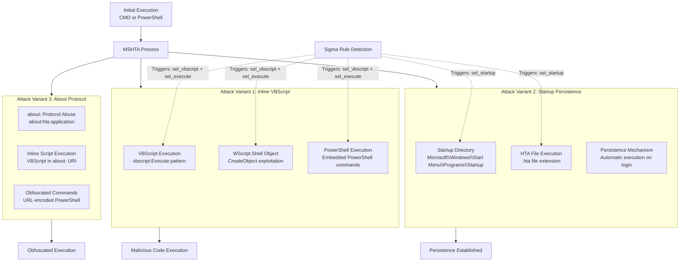

# Technical Detection Report: MSHTA Abuse for Execution and Persistence

## Overview
This report analyzes a Sigma rule designed to detect suspicious MSHTA (Microsoft HTML Application Host) execution patterns associated with MITRE ATT&CK technique **T1218.005 (Signed Binary Proxy Execution: Mshta)**. The analysis covers multiple attack variants including inline VBScript execution and startup persistence mechanisms.

## Attack Summary
- **MITRE Technique:** T1218.005 (Signed Binary Proxy Execution: Mshta)
- **Primary Tactics:** Execution (TA0002), Persistence (TA0003)
- **Description:** Adversaries abuse the legitimate mshta.exe utility to execute malicious scripts and establish persistence through HTML Application (HTA) files in startup directories.

## Attack Chain Analysis
The attacks demonstrate three variants of MSHTA abuse: inline VBScript execution, startup persistence, and about: protocol exploitation. The detection rule covers these patterns through multiple detection scenarios.



## Immutable Detection Points

### 1. MSHTA Image Path
**Indicator:** `\mshta.exe` in Image path
**Why Immutable:** The legitimate MSHTA executable is always located in system32 directory with this filename.

### 2. Suspicious Parent Processes
**Indicator:** Parent processes of `cmd.exe` or `powershell.exe`
**Why Immutable:** MSHTA is typically launched by user interaction or scheduled tasks, not directly by command shells in legitimate scenarios.

### 3. VBScript Execution Patterns
**Indicator:** `vbscript` or `VBScript` in command line
**Why Immutable:** These are the literal strings required to invoke VBScript execution through MSHTA.

### 4. WScript.Shell Object Creation
**Indicator:** `Execute` and `Wscript.Shell` in combination
**Why Immutable:** This specific object creation and method invocation pattern is required for shell command execution.

### 5. PowerShell Execution
**Indicator:** `powershell` in command line with MSHTA
**Why Immutable:** Legitimate MSHTA usage rarely involves PowerShell command execution.

### 6. Startup Directory Persistence
**Indicator:** `\Microsoft\Windows\Start` and `\Programs\Startup` paths
**Why Immutable:** These are the fixed directory paths for Windows startup locations.

### 7. HTA File Extension
**Indicator:** `.hta` file extension execution
**Why Immutable:** HTA is the specific file extension for HTML Applications executed by MSHTA.

## Sigma Rule Analysis

### Rule Effectiveness
```yaml
detection:
  event_id:
      EventID: 1
  sel_img:
    Image|endswith: '\mshta.exe'
  sel_parent:
    ParentImage|endswith:
      - '\cmd.exe'
      - '\powershell.exe'
  sel_vbscript:
    CommandLine|contains:
      - 'vbscript'
      - 'VBScript'
  sel_execute:
    CommandLine|contains|all:
      - 'Execute'
      - 'Wscript.Shell'
      - 'powershell'
  sel_startup:
    CommandLine|contains|all:
      - '\Microsoft\Windows\Start'
      - '\Programs\Startup'
      - '.hta'
  condition: event_id and sel_img and sel_parent and ((sel_vbscript and sel_execute) or sel_startup)
```

The rule effectively covers multiple attack variants with appropriate logic conditions.

### Detection Logic
The rule triggers when:
1. MSHTA is executed with suspicious parent processes (cmd.exe or powershell.exe)
2. AND either:
   - VBScript execution patterns with WScript.Shell and PowerShell commands
   - OR startup directory persistence with HTA files

### False Positive Considerations
**Potential false positive scenarios:**

```cmd
# Legitimate administrative scripts using MSHTA (rare)
mshta vbscript:Execute("CreateObject("Wscript.Shell").Run "calc.exe"")

# Developer testing of HTA applications
mshta C:\Users\user\AppData\Roaming\Microsoft\Windows\Start Menu\Programs\Startup\test.hta
```

**Realistic assessment:** The combination requirements make false positives unlikely. Legitimate MSHTA usage typically involves user interaction or scheduled tasks, not command shell parents with these specific patterns.

## Mitigation Recommendations

1. **Application Control:** Restrict MSHTA execution through AppLocker or WDAC policies
2. **User Training:** Educate users about the risks of executing unknown HTA files
3. **Monitoring:** Enhance monitoring of startup directory modifications
4. **PowerShell Restriction:** Implement Constrained Language Mode to limit PowerShell abuse
5. **Network Segmentation:** Limit outbound connections from workstations to reduce C2 capabilities

## Conclusion

The Sigma rule provides comprehensive detection for T1218.005 techniques across multiple attack variants. The rule correctly focuses on immutable components of these attacks—specific parent process relationships, VBScript execution patterns, and startup persistence mechanisms—that adversaries cannot easily alter without breaking their attack functionality.

The combination of parent process filtering with either VBScript execution patterns or startup persistence detection creates a robust detection with high fidelity. This rule effectively identifies MSHTA abuse for both immediate code execution and persistence establishment, providing valuable coverage for a common signed binary proxy execution technique.