# Technical Detection Report: Regsvr32 Abuse for Defense Evasion

## Overview
This report analyzes a Sigma rule designed to detect suspicious Regsvr32 execution patterns associated with MITRE ATT&CK technique **T1218.010 (Signed Binary Proxy Execution: Regsvr32)**. The analysis covers multiple attack variants including scriptlet execution, COM abuse, and DLL sideloading.

## Attack Summary
- **MITRE Technique:** T1218.010 (Signed Binary Proxy Execution: Regsvr32)
- **Primary Tactics:** Defense Evasion (TA0005), Execution (TA0002)
- **Description:** Adversaries abuse the legitimate regsvr32.exe utility to execute malicious code through scriptlets, COM objects, and DLL files while evading security controls.

## Attack Chain Analysis
The following flowchart details the attack patterns across multiple Atomic Tests and how the Sigma rule detects them:

```mermaid
flowchart TD
    A["Initial Execution<br>CMD or PowerShell"] --> B["Regsvr32 Process"];

    subgraph AttackVariants[Atomic Test Techniques]
        direction TB
        
        subgraph Test1[Test 1: Local COM Scriptlet]
            T1A["/s /u /i flags<br>with local .sct file"]
            T1B["Silent unregistered<br>scriptlet execution"]
            T1A --> T1B
        end

        subgraph Test2[Test 2: Remote COM Scriptlet]
            T2A["/s /u /i flags<br>with remote URL"]
            T2B["Remote scriptlet<br>execution from web"]
            T2A --> T2B
        end

        subgraph Test3[Test 3: Local DLL Execution]
            T3A["Architecture detection<br>IF-ELSE logic"]
            T3B["SysWOW64 bypass<br>for x64 systems"]
            T3C["Silent DLL loading<br>with /s flag"]
            T3A --> T3B --> T3C
        end

        subgraph Test4[Test 4: Non-DLL Registration]
            T4A["Altered file extensions<br>.jpg instead of .dll"]
            T4B["Registry manipulation<br>with non-standard files"]
            T4A --> T4B
        end

        subgraph Test5[Test 5: Silent DLL Install]
            T5A["/s /i flags combination<br>with DLL path"]
            T5B["DllRegisterServer<br>automatic call"]
            T5A --> T5B
        end
    end

    B --> AttackVariants

    subgraph SigmaDetection[Sigma Rule Detection Points]
        S1["Detection: selection_cmdline_flags<br>/s /i .dll pattern"]
        S2["Detection: selection_parent_conditional<br>IF-ELSE logic in parent"]
        S3["Detection: selection_parent_temp<br>%temp% usage with /s flag"]
    end

    Test1 -.-> S1
    Test2 -.-> S1
    Test3 -.-> S2
    Test4 -.-> S3
    Test5 -.-> S1

    AttackVariants --> C["Malicious Payload Execution<br>• Code execution<br>• Persistence<br>• Defense evasion"]
    
    D["Sigma Rule Coverage"] -.->|"Covers Tests 1,2,5"| S1
    D -.->|"Covers Test 3"| S2
    D -.->|"Covers Test 4"| S3
```



## Immutable Detection Points

### 1. Regsvr32 Image Path
**Indicator:** `\regsvr32.exe` in Image path
**Why Immutable:** The legitimate Regsvr32 executable is always located in system directories with this filename.

### 2. Suspicious Parent Processes
**Indicator:** Parent processes of `cmd.exe` or `powershell.exe`
**Why Immutable:** Regsvr32 is typically launched by installation programs or system processes, not directly by command shells in legitimate scenarios.

### 3. Automation Flags
**Indicator:** `/s` (silent) and `/i` (install) flags
**Why Immutable:** These are the literal command-line flags required for silent scriptlet execution.

### 4. DLL File References
**Indicator:** `.dll` in command line with automation flags
**Why Immutable:** DLL registration typically doesn't require silent/install flags in legitimate scenarios.

### 5. Conditional Execution Logic
**Indicator:** `IF` and `ELSE` statements in parent command line
**Why Immutable:** This pattern indicates architecture detection for DLL loading evasion.

### 6. Temp Directory Usage
**Indicator:** `%temp%` directory references
**Why Immutable:** Legitimate DLL registration rarely uses temporary directories.

## Sigma Rule Analysis

### Rule Effectiveness
```yaml
detection:
    selection_event:
        EventID: 1
    selection_target:
        Image|endswith: '\regsvr32.exe'
    selection_parent:
        ParentImage|endswith:
            - '\cmd.exe'
            - '\powershell.exe'
    selection_cmdline_flags:
        CommandLine|contains|all:
            - '/s'
            - '/i'
            - '.dll'
    selection_parent_conditional:
        ParentCommandLine|contains|all:
          - '/s'
          - ' IF '
          - ' ELSE '
    selection_parent_temp:
        ParentCommandLine|contains|all:
          - '/s'
          - '%temp%'
    
    condition: selection_event and selection_target and selection_parent and 
              (selection_cmdline_flags or selection_parent_conditional or selection_parent_temp)
```

The rule effectively covers multiple attack variants with comprehensive detection logic.

### Detection Logic
The rule triggers when:
1. Regsvr32 is executed with suspicious parent processes (cmd.exe or powershell.exe)
2. AND any of the following:
   - Automation flags (/s /i) with DLL references (Tests 1, 2, 5)
   - Conditional logic in parent command line (Test 3)
   - Temp directory usage with silent flag (Test 4)

### False Positive Considerations
**Potential false positive scenarios:**

```cmd
# Legitimate software installation scripts
regsvr32.exe /s /i:legitimate.sct scrobj.dll

# System administration tasks
regsvr32.exe /s C:\Windows\System32\valid.dll
```

**Realistic assessment:** The combination requirements significantly reduce false positives. Legitimate Regsvr32 usage typically doesn't combine command shell parents with automation flags and conditional logic.

## Mitigation Recommendations

1. **Application Control:** Restrict Regsvr32 execution through AppLocker or WDAC policies
2. **Script Monitoring:** Enhance monitoring of command shell activities and script execution
3. **Network Protection:** Block outbound connections from Regsvr32 to prevent remote scriptlet loading
4. **File Integrity Monitoring:** Monitor for unusual DLL and scriptlet files in temp directories
5. **User Training:** Educate administrators about Regsvr32 abuse techniques

## Conclusion

The Sigma rule provides comprehensive detection for T1218.010 techniques across all five Atomic Tests. The rule correctly focuses on immutable components of these attacks—specific parent process relationships, command-line flag patterns, and execution behaviors—that adversaries cannot easily alter without breaking their attack functionality.

The multi-condition approach provides robust coverage for scriptlet execution (Tests 1-2), DLL sideloading with architecture detection (Test 3), file extension evasion (Test 4), and silent DLL installation (Test 5). This rule effectively identifies Regsvr32 abuse for defense evasion and code execution, providing valuable coverage for a common signed binary proxy execution technique. The combination of parent process analysis with command-line pattern matching creates a high-fidelity detection suitable for production environments.