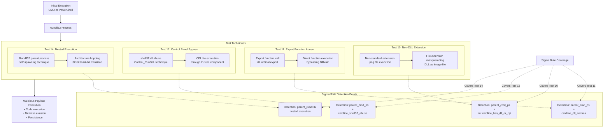

# Technical Detection Report: Rundll32 Execution Abuse

## Overview
This report analyzes a Sigma rule designed to detect suspicious Rundll32 execution patterns associated with MITRE ATT&CK technique **T1218.011 (Signed Binary Proxy Execution: Rundll32)**. The analysis covers multiple attack variants including DLL sideloading, export function abuse, and control panel item execution.

## Attack Summary
- **MITRE Technique:** T1218.011 (Signed Binary Proxy Execution: Rundll32)
- **Primary Tactics:** Defense Evasion (TA0005), Execution (TA0002)
- **Description:** Adversaries abuse the legitimate rundll32.exe utility to execute malicious code through DLL files, export function calls, and control panel item bypasses.

## Attack Chain Analysis
The following flowchart details the attack patterns across multiple tests and how the Sigma rule detects them:



## Immutable Detection Points

### 1. Rundll32 Image Path
**Indicator:** `\rundll32.exe` in Image path
**Why Immutable:** The legitimate Rundll32 executable is always located in system directories with this filename.

### 2. Suspicious Parent Processes
**Indicator:** Parent processes of `cmd.exe` or `powershell.exe`
**Why Immutable:** Rundll32 is typically launched by system processes or legitimate applications, not directly by command shells.

### 3. Export Function Syntax
**Indicator:** `,#` pattern in command line
**Why Immutable:** This specific syntax indicates direct export function calling, unusual for legitimate operations.

### 4. File Extension Patterns
**Indicator:** Non-standard extensions (.png) with Rundll32
**Why Immutable:** Rundll32 should only execute DLL and CPL files, not image files.

### 5. Control Panel Abuse
**Indicator:** `shell32.dll,Control_RunDLL` pattern
**Why Immutable:** This specific pattern indicates abuse of control panel execution mechanisms.

### 6. Nested Execution
**Indicator:** Rundll32 launching Rundll32
**Why Immutable:** Legitimate usage rarely involves nested Rundll32 processes.

## Sigma Rule Analysis

### Rule Effectiveness
```yaml
detection:
  selection_image:
    EventID: 1
    Image|endswith: '\rundll32.exe'

  parent_cmd_ps:
    ParentImage|endswith:
      - '\cmd.exe'
      - '\powershell.exe'

  cmdline_dll_comma:
    CommandLine|contains|all:
      - '.dll'
      - ',#'

  cmdline_has_dll_or_cpl:
    CommandLine|contains:
      - '.dll'
      - '.cpl'

  cmdline_shell32_abuse:
    CommandLine|contains|all:
      - 'shell32.dll,Control_RunDLL'

  cmdline_cpl:
    CommandLine|contains: '.cpl'

  parent_rundll32:
    ParentImage|endswith: '\rundll32.exe'

  condition: selection_image and (
      (parent_cmd_ps and (cmdline_dll_comma or (not cmdline_has_dll_or_cpl) or (cmdline_shell32_abuse and not cmdline_cpl)))
      or parent_rundll32)
```

The rule effectively covers multiple attack variants with comprehensive detection logic.

### Detection Logic
The rule triggers when:
1. Rundll32 is executed with suspicious parent processes (cmd.exe or powershell.exe) AND:
   - Contains DLL with export function syntax (Test 11)
   - Lacks proper DLL/CPL extensions (Test 10)
   - Uses shell32.dll control panel abuse without CPL file (Test 12)
2. OR has Rundll32 as parent process (Test 14)

### False Positive Considerations
**Potential false positive scenarios:**

```cmd
# Legitimate administrative scripts
rundll32.exe legit.dll,ExportFunction

# System control panel operations
rundll32.exe shell32.dll,Control_RunDLL appwiz.cpl
```

**Realistic assessment:** The combination requirements significantly reduce false positives. Legitimate Rundll32 usage typically doesn't combine command shell parents with these specific suspicious patterns.

## Mitigation Recommendations

1. **Application Control:** Restrict Rundll32 execution through AppLocker or WDAC policies
2. **File Integrity Monitoring:** Monitor for non-standard extensions in execution paths
3. **Process Monitoring:** Detect nested Rundll32 execution chains
4. **Network Protection:** Block outbound connections from suspicious Rundll32 instances
5. **User Training:** Educate administrators about Rundll32 abuse techniques

## Conclusion

The Sigma rule provides comprehensive detection for T1218.011 techniques across multiple test scenarios. The rule correctly focuses on immutable components of these attacks—specific parent process relationships, command-line syntax patterns, and file extension anomalies—that adversaries cannot easily alter without breaking their attack functionality.

The multi-condition approach provides robust coverage for export function abuse (Test 11), file extension masquerading (Test 10), control panel mechanism bypass (Test 12), and nested execution (Test 14). This rule effectively identifies Rundll32 abuse for defense evasion and code execution, providing valuable coverage for a common signed binary proxy execution technique. The combination of parent process analysis with command-line pattern matching creates a high-fidelity detection suitable for production environments.