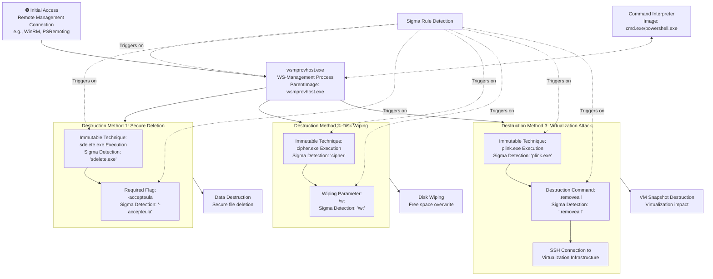

# Technical Detection Report: Data Destruction via Remote Management

## Overview

This report analyzes a sophisticated data destruction attack that leverages Windows Remote Management (WS-Management) services to execute destructive commands while evading traditional process monitoring. The attack abuses legitimate system utilities to perform irreversible data deletion and system destruction operations.

## Attack Summary

- **MITRE Technique:** T1485 (Data Destruction)
- **Primary Tactics:** Impact
- **Description:** Attackers use WS-Management channels to remotely execute destructive utilities including secure deletion tools, disk wiping commands, and virtualization infrastructure destruction commands, all while maintaining the appearance of legitimate administrative activity.

## Attack Chain Analysis

The attack follows a multi-stage approach that leverages trusted remote management protocols to execute destructive operations. The following flowchart details the exact steps and highlights where the Sigma rule's detection logic triggers on the immutable components of the attack.



## Immutable Detection Points

### 1. WS-Management Parent Process
**Indicator:** `wsmprovhost.exe` as parent process
**Why Immutable:** This is the standard Windows process for handling WS-Management requests. Attackers cannot change this parent relationship without breaking remote execution capabilities.

### 2. Secure Deletion Signature
**Indicator:** `sdelete.exe` with `-accepteula` flag
**Why Immutable:** The `-accepteula` parameter is required for non-interactive execution of SDelete and cannot be omitted or altered.

### 3. Disk Wiping Pattern
**Indicator:** `cipher.exe` with `/w:` parameter
**Why Immutable:** The `/w:` switch is the only cipher parameter that performs destructive wiping operations.

### 4. Virtualization Destruction
**Indicator:** `plink.exe` with `.removeall` commands
**Why Immutable:** The `.removeall` syntax is specific to VMware's vSphere API for snapshot destruction and cannot be altered without breaking functionality.

## Sigma Rule Analysis

### Rule Effectiveness
The Sigma rule `Suspicious Data Destruction via wsmprovhost Parent` effectively targets all immutable components of this attack:

```yaml
detection:
  selection_image:
    EventID: 1
    ParentImage|endswith: '\wsmprovhost.exe'
    Image|endswith:
      - '\cmd.exe'
      - '\powershell.exe'
  selections|1:
    CommandLine|contains|all:
      - 'plink.exe'
      - '.removeall'
  selections|2:
    CommandLine|contains|all: 
      - 'sdelete.exe'
      - '-accepteula'
  selections|3:
    CommandLine|contains|all: 
      - 'cipher'
      - '/w:'
  condition: selection_image and (1 of selections)
```

### Detection Logic
The rule triggers when these immutable elements appear together in process creation events:
1. **Remote Management Context:** Detection of `wsmprovhost.exe` as parent process
2. **Command Interpreter:** Execution through `cmd.exe` or `powershell.exe`
3. **Destructive Patterns:** Presence of specific tool and parameter combinations:
   - SDelete with acceptance flag
   - Cipher with wiping parameter
   - Plink with snapshot destruction commands

As shown in the flowchart, the Sigma rule detects the critical junction where remote management processes spawn destructive operations, providing comprehensive coverage against this technique.

### False Positive Considerations
While the rule has high fidelity, potential false positives include:

**Legitimate Administrative Activities:**
```cmd
# Approved secure deletion of sensitive data
cmd.exe /c sdelete.exe -accepteula C:\temp\confidential_data\

# Legitimate disk sanitization during decommissioning
powershell.exe -Command "cipher /w:D:\retired_servers\"

# Authorized virtualization maintenance
cmd.exe /c plink.exe -batch vcenter01 -l admin -pw "***" "vim-cmd vmsvc/snapshot.removeall 42"
```

**Enterprise Management Patterns:**
- Automated cleanup scripts run through SCCM or similar management tools
- Security compliance scripts that require secure deletion
- Virtual infrastructure maintenance automation

## Mitigation Recommendations

1. **Access Control:** Restrict WS-Management privileges to necessary administrative accounts only
2. **Application Control:** Implement whitelisting for destructive utilities like `sdelete.exe`, `plink.exe`
3. **Monitoring:** Enhance auditing of remote management sessions and command execution
4. **Backup Strategy:** Maintain immutable backups and rapid restoration capabilities
5. **Network Segmentation:** Isolate management interfaces from general network access

## Conclusion

This attack demonstrates advanced data destruction techniques that abuse trusted remote management channels to evade detection. The detection rule provides high-fidelity alerting by focusing on the immutable technical components that attackers cannot change without breaking their attack chain. The combination of specific parent process relationships, destructive tool signatures, and required command parameters creates a reliable detection signature for identifying this sophisticated attack pattern.

The Sigma rule effectively covers multiple destruction methodologies while maintaining specificity through the requirement of both the `wsmprovhost.exe` parent process and destructive command patterns. Organizations should implement this detection while establishing appropriate exception processes for legitimate administrative use cases.