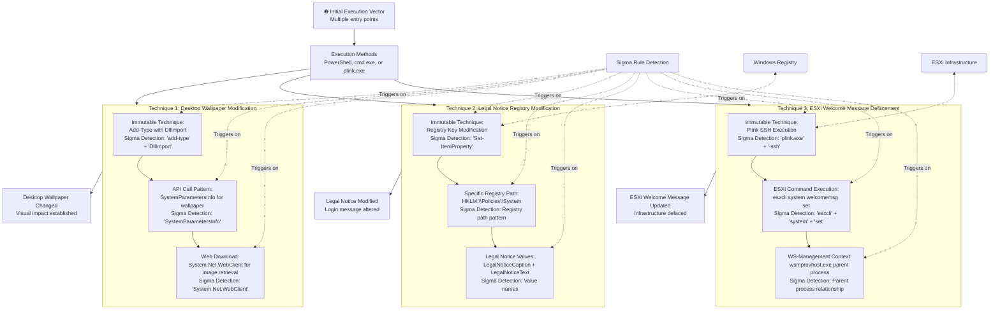

# Technical Detection Report: System Banner and ESXi Defacement Activity

## Overview

This report analyzes system defacement techniques targeting both Windows environments and VMware ESXi infrastructure. The attacks demonstrate methods adversaries use to modify system banners, legal notices, and welcome messages to display intimidating or misleading information to users.

## Attack Summary

- **MITRE Technique:** T1491.001 (Defacement: Internal Defacement)
- **Primary Tactics:** Impact
- **Description:** Attackers modify system banners, legal notices, and welcome messages to intimidate or mislead users, often as part of ransomware campaigns or destructive attacks. These techniques target both Windows systems (registry modifications) and ESXi infrastructure (SSH command execution).

## Attack Chain Analysis

The attacks demonstrate multiple techniques for system defacement across different platforms. The following flowchart details the various approaches and highlights where the Sigma rule's detection logic triggers on the immutable components of these attacks.



## Immutable Detection Points

### 1. Desktop Wallpaper Modification Patterns
**Indicator:** `Add-Type` with `DllImport` and `SystemParametersInfo`
**Why Immutable:** The Windows API function names and .NET reflection patterns are fixed and cannot be changed without breaking functionality.

### 2. Legal Notice Registry Operations
**Indicator:** `Set-ItemProperty` with `HKLM:\...\Policies\System` path and `LegalNoticeCaption`/`LegalNoticeText` values
**Why Immutable:** The registry path and value names are defined by Windows and cannot be altered.

### 3. ESXi Defacement Commands
**Indicator:** `plink.exe` with `-ssh` and `esxcli system set` commands
**Why Immutable:** The plink executable name, SSH parameter, and ESXi command syntax are fixed.

### 4. WS-Management Context
**Indicator:** `wsmprovhost.exe` parent process for remote execution
**Why Immutable:** The WS-Management host process name is defined by Windows and cannot be changed.

## Sigma Rule Analysis

### Rule Effectiveness
The Sigma rule `System Banner / ESXi Defacement Activity` effectively targets all immutable components of these defacement attacks:

```yaml
detection:
  selection_banner_addtype:
    EventID: 1
    Image|endswith:
      - '\powershell.exe'
      - '\cmd.exe'
    CommandLine|contains|all:
      - 'Get-ItemProperty'
      - 'DllImport'
      - 'SystemParametersInfo'
      - 'System.Net.WebClient'
      - 'add-type'
  selection_registry_legalnotice:
    EventID: 1
    Image|endswith:
      - '\powershell.exe'
      - '\cmd.exe'
    CommandLine|contains|all:
      - 'Set-ItemProperty'
      - 'HKLM:*\\Policies\\System'
      - 'LegalNoticeCaption'
      - 'LegalNoticeText'
  selection_esx_defacement:
    EventID: 1
    ParentImage|endswith: '\wsmprovhost.exe'
    Image|endswith:
      - '\powershell.exe'
      - '\cmd.exe'
    CommandLine|contains|all:
      - 'plink.exe'
      - '-ssh'
      - 'esxcli'
      - 'system'
      - 'set'
  condition: selection_banner_addtype or selection_registry_legalnotice or selection_esx_defacement
```

### Detection Logic
The rule triggers when these immutable elements appear in process creation events:

1. **Desktop Wallpaper Changes:** Detection of API call patterns and web download activities for wallpaper modification
2. **Registry Modifications:** Presence of legal notice registry value changes in specific system paths
3. **ESXi Defacement:** Plink SSH execution with ESXi welcome message modification commands from WS-Management context

As shown in the flowchart, the Sigma rule detects multiple defacement techniques across different target platforms and execution methods.

### False Positive Considerations
**Legitimate Administrative Activities:**
```powershell
# Approved corporate branding scripts
Add-Type -TypeDefinition $wallpaperCode
[Win32.Wallpaper]::SetWallpaper("C:\Branding\wallpaper.jpg")

# Legitimate policy compliance updates
Set-ItemProperty HKLM:\SOFTWARE\Microsoft\Windows\CurrentVersion\Policies\System -Name LegalNoticeCaption -Value "Company Policy" -Type String

# Authorized ESXi management operations
plink.exe -batch esxi01.company.com -ssh -l admin -pw "****" "esxcli system welcomemsg set -m 'Maintenance Notice'"
```

**Enterprise Management Patterns:**
- Corporate desktop branding and standardization
- Security policy compliance enforcement
- Infrastructure maintenance notifications
- Automated configuration management

## Mitigation Recommendations

1. **Access Control:** Restrict registry modification and remote management capabilities to authorized administrative accounts
2. **Monitoring:** Enhance auditing of registry changes, especially in HKLM\Policies\System
3. **Application Control:** Implement application whitelisting to prevent unauthorized plink.exe usage
4. **Network Segmentation:** Restrict SSH access to ESXi management interfaces
5. **Logging:** Enable comprehensive PowerShell logging and process creation monitoring
6. **Backup Strategy:** Maintain system configuration backups to quickly restore legitimate settings

## Conclusion

This analysis demonstrates various techniques adversaries use to deface systems through banner modifications, legal notice changes, and ESXi welcome message alterations. The detection rule provides high-fidelity alerting by focusing on the immutable technical components that attackers cannot change without breaking their attack chains. The combination of specific API patterns, registry operations, and remote command execution creates a reliable detection signature for identifying defacement activities.

The Sigma rule effectively covers both Windows and ESXi defacement techniques while maintaining specificity through the requirement of multiple correlated indicators. Organizations should implement this detection while establishing appropriate exception processes for legitimate administrative activities, particularly focusing on the business justification for system banner modifications rather than blocking the functionality entirely.