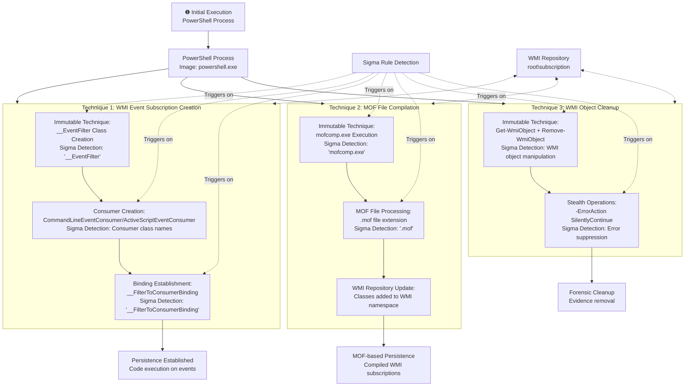

# Technical Detection Report: WMI Event Subscription Persistence

## Overview

This report analyzes Windows Management Instrumentation (WMI) event subscription techniques used by adversaries to establish persistence on Windows systems. The attacks demonstrate how malicious code can be triggered by system events through WMI event filters, consumers, and bindings.

## Attack Summary

- **MITRE Technique:** T1546.003 (Event Triggered Execution: Windows Management Instrumentation Event Subscription)
- **Primary Tactics:** Persistence, Privilege Escalation
- **Description:** Adversaries abuse WMI event subscriptions to execute malicious code when specific system events occur, providing persistence that survives reboots and operates with elevated SYSTEM privileges through the WMI Provider Host process.

## Attack Chain Analysis

The attacks demonstrate multiple techniques for establishing WMI-based persistence through event subscriptions. The following flowchart details the various approaches and highlights where the Sigma rule's detection logic triggers on the immutable components of these attacks.



## Immutable Detection Points

### 1. WMI Event Subscription Classes
**Indicator:** `__EventFilter`, `__FilterToConsumerBinding`, `CommandLineEventConsumer`, `ActiveScriptEventConsumer`
**Why Immutable:** These are the official WMI class names for event subscriptions defined by Microsoft and cannot be changed without breaking functionality.

### 2. MOF Compilation Process
**Indicator:** `mofcomp.exe` with `.mof` file extension
**Why Immutable:** mofcomp.exe is the official Microsoft utility for compiling MOF files, and .mof is the standard file extension.

### 3. WMI Object Manipulation
**Indicator:** `Get-WmiObject` and `Remove-WmiObject` with error suppression
**Why Immutable:** These are the standard PowerShell cmdlets for WMI object management with fixed names and common error handling patterns.

### 4. Namespace Specification
**Indicator:** `root\subscription` namespace operations
**Why Immutable:** This is the standard WMI namespace for event subscriptions and cannot be altered.

## Sigma Rule Analysis

### Rule Effectiveness
The Sigma rule `Suspicious PowerShell WMI Persistence` effectively targets all immutable components of WMI-based persistence attacks:

```yaml
detection:
  selection|wmi:
    EventID: 1
    Image|endswith: '\powershell.exe'
    CommandLine|contains|all:
      - '__EventFilter'
      - '__FilterToConsumerBinding'
    CommandLine|contains:
      - 'CommandLineEventConsumer'
      - 'ActiveScriptEventConsumer'
  selection|mof:
    EventID: 1
    Image|endswith: '\powershell.exe'
    CommandLine|contains|all:
      - 'mofcomp.exe'
      - '.mof'
  selection|cleanup:
    EventID: 1
    Image|endswith: '\powershell.exe'
    CommandLine|contains|all:
      - 'Get-WmiObject'
      - 'Remove-WmiObject'
      - '-ErrorAction SilentlyContinue'
  condition: 1 of selection
```

### Detection Logic
The rule triggers when these immutable elements appear in PowerShell process creation events:

1. **WMI Subscription Creation:** Detection of WMI event subscription class names and binding operations
2. **MOF File Compilation:** Presence of mofcomp.exe with .mof file processing
3. **WMI Cleanup Operations:** Suspicious WMI object removal with error suppression

As shown in the flowchart, the Sigma rule detects multiple techniques for WMI-based persistence across different execution phases.

### False Positive Considerations
**Legitimate Administrative Activities:**
```powershell
# Approved system monitoring WMI subscriptions
New-CimInstance -Namespace root/subscription -ClassName __EventFilter -Property @{
    name='LegitimateMonitor';
    EventNameSpace='root\CimV2';
    QueryLanguage="WQL";
    Query="SELECT * FROM Win32_ProcessStartTrace WHERE ProcessName='important.exe'"
}

# Legitimate MOF file deployment for management
mofcomp.exe "C:\Program Files\ManagementTool\config.mof"

# Authorized WMI maintenance scripts
Get-WmiObject -Namespace root/subscription -Class __EventFilter | 
Where-Object {$_.Name -like "OldMonitor*"} | 
Remove-WmiObject -ErrorAction SilentlyContinue
```

**Enterprise Management Patterns:**
- System monitoring and alerting solutions using WMI event subscriptions
- Configuration management tools deploying MOF files
- IT automation scripts performing WMI maintenance
- Security monitoring solutions using WMI for event collection

## Mitigation Recommendations

1. **Access Control:** Restrict WMI namespace modification to authorized administrative accounts
2. **Monitoring:** Enhance auditing of WMI event subscription creation and modification
3. **Application Control:** Implement application whitelisting to prevent unauthorized mofcomp.exe usage
4. **Privilege Management:** Limit SYSTEM-level WMI operations to necessary applications
5. **Logging:** Enable comprehensive WMI activity logging and PowerShell transcription
6. **Network Segmentation:** Restrict WMI traffic to management zones

## Conclusion

This analysis demonstrates sophisticated techniques adversaries use to establish persistence through WMI event subscriptions. The detection rule provides high-fidelity alerting by focusing on the immutable technical components that attackers cannot change without breaking their attack chains. The combination of specific WMI class names, compilation utility patterns, and object manipulation signatures creates a reliable detection signature for identifying unauthorized WMI persistence activity.

The Sigma rule effectively covers both creation and cleanup phases of WMI-based attacks while maintaining specificity through the requirement of multiple correlated indicators. Organizations should implement this detection while establishing appropriate exception processes for legitimate WMI management activities, particularly focusing on the business justification for event subscriptions and MOF file deployment rather than blocking the functionality entirely.