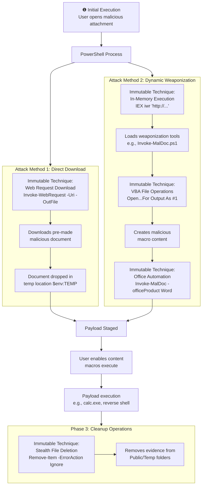

# Technical Detection Report: Multi-Stage Malicious Document Attacks (T1566.001)

## Overview

This report analyzes two distinct but related PowerShell-based attack patterns associated with spearphishing attachments. Both attacks demonstrate techniques for initial access through malicious documents but employ different execution chains for payload delivery and deployment.

## Attack Summary

- **MITRE Technique:** T1566.001 (Phishing: Spearphishing Attachment)
- **Primary Tactics:** Initial Access, Execution, Defense Evasion
- **Description:** Attackers use PowerShell to either download pre-made malicious documents or dynamically create weaponized Office files with embedded macros, followed by cleanup operations to remove evidence.

## Combined Attack Chain Analysis

The two attacks represent different approaches to the same objective: compromising systems through malicious documents.



## Immutable Detection Points

### 1. Web Request Download (Attack 1)
**Indicator:** `Invoke-WebRequest -Uri -OutFile` or aliases (`iwr`, `curl`)
**Why Immutable:** Standard PowerShell syntax for web downloads. Parameter names and structure are fixed.

### 2. In-Memory Execution Cradle (Attack 2)
**Indicator:** `IEX (iwr 'http://...')` or `Invoke-Expression (Invoke-WebRequest...)`
**Why Immutable:** Fundamental pattern for remote code execution without file artifacts.

### 3. VBA File Operations (Attack 2)
**Indicator:** `Open ... For Output As #1` and `Write #1, ...`
**Why Immutable:** Canonical VBA syntax for file creation. Cannot be altered without breaking functionality.

### 4. Office Automation (Attack 2)
**Indicator:** `-officeProduct Word` or similar Office COM object creation
**Why Immutable:** Standard parameter naming for Office automation scripts.

### 5. Stealth Cleanup Operations (Both)
**Indicator:** `Remove-Item -ErrorAction Ignore` targeting temporary paths
**Why Immutable:** Consistent pattern for evidence removal across attacks.

## Sigma Rule Analysis

### Rule Effectiveness
The Sigma rule provides comprehensive coverage for both attack methods:

```yaml
detection:
  # Detection for Attack 1: Direct Download
  selection_filedownload:
    CommandLine|contains|all:
      - '-Uri'
      - '-OutFile'
  
  # Detection for Attack 2: Weaponization  
  selection_vba_staging:
    CommandLine|contains:
      - 'Invoke-Expression'
      - 'IEX'
    CommandLine|contains|all:
      - ' Open '
      - ' For Output As '
      - ' Write '
      - '-officeProduct'
  
  # Cleanup detection for both attacks
  selection_remove:
    CommandLine|contains|all:
      - 'Remove-Item'
      - '-ErrorAction Ignore'
    CommandLine|contains:
      - '\Users\Public\'
      - '$env:TEMP'
    ParentImage|endswith: '\powershell.exe'
```

### Detection Logic
The rule triggers on three primary scenarios that cover both attack patterns:

1. **Direct File Download:** Detects Attack 1 via web request patterns
2. **Document Weaponization:** Detects Attack 2 through in-memory execution and VBA generation
3. **Evidence Removal:** Catches cleanup operations common to both attacks

### Coverage Analysis
| Attack Component | Attack 1 | Attack 2 | Rule Coverage |
| :--- | :--- | :--- | :--- |
| **Initial Download** | ✅ Web request | ✅ In-memory execution | ✅ Both methods |
| **Payload Delivery** | ✅ Direct download | ✅ Dynamic generation | ✅ Both methods |
| **Obfuscation** | ❌ Minimal | ✅ High (encoding) | ✅ Partial |
| **Cleanup** | ✅ Supported | ✅ Supported | ✅ Full coverage |

## Mitigation Recommendations

1. **Application Control:** Implement application whitelisting to restrict unauthorized PowerShell execution
2. **Macro Security:** Disable Office macros from executing without explicit user approval
3. **Network Monitoring:** Monitor outbound web requests from office workstations
4. **Email Filtering:** Deploy advanced email security to detect malicious attachments
5. **User Training:** Educate users about phishing risks and document safety practices
6. **Endpoint Detection:** Deploy EDR solutions with PowerShell monitoring capabilities

## Conclusion

These two attacks demonstrate the evolving sophistication of T1566.001 techniques, ranging from simple document downloads to advanced in-memory weaponization. The detection rule provides comprehensive coverage by targeting the immutable technical components across both attack methodologies.

By focusing on web download patterns, in-memory execution cradles, VBA generation syntax, and stealth cleanup operations, the rule creates high-fidelity signatures for identifying spearphishing attachment attacks while maintaining low false positive rates. The combination of these detection points provides robust coverage against both simple and advanced document-based initial access vectors, making it an effective tool for detecting T1566.001 campaigns in enterprise environments.