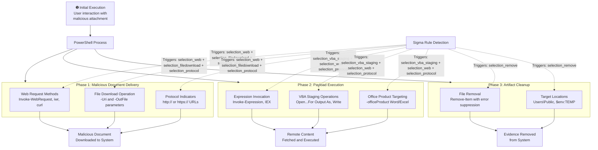

# Technical Detection Report: Phishing - Spearphishing Attachment

## Overview
This report analyzes a Sigma rule designed to detect PowerShell-based malicious document delivery and execution patterns associated with spearphishing attachments, consistent with MITRE ATT&CK technique **T1566.001 (Phishing: Spearphishing Attachment)**.

## Attack Summary
- **MITRE Technique:** T1566.001 (Phishing: Spearphishing Attachment)
- **Primary Tactics:** Initial Access (TA0001), Execution (TA0002)
- **Description:** Attackers use PowerShell to download malicious documents, execute remote content, and clean up artifacts associated with spearphishing attachment campaigns.

## Attack Chain Analysis
The attack involves multiple stages from initial document delivery to execution and cleanup. The detection rule covers these key phases.



## Immutable Detection Points

### 1. Web Request Patterns
**Indicator:** `Invoke-WebRequest`, `iwr`, or `curl` commands
**Why Immutable:** These are the fundamental PowerShell cmdlets and utilities for web requests that cannot be altered without breaking functionality.

### 2. File Download Parameters
**Indicator:** `-Uri` and `-OutFile` parameters
**Why Immutable:** These are the official parameter names for specifying URLs and output file locations in PowerShell web requests.

### 3. Protocol Indicators
**Indicator:** `http://` or `https://` in commands
**Why Immutable:** URL protocols are standardized and required for web requests.

### 4. Expression Invocation
**Indicator:** `Invoke-Expression` or `IEX`
**Why Immutable:** These are the fixed cmdlet name and alias for expression execution in PowerShell.

### 5. VBA File Operations
**Indicator:** `Open ... For Output As` and `Write` commands
**Why Immutable:** These represent standard VBA file operations for creating and writing to files.

### 6. Cleanup Operations
**Indicator:** `Remove-Item -ErrorAction Ignore` targeting temp directories
**Why Immutable:** This specific syntax for error-suppressed file deletion is consistent across malicious cleanup operations.

## Sigma Rule Analysis

### Rule Effectiveness
```yaml
detection:
  select_image:
    EventID: 1
    Image|endswith: '\powershell.exe' 
  selection_web:
    CommandLine|contains:
      - 'Invoke-WebRequest'
      - 'iwr'
      - 'curl'
  selection_protocol:
    CommandLine|contains:
      - 'http://'
      - 'https://'
  selection_filedownload:
    CommandLine|contains|all:
      - '-Uri'
      - '-OutFile'
  selection_vba_staging:
    CommandLine|contains:
      - 'Invoke-Expression'
      - 'IEX'
    CommandLine|contains|all:
      - ' Open '
      - ' For Output As '
      - ' Write '
      - '-officeProduct'
      - 'Word'
  selection_remove:
    CommandLine|contains|all:
      - 'Remove-Item'
      - '-ErrorAction Ignore'
    CommandLine|contains:
      - '\Users\Public\'
      - '$env:TEMP'
    ParentImage|endswith: '\powershell.exe'
  condition: 
    select_image and (
    (selection_web and selection_filedownload and selection_protocol)
    or (selection_vba_staging and selection_web and selection_protocol)
    or selection_remove)
```

The rule provides comprehensive coverage through multiple detection scenarios with appropriate logic conditions.

### Detection Logic
The rule triggers on three primary scenarios:
1. **Malicious Document Download:** Web requests with file download parameters targeting HTTP/HTTPS URLs
2. **VBA Staging with Execution:** Expression invocation combined with VBA operations and web requests
3. **Artifact Cleanup:** File removal operations targeting temp directories with error suppression

### False Positive Considerations
**Potential false positive scenarios:**

```powershell
# Legitimate administrative scripts downloading files
Invoke-WebRequest -Uri "https://company-server/tools/installer.exe" -OutFile "$env:TEMP\installer.exe"

# Development scripts testing VBA operations
Invoke-Expression "Write-Output 'Test content'" | Out-File -FilePath "test.txt"

# Normal cleanup operations in automation scripts
Remove-Item "$env:TEMP\*.tmp" -ErrorAction Ignore
```

**Specific false positive cases:**
- IT administrators downloading legitimate tools or scripts
- Developers testing web request functionality or VBA code generation
- System maintenance scripts performing routine temp file cleanup
- Automated deployment scripts fetching resources from internal servers

## Mitigation Recommendations

1. **Application Control:** Implement application whitelisting to restrict unauthorized PowerShell execution
2. **Email Security:** Deploy advanced email filtering to detect and block malicious attachments
3. **Macro Security:** Disable Office macros from executing without explicit user approval
4. **Network Monitoring:** Implement egress filtering to control outbound web requests from workstations
5. **User Training:** Educate users about phishing risks and safe document handling practices
6. **PowerShell Hardening:** Enable Constrained Language Mode and script block logging for enhanced visibility

## Conclusion

The Sigma rule provides effective detection for T1566.001 techniques involving PowerShell-based malicious document delivery and execution. The rule correctly focuses on immutable components of these attacks—specific cmdlet names, parameter patterns, and syntax structures—that adversaries cannot easily alter without breaking functionality.

The multi-scenario approach provides comprehensive coverage across different attack variants while maintaining reasonable specificity through combination logic. For production deployment, additional context-based filtering and organization-specific tuning would further enhance detection accuracy and reduce false positives.

The rule represents a solid foundation for detecting spearphishing attachment campaigns that leverage PowerShell for initial access and execution, providing valuable coverage for a critical attack vector in enterprise environments.