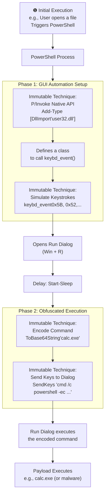

# Technical Detection Report: Phishing - Spearphishing Link

## Overview

This report analyzes a sophisticated PowerShell-based attack designed to evade detection by simulating user interaction with the Windows GUI. The attack leverages trusted system utilities to execute malicious code while bypassing standard command-line monitoring.

## Attack Summary

- **MITRE Technique:** T1566.002 (Phishing: Spearphishing Link)
- **Primary Tactics:** Initial Access
- **Description:** Attackers use a phishing link to deliver a payload that uses PowerShell to programmatically control Windows GUI elements, simulating keystrokes to execute obfuscated commands through trusted system dialogs.

## Attack Chain Analysis

The attack follows a two-phase approach that combines GUI automation with command obfuscation:



## Immutable Detection Points

### 1. Native API Import via P/Invoke
**Indicator:** `Add-Type` with `[DllImport("user32.dll")]`
**Why Immutable:** This is the standard .NET method for importing native Windows API functions. The DLL name (`user32.dll`) and import syntax cannot be changed without breaking functionality.

### 2. GUI Input Simulation
**Indicator:** `keybd_event` function calls
**Why Immutable:** The `keybd_event` API is the fundamental Windows function for simulating keyboard input. Virtual key codes (0x5B for Windows key, 0x52 for 'R') are defined by the Windows API.

### 3. Command Obfuscation
**Indicator:** `ToBase64String` with `Unicode.GetBytes`
**Why Immutable:** This is the only method to properly encode commands for PowerShell's `-EncodedCommand` (-ec) parameter.

### 4. GUI Automation
**Indicator:** `SendKeys` or `SendWait` from `System.Windows.Forms`
**Why Immutable:** The standard .NET namespace and methods for programmatic GUI interaction.

## Sigma Rule Analysis

### Rule Effectiveness
The Sigma rule `Suspicious PowerShell Malicious Document Activity (SendKeys / Add-Type)` effectively targets all immutable components of this attack:

```yaml
detection:
  selection_addtype_sendkeys:
    EventID: 1
    Image|endswith: '\powershell.exe'
    CommandLine|contains|all:
      - 'Add-Type'
      - 'user32.dll'
      - 'keybd_event'
      - 'SendKeys'
      - 'ToBase64String'
    CommandLine|contains:
      - 'System.Windows.Forms'
      - 'SendWait'
```

### Detection Logic
The rule triggers when these immutable elements appear together in a PowerShell command line:
1. **Native API Import:** Detection of `user32.dll` import via `Add-Type`
2. **Input Simulation:** Presence of `keybd_event` function reference
3. **GUI Automation:** Usage of `SendKeys`/`SendWait` methods
4. **Command Obfuscation:** Base64 encoding via `ToBase64String`

### False Positive Considerations
The combination of these techniques has minimal legitimate use cases:
- Administrative scripts rarely import native GUI APIs
- UI testing frameworks don't typically combine with command obfuscation
- Base64 encoding alone isn't suspicious, but combined with GUI automation indicates malicious intent

## Mitigation Recommendations

1. **Application Control:** Implement application whitelisting to prevent unauthorized PowerShell execution
2. **Monitoring:** Enhance command-line logging to capture full PowerShell activity
3. **User Training:** Educate users about the risks of opening unexpected attachments
4. **Network Segmentation:** Limit lateral movement capabilities if initial access occurs

## Conclusion

This attack demonstrates advanced defense evasion techniques that abuse trusted system utilities. The detection rule provides high-fidelity alerting by focusing on the immutable technical components that attackers cannot change without breaking their attack chain. The combination of native API imports, GUI simulation, and command obfuscation provides a reliable signature for identifying this sophisticated attack pattern.