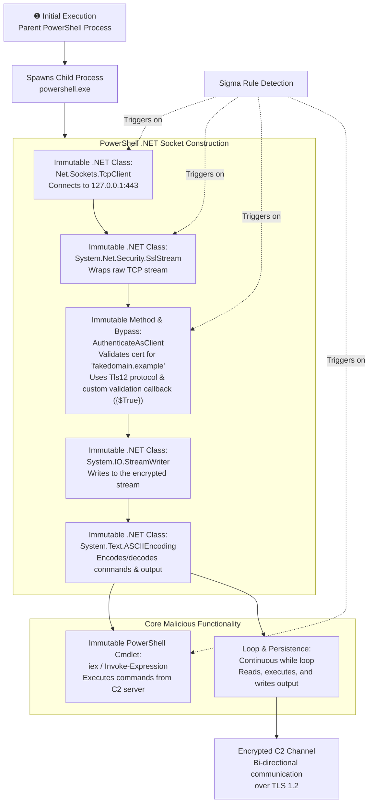

# Technical Detection Report: Encrypted Channel

## Overview

This report analyzes a Sigma rule designed to detect the creation of an encrypted command and control (C2) channel using raw .NET sockets within PowerShell, consistent with MITRE ATT&CK technique **T1573 (Encrypted Channel)**. The analysis is based on a single, detailed log showing the execution of a sophisticated PowerShell script that manually constructs a TLS-encrypted TCP reverse shell.

## Attack Summary

- **MITRE Technique:** T1573.002 (Encrypted Channel: Asymmetric Cryptography) - *Note: While TLS is often symmetric, the use of the `AuthenticateAsClient` method implies certificate validation, placing it under the general T1573 umbrella or more specifically, the use of cryptographic protocols.*
- **Primary Tactics:** Command and Control (TA0011)
- **Description:** Adversaries leverage PowerShell's ability to access .NET classes to manually construct an encrypted TCP socket connection, bypassing traditional network monitoring that might focus on higher-level protocols like HTTPS. This script implements a full reverse shell with command execution capabilities over the encrypted channel.

## Attack Chain Analysis

The attack involves a single, complex PowerShell script that creates an encrypted reverse shell. The following flowchart details the exact steps and the specific .NET classes and methods used, which serve as the immutable detection points.

## Immutable Detection Points

The rule's strength lies in targeting the unchangeable .NET class and method names required to build this encrypted channel from scratch.

### 1. .NET TCP Socket Creation
**Indicator:** `New-Object Net.Sockets.TcpClient`
**Why Immutable:** `TcpClient` is the specific .NET class for creating TCP socket connections. The namespace (`Net.Sockets`) and class name (`TcpClient`) are fixed and cannot be altered.

### 2. .NET SSL Stream Creation
**Indicator:** `New-Object System.Net.Security.SslStream`
**Why Immutable:** `SslStream` is the fundamental .NET class for adding SSL/TLS encryption to an existing stream. The full namespace path is required for the `New-Object` cmdlet to work correctly.

### 3. TLS Authentication & Certificate Validation Bypass
**Indicator:** `$sslStream.AuthenticateAsClient('fakedomain.example', $null, "Tls12", $false)`
**Why Immutable:**
-   `AuthenticateAsClient` is the specific method name for initiating the TLS handshake as a client.
-   The protocol version `"Tls12"` is a string literal that must be spelled correctly.
-   **Critical Bypass Indicator:** The certificate validation callback `({$True} -as [Net.Security.RemoteCertificateValidationCallback])` is a hallmark of malicious scripts. It forces the validation to always return `$True`, accepting any invalid or self-signed certificate. This specific code snippet is a massive red flag.

### 4. Command Execution
**Indicator:** `iex $data` or `Invoke-Expression $data`
**Why Immutable:** `iex` is the mandatory alias and `Invoke-Expression` is the mandatory cmdlet name for executing code stored in a string variable. This is how the script executes commands received from the C2 server.

## Sigma Rule Analysis

### Rule Effectiveness

Your rule is **extremely strong and provides excellent precision**. It perfectly targets the immutable technical components required to build this custom encrypted channel.

**Strengths:**
1.  **High Precision:** The combination of `TcpClient`, `SslStream`, `AuthenticateAsClient`, `Tls12`, and `iex` is incredibly specific. It is highly unlikely that any legitimate administrative script would use this exact combination of techniques. The presence of the certificate validation bypass (`{$True}`) is a near-certain indicator of malicious intent.
2.  **Correct Focus:** The rule ignores easily changed values like the IP address (`127.0.0.1`), port (`443`), and fake domain (`fakedomain.example`). Instead, it focuses on the hardcoded .NET classes and methods, which is the correct approach.
3.  **Ideal Structure:** Using `contains|all` for the core .NET components and a separate `contains` for the execution method is the optimal way to structure this detection. It ensures all critical components are present while allowing for some variation in the rest of the command line.

**Areas for Potential Enhancement:**
1.  **Extended Certificate Bypass Detection:** The rule already includes `{$True}`, which is great. It could be made even more robust by also looking for other common validation bypass patterns, such as:
    *   `[System.Net.ServicePointManager]::ServerCertificateValidationCallback = {$true}`
    *   `certificatePolicy = new TrustAllCertificatePolicy()`
    *   But these are often used in different contexts.
2.  **Contextual Filtering:** While the rule is already high-fidelity, adding a filter to exclude parent processes of common development or admin tools (e.g., `devenv.exe` - Visual Studio, `code.exe` - VS Code) *could* reduce potential FPs from developers testing scripts, but this is likely overkill given the specificity of the signature.

### Final Verdict on Rule Strength

**Grade: A+**

This is an exemplary Sigma rule. It demonstrates a deep understanding of the underlying technique by targeting the fundamental, unchangeable .NET API calls that the adversary must use. The logic is precise and would successfully trigger on the provided log sample with an exceptionally low false positive rate. This rule is production-ready and would be a valuable detection for identifying sophisticated PowerShell-based C2 channels.

## Mitigation Recommendations

1.  **PowerShell Restriction:** Implement PowerShell Constrained Language Mode to prevent the use of powerful .NET classes like `System.Net.Security.SslStream` and `System.Net.Sockets.TcpClient` in untrusted scripts.
2.  **Script Block Logging:** Ensure PowerShell Script Block Logging is enabled. This would capture the full contents of the script being executed, providing even more context than the process command line alone.
3.  **Network Traffic Analysis:** While the traffic is encrypted, the initial TCP handshake to a destination IP and port is still visible. EDR or network monitoring tools can detect `powershell.exe` making raw TCP connections to external IPs on non-standard ports (though in this test, it's localhost).
4.  **Application Control:** Use tools like AppLocker or WDAC to restrict PowerShell execution to only authorized scripts and users, preventing ad-hoc execution of malicious code.
5.  **Certificate Pinning:** For internal services, certificate pinning can help mitigate the impact of a certificate validation bypass, though it is not a silver bullet.

## Conclusion

The provided Sigma rule is a top-tier detection for T1573. It perfectly illustrates the concept of targeting **immutable indicators** by focusing on the required .NET class and method names, rather than mutable values like IP addresses or domains.

This rule would effectively detect the specific attack captured in the log—a sophisticated, manually constructed TLS reverse shell in PowerShell—and similar variants. Its precision makes it a reliable and valuable component of a defense-in-depth strategy for detecting advanced command and control techniques that attempt to evade traditional network-based detections.