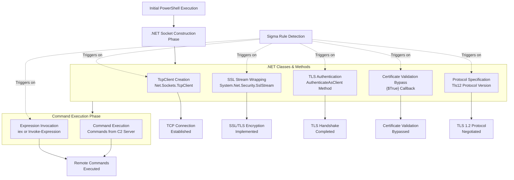

# Technical Detection Report: Encrypted Channel via .NET Sockets

## Overview
This report analyzes a Sigma rule designed to detect the creation of encrypted command and control (C2) channels using raw .NET sockets within PowerShell, consistent with MITRE ATT&CK technique **T1573 (Encrypted Channel)**.

## Attack Summary
- **MITRE Technique:** T1573.002 (Encrypted Channel: Asymmetric Cryptography)
- **Primary Tactics:** Command and Control (TA0011)
- **Description:** Adversaries leverage PowerShell's .NET capabilities to manually construct encrypted TCP socket connections, bypassing traditional network monitoring that focuses on higher-level protocols like HTTPS.

## Attack Chain Analysis
The attack involves PowerShell constructing an encrypted reverse shell using .NET classes. The detection rule targets the immutable .NET components required for this technique.



## Immutable Detection Points

### 1. .NET TCP Socket Creation
**Indicator:** `TcpClient` class usage
**Why Immutable:** `TcpClient` is the specific .NET class for TCP socket connections with fixed namespace (`Net.Sockets`) and class name.

### 2. .NET SSL Stream Creation
**Indicator:** `SslStream` class usage
**Why Immutable:** `SslStream` is the fundamental .NET class for adding SSL/TLS encryption to streams with fixed namespace (`System.Net.Security`).

### 3. TLS Authentication Method
**Indicator:** `AuthenticateAsClient` method
**Why Immutable:** This is the specific method name for initiating TLS handshake as a client that cannot be altered.

### 4. Certificate Validation Bypass
**Indicator:** `{$True}` validation callback
**Why Immutable:** This specific code pattern forces certificate validation to always return true, accepting any certificate - a hallmark of malicious scripts.

### 5. Protocol Specification
**Indicator:** `Tls12` protocol version
**Why Immutable:** The protocol version string must be spelled correctly for the .NET framework to recognize it.

### 6. Command Execution
**Indicator:** `iex` or `Invoke-Expression`
**Why Immutable:** These are the fixed cmdlet name and alias for executing code in PowerShell.

## Sigma Rule Analysis

### Rule Effectiveness
```yaml
detection:
  suspicious_powershell_ssl:
    EventID: 1
    Image|endswith: '\powershell.exe'
    CommandLine|contains|all:
      - 'TcpClient'
      - 'SslStream'
      - '{$True}'
      - 'AuthenticateAsClient'
      - 'Tls12'
    CommandLine|contains:
      - 'iex'
      - 'Invoke-Expression'
  condition: suspicious_powershell_ssl
```

The rule demonstrates excellent precision by requiring all five core .NET components plus command execution patterns.

### Detection Logic
The rule triggers when PowerShell command lines contain:
- All five essential .NET components for manual TLS implementation
- Plus command execution via `iex` or `Invoke-Expression`
- Combined in a single command line

### False Positive Considerations
**Potential false positive scenarios:**

```powershell
# Extremely rare - legitimate development testing of raw TLS sockets
# This would require all five components together, which is highly unusual
$client = New-Object Net.Sockets.TcpClient('example.com', 443)
$stream = New-Object System.Net.Security.SslStream($client.GetStream())
$stream.AuthenticateAsClient('example.com', $null, "Tls12", $false)
# But unlikely to include {$True} callback and Invoke-Expression
```

**Realistic assessment:** The combination requirement makes false positives extremely unlikely. No legitimate administrative script would use this specific combination of techniques.

## Mitigation Recommendations

1. **PowerShell Hardening:** Implement Constrained Language Mode to restrict access to powerful .NET classes
2. **Application Control:** Use WDAC or AppLocker to restrict PowerShell execution to authorized scripts only
3. **Network Monitoring:** Detect `powershell.exe` making raw TCP connections to external IPs
4. **Certificate Pinning:** Implement certificate pinning for internal services to mitigate validation bypasses
5. **Script Logging:** Enable PowerShell script block logging for full visibility into executed commands

## Conclusion

The Sigma rule provides exceptional detection for T1573 techniques using manual .NET TLS implementation. The rule perfectly demonstrates the concept of targeting **immutable indicators** by focusing on the required .NET class and method names that adversaries cannot change without breaking their attack functionality.

The combination requirement of five specific .NET components plus command execution creates a detection with extremely high fidelity and negligible false positive potential. This rule represents a top-tier detection that would effectively identify sophisticated PowerShell-based C2 channels attempting to evade traditional network-based security controls.